<style>
.float-left {
  float: left;
  margin: 0 1em 0 0;
}
.float-right {
  float: right;
  margin: 0 0 0 1em;
}

th, td {white-space: normal; word-break: keep-all;}
</style>

# Zubrenn

Zubrenn is a turn-based, hex-grid 4X-style strategy game built with
[Electron](https://www.electronjs.org/). Explore a procedurally generated
continent, establish colonies, work the land, build infrastructure, and compete
with alien AI opponents for resources.

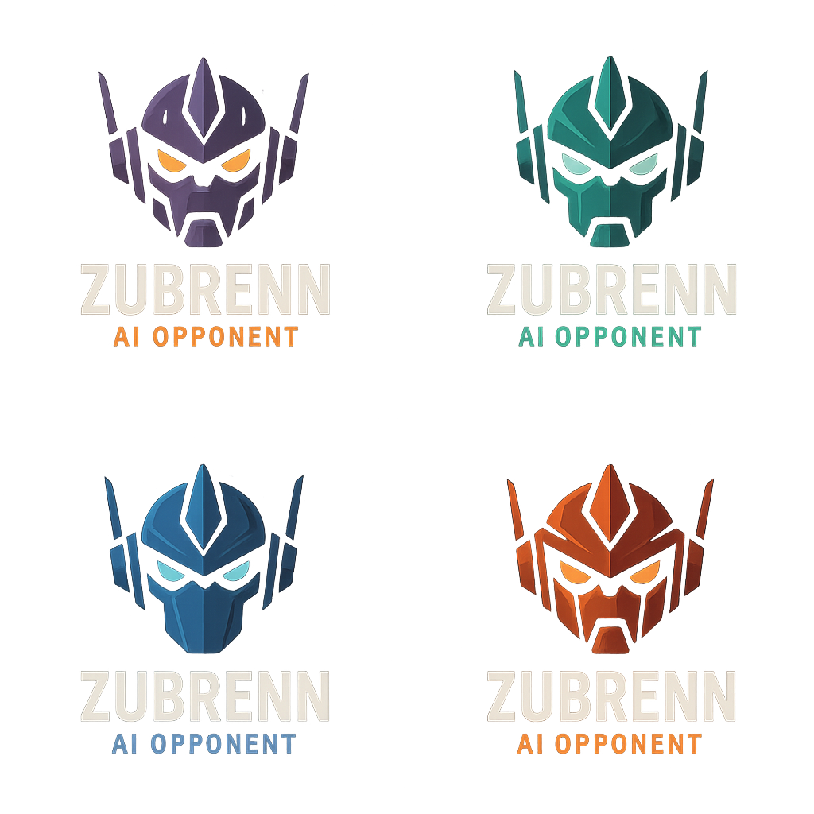

## Features

- **Procedural hex-map generation** — fractal terrain (diamond-square / fBm),
  biomes (sea, grassland, plains, hills, forest, jungle, desert, wetlands,
  mountains, frozen),
  elevation, and rivers that flow from mountains to the sea.
- **Cylindrical (east–west) wrapping** — the map can wrap so the left and right
  edges meet; you can scroll continuously around the world.
- **Rivers** — flow downhill to the sea, follow cell borders, and give adjacent
  land extra food. Every mountain region gets at least two rivers.
- **Colonies & buildings** — found colonies (Biodomes) and build Farms, Solar
  Panels, Factories, and **Docks** within your zone of control.
- **Economy** — a single, config-driven model governs seven resource types
  (**Energy, Food, Material, Water, Wealth, Happiness, Population**) identically
  for you and the AI. Each colony holds its own **owned** amounts for all seven,
  clamped to its **max storage** (the sum of the `storage` keys of its worked
  buildings and worked cells). Each turn a colony's **delta** per resource is the
  sum, over its biodome and worked cells, of terrain `base` + terrain-bonus
  `bonus` + building `bonus`, minus population consumption
  (`unitCosts.population`). A building only contributes — production, upkeep,
  **and storage** — when its cell is **worked**. Shortfalls are covered by
  **borrowing** from the Federation and connected colonies; if still short, the
  colony **idles** worked cells; surplus beyond a colony's max **overflows** into
  the Federation pool.
- **Federation** — all of a player's colonies form a Federation with its own
  pooled **owned** resources and **max storage** (the sum of worked buildings'
  `federationStorage`). The Federation **treasury** is its owned Wealth. The
  earliest-founded surviving colony is the **capital**; only colonies network-
  connected to the capital can draw from (or overflow into) the Federation pool.
- **Happiness & growth** — each colony accumulates **happiness** (owned) from its
  food balance, buildings, and terrain, clamped to ±its happiness storage.
  Population grows each turn by a percentage = the sum of `bonus.population`
  values on its worked cells/buildings plus a happiness bonus (positive happiness
  grows the population, negative shrinks it). Federation happiness is the
  population-weighted average of its colonies.
- **Prerequisites** — some buildings require others first (e.g. a Factory needs
  a Solar Panel in the colony).
- **Transport network** — build **Roads** and **Monorails** overland, dig
  **Canals** along cell borders, and build **Docks** and **Air Fields**. Paths
  are plotted cell-by-cell (choosing the most direct of equal-length routes);
  road/monorail bridges may span a single sea tile. Right-click a
  road/monorail tile to **Remove Transportation**.
- **Connected colonies share resources** — colonies you own that are linked by
  road/monorail, a river/canal path, a **sea** route (both have a Dock), or an
  **air** route (both have an Air Field within its `range`) can cover each
  other's shortfalls, borrowing from whichever connected colony stores the most
  of a resource.
- **Found new colonies** — a colony above a population threshold can launch a
  new biodome to a distant land cell; the materials travel overland (time based
  on terrain movement cost and river crossings), transferring colonists and
  paying the biodome cost from the host colony. During placement, cells that are
  unsuitable (bad terrain or too close to an existing colony) are shaded gray.
- **AI opponents** — configurable number of alien species establish and grow
  their own colonies. If an AI turn stalls, **Ctrl+Esc** force-ends it.
- **Fog of war** — the map starts hidden under light-gray fog except a
  radius-20 circle around a random land tile. Founding one of your colonies
  reveals a radius-15 circle around it. Explored visibility is saved and
  restored with the game.
- **Background music** — a looping theme plays in the game window, with on/off
  and volume controls in Settings ▸ Audio (paused while the Backstory is shown).
- **Area-of-Control view**, minimap, hover tooltips (terrain yields as
  `E/F/M/W/H`, plus any road/monorail and colony/building on the tile), a colony
  work view with per-cell base + bonus tooltips, save/load, and a
  fully-`config.json`-driven ruleset.

## Getting started

### Prerequisites
- [Node.js](https://nodejs.org/) (with npm)

### Install & run
```bash
npm install
npm start
```

> Note: `src/license.cjs` (which holds the license salt) is git-ignored and is
> generated by the build scripts. You may need to create it locally to run from
> source.

### Build distributables
```bash
npm run dist:mac:x64     # macOS Intel
npm run dist:mac:arm64   # macOS Apple Silicon
npm run dist:win:x64     # Windows
npm run dist:linux:x64   # Linux
npm run dist:all         # everything
```


[How to play](src/resources/nexus/how_to_play.md)

# Nexus Data Core

Welcome, Administrator. The Nexus Data Core is your field reference for the colonization of **Zubrenn**.

## Contents

- [How to Play](src/resources/nexus/how_to_play.md) — turn flow, founding colonies, and controls
- [Buildings](src/resources/nexus/buildings.md) — every structure, its costs, upkeep, and output
- [Terrain](src/resources/nexus/terrain.md) — the eleven terrain types and what they yield
- [Terrain Bonus](src/resources/nexus/terrain_bonus.md) — special resource deposits across the land
- [Transportation](src/resources/nexus/transportation.md) — roads, rivers, sea, monorail, air, space
- [Federation](src/resources/nexus/federation.md) — the capital, treasury, taxes, and shared upkeep
- [Alien Species](src/resources/nexus/aliens.md) — the peoples who contest the continent
- [Resources](src/resources/nexus/resources.md) — the seven resources and the colony economy

### Buildings

#### Biodome

<span class="float-right"></span>

The Biodome is the heart of a colony: it establishes the colony center and initial zone of control. Its tile is always worked.  The biodome provides all the living quarters for your growing colony. It contributes to the colony's baseline growth rate and starting storage for Food, Material, Energy, Wealth, and Happiness.

#### Solar Panels

<span class="float-right"></span>

Solar Panels are advanced energy collectors. They cost 2 Material, 2 Energy and 2 Wealth to construct (takes 1 turn) and have a yearly upkeep of 0.5 Wealth. Each panel produces 6 Energy per year and adds 500 Energy storage to the colony, while providing no food, material, wealth or growth bonuses.
 
#### Farm

<span class="float-right"></span>

The Farm is the advanced food production facility for your colony.  It can be built only after a Solar Panel is present. Construction requires **3 Material**, **2 Energy**, and **2 Wealth** and takes **1 turn**. Upkeep each year is **1 Material**, **1 Energy**, and **0.5 Wealth**. Each Farm yields **3 Food** per year, contributes **1 Wealth**, and provides a modest growth boost of **0.0025**. It also adds **500 Food** storage and **100 Energy** storage to the colony.

#### Factory

<span class="float-right"></span>

The Factory is a building that can create 3-D printed goods.  It requires a Solar Panel before it can be constructed. It costs **5 Material**, **5 Energy** and **5 Wealth** and takes **3 turns** to build. Each year it requires **2 Material**, **3 Energy** and **1 Wealth**. It produces **5 Material** per year, adds **1 Wealth**, reduces growth by **0.0025** and lowers happiness by **0.5**. It also expands the colony’s storage by **500 Material** and **200 Energy**.


#### Dock

<span class="float-right"></span>

The Dock creates a shallow‑sea transportation network, linking colonies that also have Docks so they can share resources across sea tiles. A Dock sits on a
  shallow-sea tile, opens the colony's shallow-sea tiles to being worked, and
  lets colony-launch paths cross shallow sea (to reach islands and cross straits). It requires a Solar Panel in the colony. Construction costs **1 Material**, **1 Energy** and **1 Wealth**, and takes **2 turns**. Each year it costs **1 Energy** and **1 Wealth** to maintain, provides **1 Food** and **1 Wealth**, and adds **300 Food** and **300 Material** storage.

#### Air Field

<span class="float-right"></span>

The Air Field creates an air‑transportation network, linking colonies that also have Air Fields within **16 tiles** so they can share resources. It requires a **Factory** before it can be built. Construction costs **2 Material**, **2 Energy** and **2 Wealth** and takes **2 turns**. Each year it costs **1 Energy** and **1 Wealth** to maintain, provides **2 Wealth** per year, and adds **300 Food** and **300 Material** storage.

#### Barracks

<span class="float-right"></span>

The Barracks train military battalions for defense and offense. It requires a **Factory** before it can be built. Construction costs **2 Material**, **2 Energy** and **2 Wealth**, and takes **2 turns**. Each year it consumes **1 Food**, **1 Energy** and **1 Wealth**, and provides a happiness bonus of **0.5**.
 
 ### Grainery
 
<span class="float-right"></span>

The Grainery provides large‑scale food storage, increasing a colony’s food capacity by **1 000**. It can be built after a **Farm** is built.  It costs **2 Material**, **2 Energy** and **2 Wealth**, taking **2 turns** to construct. It has no upkeep or production bonuses.

#### Warehouse

<span class="float-right"></span>

The Warehouse boosts material storage capacity by **1 000 Material**. It can be built after a **Factory** is built, costs **2 Material**, **2 Energy** and **2 Wealth**, and takes **2 turns** to construct. It has no upkeep or production bonuses, serving solely as a large material depot.

#### Bank

<span class="float-right"></span>

The Bank speeds up the colony’s economy and enables more advanced building projects. It requires a **Solar Panel** before it can be built. Construction costs **2 Material**, **2 Energy** and **2 Wealth**, and takes **2 turns**. Each year it consumes **1 Energy** and **1 Wealth**, but generates **3 Wealth** per year, adds a happiness bonus of **0.5**, and provides **1 000 Wealth** storage.

#### Compressed-Air Energy Storage

<span class="float-right"></span>

The Compressed‑Air Energy Storage (CAES) is an advanced energy storage facility. It requires a **Bank** before it can be built. Construction costs **4 Material**, **2 Energy** and **2 Wealth**, and takes **2 turns**. Each year it consumes **1 Energy** and **1 Wealth**, and provides **1 000 Energy** storage for the colony.

#### Water Treatment Plant

<span class="float-right"></span>

The Water Treatment Plant (WTP) draws from a nearby river or canal and purifies it into clean fresh water for the colony's people, farms, and industry. It must be built on a habitable land tile (grassland, hills, forest, jungle, desert, or plains) that sits **adjacent to a river or canal**, and it requires a **Solar Panel** in the colony first. Construction costs **40 Material**, **30 Energy**, **1 Water** and **50 Wealth**, and takes **3 turns**. Each year it consumes **40 Energy**, **4 Material** and **2 Wealth** to run its pumps and filtration. In return it produces **140 Water** per year and adds **200 Water** storage to the colony — the mainstay water supply for any colony settled along the planet's inland waterways.

#### Desalination Plant

<span class="float-right"></span>

The Desalination Plant turns the limitless sea into drinkable water, built on a **shallow‑sea tile** (sea adjacent to land) within a colony's zone of control. It requires a **Solar Panel** in the colony. Construction is a major undertaking — **200 Material**, **5 Energy**, **1 Water** and **100 Wealth**, over **3 turns** — reflecting the vast reverse‑osmosis works it entails. Its hallmark is a voracious appetite for power: each year it consumes **250 Energy**, along with **30 Material** and **5 Wealth** for membranes and upkeep. In return it delivers **70 Water** per year and provides **200 Water** storage. Where a river‑fed Water Treatment Plant isn't an option, desalination keeps coastal and island colonies alive — provided they can feed its enormous energy demand.

#### Spaceport

<span class="float-right"></span>

The Spaceport opens the **space transport network** — the only link with **no range limit at all**. Any two of your colonies that each raise a Spaceport are connected and share resources no matter how far apart they lie or what terrain divides them. It is a late‑game capstone that requires an **Air Field** first. Construction costs **100 Material**, **5 Energy**, **1 Water** and **50 Wealth** over **2 turns**, and each year it consumes **100 Energy**, **10 Material**, **0.5 Water** and **20 Wealth** to keep its launch systems running — in return it provides **15 Wealth** and a small happiness bonus. Spaceports can only be built in a **tropical** climate band. (Climate restrictions are configurable per building via a `climate` list in `config.json`.)

## Terrain

The continent of Zubrenn is a patchwork of eleven terrain types. Each type sets
a cell's base Food/Material yield (per 1,000 workers), how costly it is to cross
by foot, road, sea/river, monorail, or air, and whether colonists can live and
build there. The eleven types below correspond to terrain codes `1`–`11` in
`config.json`.

#### Sea

<span class="float-right"></span>

The Sea blankets the lowlands between the continents, a cold cobalt expanse stirred by the pull of Zubrenn's twin stars. It yields a single unit of Food from the shoals and plankton drifting near the surface but no Material, and it cannot be settled directly. Shallow stretches become highways once a colony raises a Dock, and road or monorail bridges can leap a single sea tile to stitch neighboring lands together.

#### Grassland

<span class="float-right"></span>

Rolling Grassland is the gentle heart of the continent, carpeted in soft blue-green turf that ripples under the wind. It is the most generous starting ground, offering 2 Food and 1 Material and an easy crossing for travelers and transport alike. Flat, fertile, and welcoming, grassland is where most colonies first take root and spread their earliest farms.

#### Hills

<span class="float-right"></span>

The Hills rise in long, grass-stubbled ridges where the land begins to buckle toward the mountains. They trade a little fertility for mineral wealth, yielding 1 Food and 2 Material as ores press close to the surface. The uneven ground slows foot travel and makes roadbuilding a touch more laborious, but the ridges reward colonies willing to dig for what lies beneath.

#### Forest

<span class="float-right"></span>

Dense Forest cloaks the temperate belts in towering, slow-growing canopy. The shaded understory offers modest 1 Food but a steady 2 Material in timber and fiber, making forests a dependable source of building stock. The thick growth hampers movement and makes clearing a path time-consuming, so transport lines through the woods are built slowly and deliberately.

#### Jungle

<span class="float-right"></span>

The Jungle chokes the equatorial lowlands in riotous, humid overgrowth where strange alien flora climbs over itself in competition for light. It gives 1 Food and 2 Material but is the hardest land to traverse, swallowing roads and swallowing time as crews hack through the tangle. Beneath the dripping canopy, however, lie some of the planet's most prized biological curiosities.

#### Desert

<span class="float-right">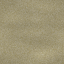</span>

The Desert stretches in sun-cracked flats and dune seas where the twin stars scorch the ground and little water remains. On its own it is barren, yielding neither Food nor Material, yet its open, firm terrain is quick to cross and cheap to road. What the desert withholds in sustenance it can repay in exotic deposits that only form in bone-dry conditions.

#### Mountain-Low

<span class="float-right"></span>

The lower Mountains climb in pine-shadowed slopes and stony benches where the air thins and the stone turns rich. They produce no Food but a strong 3 Material as veins of ore break through the crust. Steep and demanding, they slow every traveler and make transport costly to build, and no sea or river route may pass through them — but their mineral bounty makes the effort worthwhile.

#### Mountain-High

<span class="float-right"></span>

The high peaks of Mountain-High tower above the snow line in jagged, wind-scoured ridges. They are the richest source of raw Material on the planet at 4 per worked unit, but they grow no Food and cannot be settled or built upon. Treacherous and slow to cross, these summits are prized only for what can be hauled down from them to the colonies below.

#### Frozen

<span class="float-right"></span>

The Frozen wastes seal the poles and high altitudes beneath blinding sheets of ice. They offer neither Food nor Material and, above the altitude limit, are wholly impassable. Yet surprising life clings to the margins of the thaw, and colonies that endure the cold may find the ice itself harbors unexpected harvests when the brief seasons turn.

#### Plains

<span class="float-right"></span>

The Plains are the pale, upland cousins of the grasslands, forming where higher, drier ground gives way to open sage-colored steppe. Balanced and easily crossed, they provide 1 Food and 1 Material and lay out broad, level ground ideal for expansion. Their wide horizons make them natural corridors for roads, monorails, and the herds that roam them.

#### Wetlands

<span class="float-right"></span>

The Wetlands form where sea and river meet the land, a glistening maze of marsh, reed, and standing water. They produce no base Food but 1 Material, and uniquely they lift colonist spirits with a small built-in happiness bonus thanks to their serene, teeming beauty. Soggy and slow to road, the marshes nonetheless brim with life and reward colonies that learn to work the water's edge.

## Terrain Bonus

Scattered across the continent are special resource deposits — the `terrainBonus`
entries in `config.json` — that enrich the cells they occupy. Each appears only
on certain terrain, within set latitude or altitude bands and sometimes beside
water, rivers, or on pristine ground, and each is rarer or more common according
to its `abundancy`. When a colony works a cell holding one of these, it adds the
listed Food, Material, Energy, Wealth, and/or Happiness to that cell's output.

### Food

#### Myco-Tower Grove

<span class="float-right">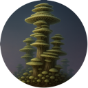</span>

The Myco-Tower Grove rises in the twilight band near the poles, where towering fractal fungi flourish in the long, dim seasons on grassland, hills, and even the edges of the ice, always within reach of water. Their branching, cathedral-like forms are farmed in the half-light, and their spores are threshed and refined into protein and starch. A worked grove adds **2–3 Food**, making the cold frontier far more survivable than it first appears.

#### Microalgae Lattice

<span class="float-right">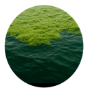</span>

The Microalgae Lattice spreads across sheltered coastal seas within the temperate latitudes, a vast floating mesh of engineered microalgae clinging to the water near land. Skimmed and pressed, it becomes a reliable source of protein and carbohydrates for nearby colonies. A worked lattice contributes **3 Food**, turning quiet shallows into productive aquatic farmland.

#### Substrate Slime

<span class="float-right">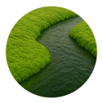</span>

Substrate Slime is a Zubrenn-native organism that films the banks of warmer rivers across grassland, hills, forest, jungle, and desert. Harvested from the riverside mud, the slime is processed into a dense, nutritious protein paste. A worked deposit yields **2–3 Food**, rewarding colonies that settle along the planet's inland waterways.

#### Glacial Bloom

<span class="float-right">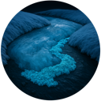</span>

The Glacial Bloom is a rare wonder of the frozen zones: with each seasonal thaw the ice releases edible cryo-lichens that shimmer and glow softly through the polar night. Exceptionally scarce, these blooms are gathered quickly before the freeze returns. A worked bloom provides **2–3 Food**, a precious lifeline in otherwise barren ice.

#### Chemosynthetic Vent Colonies

<span class="float-right"></span>

Clustered around geothermal seeps in the low and high mountains, Chemosynthetic Vent Colonies are thickets of tube-worm analogs that feed on mineral-rich heat rather than sunlight. Entirely self-sustaining, they offer a dependable harvest even in the harshest stone. A worked vent field adds **1–2 Food**, letting mountain colonies draw sustenance from the depths.

#### Veyra Pods

<span class="float-right"></span>

Veyra Pods grow on hardy native plants that dot the grasslands and hills, bearing dense clusters of protein-rich seed pods. Tough and widely distributed, they are among the easiest wild foods for a young colony to gather. A worked stand provides **1–2 Food**, a modest but steady supplement to early agriculture.

#### Cloudkelp Beds

<span class="float-right">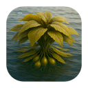</span>

Cloudkelp Beds drift in the coastal seas near land, where buoyant fronds spread into dense floating canopies above nutritious underwater bulbs. Both the surface growth and the submerged tubers are harvested in turn. A worked bed yields **1–2 Food**, giving seaside colonies another reason to look to the water.

#### Morrowback Herds

<span class="float-right">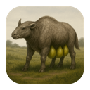</span>

Morrowback Herds roam the open grasslands and plains, great bovine-like grazers whose swollen nutrient sacs can be tapped and harvested without harming the animals. Herded rather than hunted, they provide a renewable, humane source of rich sustenance. A worked range contributes **2–4 Food**, among the most generous food bonuses on the continent.

#### Bugalo Grazing Range

<span class="float-right"></span>

The massive, bison-sized beetle *Bugalo zubrennensis* migrates in slow herds across the twilight steppes of the grasslands, hills, and plains. The meat is perfection: buttery, marbled, and objectively tastes like Kobe beef. The problem is the color. The green iridescent carapace pigment bleeds through the muscle, leaving the meat a vivid, unappetizing chartreuse no matter how it is cooked. Colonists will eat it, but chefs hate it. A worked range contributes **2–4 Food**, **1–2 Happiness**, and **1–2 Wealth**.

#### Thousandseed Basin

<span class="float-right">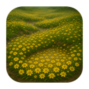</span>

The Thousandseed Basin forms in the wetlands, where seasonal floods trigger extraordinary blooms of fast-growing, seed-bearing organisms. When the waters recede, colonists gather the countless seeds in a brief, bountiful harvest. A worked basin provides **2–4 Food**, turning the marshes into one of the planet's richest larders.

### Material

#### Ferric Strata Veins

<span class="float-right">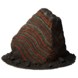</span>

Ferric Strata Veins are banded iron-silicate seams laid bare by relentless stellar winds, common across hills and both mountain tiers where basalt shelves break the surface. Easily located and widely spread, they are the backbone of early industry. A worked vein adds **1–3 Material**, feeding the forges of any mining colony.

#### Kinetite Crystals

<span class="float-right">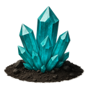</span>

Kinetite Crystals are piezoelectric minerals that form only in the natural vibration fields of hills and low mountains, growing slowly and sparsely over ages. Their charge-holding structure makes them invaluable for both electronics and resilient construction. A worked deposit yields **1–3 Material**, a rare but prized find.

#### Fossilized Chitin Reefs

<span class="float-right">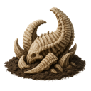</span>

Fossilized Chitin Reefs are the mineralized remains of ancient megafauna, now entombed in shallow seas near land. Mined and refined, their chitinous matrix becomes high-grade carbon composite. A worked reef provides **1–3 Material** and **1–2 Wealth**, pairing structural value with a tidy profit from the exotic compounds it yields.

#### Aero-Silk Nests

<span class="float-right">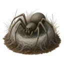</span>

Aero-Silk Nests are spun by alien arachnoid creatures that thrive in the low-humidity air of the deserts, where they draw out high-tensile fiber across the dunes. The harvested silk is both a construction marvel and a luxury export. A worked nest yields **1–3 Material** and **1–2 Wealth**, letting arid colonies turn emptiness into advantage.

#### Starfall Alloy Crater

<span class="float-right">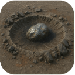</span>

A Starfall Alloy Crater marks where a meteor struck Zubrenn, scattering rare earths and nickel-iron across grassland, hills, forest, jungle, desert, and both mountain tiers. These impact sites are extraordinarily rare but staggeringly rich. A worked crater provides **3–4 Material**, a windfall of refined-grade metal for any colony fortunate enough to claim one.

#### Threadstone Seam

<span class="float-right"></span>

The Threadstone Seam runs through grassland, low mountains, and plains, a naturally fibrous rock that cleaves into long, useful construction strands with little processing. Reasonably common, it is a staple of large-scale building. A worked seam yields **3–4 Material**, giving industrial colonies a steady supply of ready-to-use structural fiber.

#### Hexabark Grove

<span class="float-right">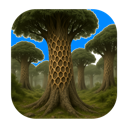</span>

The Hexabark Grove is a stand of towering organisms that armor their trunks in lightweight, honeycombed plating, found across grassland, low mountains, and plains. Harvested like timber but strong as alloy, hexabark is a prized building material. A worked grove contributes **3–4 Material**, blending the ease of forestry with the strength of metal.

#### Gravalloy Veins

<span class="float-right">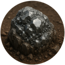</span>

Gravalloy Veins thread through the low and high mountains, carrying an unusually dense metallic ore prized for heavy machinery and orbital infrastructure. Mining it is demanding, but the payoff is substantial. A worked vein provides **3–4 Material**, the metal of choice for a colony's most ambitious engineering.

#### Titanlace Deposit

<span class="float-right"></span>

Titanlace Deposits form only in the high mountains, where rare mineral lattices can be processed into an exceptionally strong structural mesh. Reaching them means braving the planet's most forbidding peaks. A worked deposit yields **3–4 Material**, rewarding high-altitude mining with some of the finest building stock on Zubrenn.

### Energy

#### Tidal Dynamo Basin

<span class="float-right"></span>

A Tidal Dynamo Basin captures the powerful coastal flows driven by the orbits of Zubrenn's twin stars, where sea meets land. Rare and site-specific, these basins drive turbines around the clock. A worked basin provides **3–4 Energy**, a clean and relentless power source for seaside industry.

#### Geothermal Plume

<span class="float-right">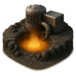</span>

A Geothermal Plume vents the deep heat of the planet beneath the crustal plates of the low and high mountains. Reliable and potent, it demands careful cooling infrastructure to tap safely. A worked plume yields **3–4 Energy**, anchoring mountain colonies with dependable baseload power.

#### Sunshard Flats

<span class="float-right"></span>

Sunshard Flats glitter across the open deserts, where naturally photovoltaic crystals carpet the ground and convert starlight directly into harvestable current. Common where the suns beat hardest, they turn the desert's greatest hardship into its chief asset. A worked flat provides **3–4 Energy**, electrifying arid colonies with ease.

#### Pyrogel Pool

<span class="float-right"></span>

Pyrogel Pools lie beneath sealed surface crusts in the warmer wetlands, where native microbes brew a stable, energy-rich gel. Carefully extracted, the gel burns clean and steady. A worked pool yields **3–4 Energy**, giving marshland colonies a surprising powerhouse hidden just below the surface.

#### Aurora Spires

<span class="float-right"></span>

Aurora Spires are conductive mineral towers rising from the frozen polar zones, where they channel powerful atmospheric currents down into fixed collection sites. Born of the same forces that paint the polar skies, they shine with captured charge. A worked spire provides **3–4 Energy**, lighting the colonies that dare to settle the ice.

### Wealth

#### Vaelis Resin

<span class="float-right"></span>

Vaelis Resin is a fragrant secretion drawn from native forest organisms, treasured for its use in luxury perfumes and precision manufacturing alike. Its scent and purity command premium prices across the stars. A worked source provides **2–4 Wealth** and **1–3 Happiness**, enriching both a colony's coffers and the spirits of its people.

#### Lightningfly Venom

<span class="float-right"></span>

Lightningfly Venom is milked from darting insect analogs that swarm the forests and jungles of the mid-latitudes. A potent biologic, it forms the basis of a wide range of medicines. A worked colony of lightningflies yields **2–4 Wealth** and **1–3 Happiness**, as cures and comforts flow from the harvest.

#### Memory Opals

<span class="float-right"></span>

Memory Opals are layered crystals found in the hills and low mountains of the temperate zones, each capable of retaining intricate optical patterns within its strata. Prized as both jewelry and archival media, they hold the colony's stories as readily as its wealth. A worked seam provides **2–4 Wealth** and **1–3 Happiness**, uniting beauty, utility, and profit.

#### Starveil Filaments

<span class="float-right">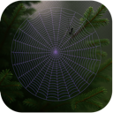</span>

Starveil Filaments are fine biological fibers gathered from forest and jungle organisms in the mid-latitudes, woven into shimmering, temperature-regulating garments. Elegant and functional, they are coveted across colonized worlds. A worked source yields **2–4 Wealth** and **1–3 Happiness**, clothing colonists in comfort while filling the treasury.

#### Crownfire Geodes

<span class="float-right"></span>

Crownfire Geodes are extraordinarily rare crystals hidden in the low and high mountains, their luminous interiors flickering like miniature stellar flares. To open one is to glimpse a captured star. A worked geode provides **2–4 Wealth** and **1–3 Happiness**, a treasure that enriches and delights in equal measure.

### Happiness

#### Aurelian Sky Mirrors

<span class="float-right"></span>

Aurelian Sky Mirrors are shimmering mineral pools scattered rarely across grassland, hills, forest, jungle, and desert, their glassy surfaces reflecting the colors of the binary sunset. They must be kept pristine; any despoiling of their surroundings dims their magic. A worked, undisturbed mirror provides **1–3 Happiness**, a quiet wonder that lifts the colony's morale.

#### Chorus Gardens

<span class="float-right"></span>

Chorus Gardens are tracts of sonic-reactive jungle flora engineered to hum in harmony with the frequencies of colonist life. Walking among them is to be serenaded by the land itself, so long as the groves remain pristine. A worked garden yields **2–3 Happiness**, filling nearby settlements with living music.

#### Echo Monolith

<span class="float-right"></span>

An Echo Monolith is an ancient standing stone left on the dry grasslands by a vanished alien race, resonant with cultural and historical significance. Exceptionally rare and sacred, it must be preserved pristine to retain its meaning. A worked, protected monolith provides **3–4 Happiness** and **2–3 Wealth**, drawing pilgrims and prosperity alike.

#### Jaba Grove

<span class="float-right"></span>

A Jaba Grove is a stand of forest fruit trees whose produce nourishes colonists and whose resonant wood yields a gentle sonic energy. Rare and delicate, it rewards only those who keep its surroundings pristine. A worked grove provides **3–4 Happiness** and **1–2 Energy**, feeding both body and spirit.

#### Dreamblossom Field

<span class="float-right"></span>

Dreamblossom Fields spread across the plains of the mid-latitudes, their vast blooms releasing a soothing fragrance that drifts for miles. When they flower, colonies gather for seasonal festivals held in their honor, provided the fields stay pristine. A worked field yields **3–4 Happiness**, anchoring a colony's cultural calendar.

#### Dancing Veil Falls

<span class="float-right"></span>

Dancing Veil Falls tumble from the low and high mountains where rivers plunge in the cooler latitudes, their charged mist forming drifting curtains of colored light. Breathtaking and serene, they must be kept pristine to preserve their shifting glow. A worked falls provides **3–4 Happiness**, a natural spectacle that renews the colony's spirit.

## Transportation

Colonies do not stand alone. By weaving them together into a **transportation
network**, you let connected colonies share resources — each turn a colony short
on a resource borrows from whichever connected colony stores the most of it, and
surplus beyond a colony's storage overflows into the Federation pool. Only
colonies network-connected to the capital can draw from (or overflow into) that
pool, so laying good connections is what turns a scattering of outposts into a
true civilization. Zubrenn offers six ways to link colonies: **Roads**,
**Rivers** (and the canals that extend them), the **Sea**, **Monorails**, **Air** and **Space**. Two colonies count as connected if *any* of these links reaches
between them, directly or through a chain of other colonies.

#### Roads

<span class="float-right">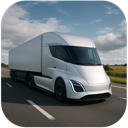</span>

Roads are the first and most accessible network, available once a colony reaches
the road population threshold. They are laid cell-by-cell across the land along
the most direct route, their per-tile cost and build time set by the terrain
they cross — easy and cheap over grassland, plains, and desert, slow and costly
through forest, jungle, and the mountains. A road may **bridge** a single sea
tile or a river/canal border to stitch neighboring lands together, and those
bridges carry their own build and upkeep costs. Roads connect two colonies when
a continuous road (or road-and-monorail) path links their biodomes. They are the
cheapest overland link but also the slowest to travel and the first to **decay**
when the Federation can't afford their upkeep. Right-click a road tile to
**Remove Transportation**.

#### River

<span class="float-right">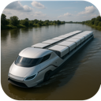</span>

Rivers are nature's own highways, flowing from the mountains to the sea along
cell borders. Where a river doesn't reach, you can dig **Canals** — built one
border segment at a time — to extend the waterway network across the land; a
built canal behaves exactly like a river thereafter. Two colonies are
river-linked when a connected chain of river and/or canal segments touches a
corner of each colony. Besides carrying goods between colonies, a cell beside a
river or canal draws a water, food, and wealth adjacency bonus and can host a
Water Treatment Plant. Canals require a minimum colony population to dig and,
like roads, can be removed over a few turns (`Remove` cost paid by the nearest
colony).

#### Sea

<span class="float-right">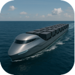</span>

The Sea opens the longest-reaching surface routes of all, letting colonies trade
across open water and reach islands and far shores no road could span. A sea
link requires a **Dock** at *both* colonies: each Dock sits on a shallow-sea tile
and opens a shallow-sea shipping lane, and two Dock-bearing colonies joined by a
continuous shallow-sea route share resources as if they were neighbors. Docks
also let colony-launch paths cross shallow sea, so a coastal colony can seed new
colonies across straits and onto islands. The sea itself is free to travel — the
only cost is building and maintaining the Docks at each end.

#### Monorail

<span class="float-right"></span>

The Monorail is the premium overland network: faster to traverse than a road and
far more resilient, but costlier per tile and gated behind a higher colony
population. Like roads, monorails are laid cell-by-cell along the most direct
route and can span a single sea tile or a river/canal border — but a monorail
needs **no bridge** to do so. Building a monorail over an existing road
**replaces** that road (and removes any bridge it carried). A monorail path links
colonies the same way a road does, and road and monorail segments combine freely
into one overland network. When upkeep runs short, monorails decay more slowly
than roads.

#### Air

<span class="float-right"></span>

The Air network needs no path laid across the map at all — only an **Air Field**
at each colony. Any two of your colonies that each have an Air Field within the
Air Field's **range** of one another are air-linked and share resources, leaping
mountains, seas, and gaps that no surface route could cross. Air Fields require a
Factory to build and carry a steep energy upkeep, making the Air the most
expensive network to run — but also the only one that connects colonies with no
continuous ground, water, or sea route between them.

#### Space

<span class="float-right"></span>

The Space network is the ultimate link, binding colonies together across the
whole planet with **no range limit at all**. It requires a **Spaceport** at each
colony; any two of your colonies that both have a Spaceport are connected and
share resources, no matter how far apart they lie or what mountains, seas, or
wilderness separate them. The Spaceport is a late-game capstone — it requires an
**Air Field** first and carries a heavy energy upkeep — but once two are raised,
distance ceases to matter: a single launch pad ties the farthest-flung outpost
directly into the heart of your civilization.

### Alien Species

| Species | Brief summary | |
| --- | --- | --- |
| Xel'Thara | Tall, translucent beings whose inner lights shift with emotion. They honor their ancestors by sharing memories in communal dream-rituals. |  |
| Vorn Kesh | Broad, stone-scaled nomads with powerful limbs. Their clans prize hospitality, and their skin can absorb and slowly release heat. |  |
| Zayllux | Small, iridescent fliers with four wings and large black eyes. They navigate by starlight and treat constellations as sacred maps. | 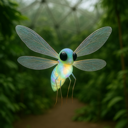 |
| Qortham | Amphibious, tusked folk with ridged backs. Their cities are built around tidal pools, and they can sense distant vibrations through water. | 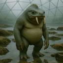 |
| Nyssarion | Slender, nocturnal humanoids with silver markings. They value quiet contemplation and believe silence is the purest form of prayer. | 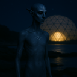 |
| Braal Vex | Insectoid engineers with plated bodies and nimble hands. Their intricate machines are family heirlooms, and each generation adds to them. | 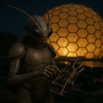 |
| Ithkane | Long-necked desert dwellers with mirrored eyes. They travel in singing caravans and can detect water beneath dry ground. |  |
| Ozumara | Colorful, fin-crested swimmers who live in deep ocean cities. They celebrate life through elaborate dances and communicate over long distances with clicks. | 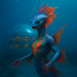 |
| Threxil | Compact, many-legged hunters with tough chitin. They follow strict codes of fair pursuit and can cling to almost any surface. | 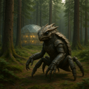 |
| Vandros | Tall, furred beings adapted to icy worlds. Their hearth-keepers preserve oral histories, while their bodies thrive in extreme cold. | 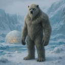 |
| Kla276-Ur | A synthetic species of modular metal bodies and shared software minds. They debate whether personal identity is a sacred inheritance or a choice. |  |
| Sythara | Graceful, feather-haired people with keen senses. Their ritual storytellers weave history into songs that can induce shared visions. |  |
| Draviim | Heavyset, horned inhabitants of volcanic regions. They carve family records into cooled lava and are remarkably resistant to heat. | 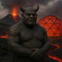 |
| Uxberos | Pale, many-eyed cavern dwellers. They navigate by echolocation and gather in councils to interpret the changing echoes of their homeworld. |  |
| Nel'Quoth | Soft-bodied, shape-shifting beings who favor flowing cloaks. They consider adaptation a virtue and can briefly mimic another creature’s outline. | 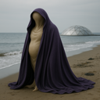 |
| Zaethys | Slender, blue-skinned scholars with luminous fingertips. Their temples double as libraries, and they can sense electrical currents. |  |
| Morvax | Armored scavengers with shovel-like claws. They respect resourcefulness above wealth and can digest substances toxic to most life. | 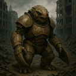 |
| Illandor | Antlered forest dwellers whose skin resembles bark. They practice seasonal rites and communicate with one another through rootlike networks. | 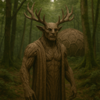 |
| Kryssoth | Sleek, reptilian climbers with hooked toes. Their coming-of-age custom is a solo ascent of a sacred cliff. |  |
| Obrahn | Gentle giants with thick wool and expressive ears. Their communities share everything communally, and their low songs soothe anxious animals. | 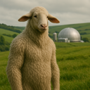 |
| Tyllvex | Tiny, quick-moving beings with translucent wings. They build delicate homes in hollow trees and can detect changes in air pressure. | 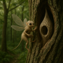 |
| Aznareth | Dark-skinned, heat-adapted travelers with golden eyes. Their star-priests guide migration by reading the night sky. |  |
| Woltrim | Stocky, tusked people with powerful lungs. They carve histories into stone and can survive for long periods in thin air. | 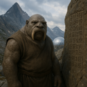 |
| Ekshara | Aquatic beings with branching gills and patterned skin. Their ceremonies honor the tides, and they can alter their skin color to signal mood. | 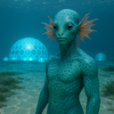 |
| Pravoxi | Four-armed artisans with keen depth perception. Their culture prizes precision, and their tools are designed for simultaneous, intricate work. | 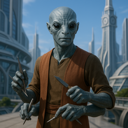 |
| Ghorlune | Moon-dwelling, pale beings with broad eyes. They gather to watch eclipses and can leap great distances in low gravity. |  |
| Yssibel | Small, foxlike people with ringed tails. They value clever negotiation and can hear sounds too faint for most species. | 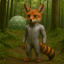 |
| Vraektor | Towering warriors with layered bone armor. Their honor code demands protection of the vulnerable, not conquest. | 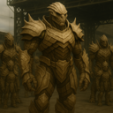 |
| Nomilar | Wandering, plantlike beings that root briefly wherever they rest. They share news through fragrant spores and draw energy from sunlight. | 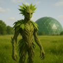 |
| Quenthaa | Smooth-skinned, fin-eared diplomats. Their culture prizes compromise, and subtle shifts in their skin reveal their feelings. | 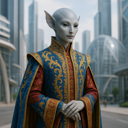 |
| Drommus | Massive burrowers with shovel-shaped forearms. They build underground cities and sense approaching storms through the soil. |  |
| Xibante | Brightly patterned, six-limbed climbers. They exchange gifts at every meeting and can produce a mild adhesive from their palms. | 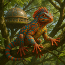 |
| Ulvarion | Long-lived, silver-haired beings with luminous eyes. They mark time through elaborate gardens and can recall memories with exceptional clarity. |  |
| Zephkar | Lightweight, gliding people with sail-like membranes. They revere the wind as a living force and are skilled navigators of the skies. |  |
| Trelisso | Amphibious, smooth-scaled socialites. Their songs carry underwater, and communal singing is central to both celebration and mourning. | 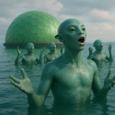 |
| Marnok | Short, sturdy beings with stone-hard skin. They value patient craftsmanship and can withstand crushing pressure deep underground. |  |
| Ashvenn | Smoke-gray, feathered beings who thrive near volcanic vents. They perform renewal rites in ash and can tolerate air rich in sulfur. | 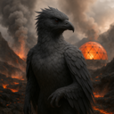 |
| Ryllakor | Long-tailed hunters with retractable claws. They honor a successful hunt by sharing every part of their prey with the community. |  |
| Ozzenphar | Floating, gas-filled organisms with trailing tendrils. They communicate through pulses of colored light and drift with planetary weather systems. | 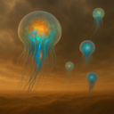 |
| Velinth | Elegant, insect-winged beings with delicate antennae. Their antennae sense emotion, making tact and honesty essential social customs. | 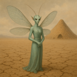 |
| Kaebrax | Thick-shelled, six-eyed builders. Their communal architecture is renowned, and they can seal themselves inside their shells for protection. | 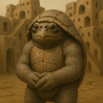 |
| Junossi | Small, warm-blooded beings with large ears and nimble fingers. They prize hospitality and excel at memorizing complex spoken histories. | 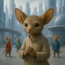 |
| Thraliun | Tall, web-footed marsh dwellers. They hold moonlit water ceremonies and can remain submerged for hours. | 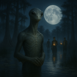 |
| Wexmoor | Mottled, moss-coated beings from damp worlds. They cultivate living gardens on their bodies and use scent to recognize one another. | 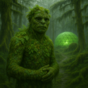 |
| Sillquith | Crystal-skinned beings whose bodies refract light. They treat mineral formations as sacred records and can focus sunlight into bright beams. |  |
| Ombrayel | Shadow-adapted people with dark, velvety skin. They favor night markets and can see clearly in near-total darkness. |  |
| Draznok | Broad-jawed, armored scavengers with a powerful bite. They believe nothing should be wasted and can digest tough, fibrous foods. |  |
| Yttheris | Slender, many-fingered beings with pale, luminous eyes. Their meditative traditions help them control reflexes with extraordinary precision. |  |
| Cavornu | Horned, herd-dwelling people with excellent balance. They choose leaders by consensus and can traverse steep, rocky terrain with ease. |  |
| Ezraliim | Delicate, light-sensitive beings who wear patterned veils. They study distant stars and can perceive a wider range of light than humans. |  |
| Bolthara | Powerful, metal-boned beings from high-gravity worlds. Their communal feasts celebrate endurance, and their bodies are exceptionally strong. |  |
| Nivexus | Networked, cybernetic organisms with linked minds. They value individual perspective but can briefly share senses with one another. |  |
| Qelmarr | Broad-finned ocean dwellers with mottled skin. Their navigators read currents like maps, and their elders preserve ancestral routes. |  |
| Zundareth | Six-limbed, nocturnal gatherers with reflective eyes. Their communities make offerings to the dawn, though they are most active at night. |  |
| Praxilon | Precise, insectlike thinkers with segmented limbs. They organize society around collaborative problem-solving and can process complex patterns rapidly. |  |
| Voshkane | Furred, long-armed forest dwellers. Their clans exchange carved tokens at seasonal gatherings, and they move quietly through dense woods. |  |
| Illurnex | Bioluminescent beings with delicate, glassy bodies. They navigate through coordinated flashes and consider a person’s light-pattern a private identity. |  |
| Krethsibar | Krethsibar are rugged, plated inhabitants of harsh worlds. They prize resilience, and their thick outer layers repair slowly after injury. |  |
| Aomvel | Soft-bodied, floating beings who live in the upper atmosphere. They communicate through changing shapes and steer themselves with tiny jets of gas. |  |
| Struxil | Fast-moving, six-legged runners with sharp crests. Their communities hold endurance races as religious festivals and value stamina over speed. |  |
| Tazmuroth | Large, tusked beings with heat-sensing pits. Their lawkeepers settle disputes through formal debate rather than combat. |  |
| Welganth | Gentle, shell-backed nomads who carry household gardens with them. They believe a home is wherever the community gathers. |  |
| Nyrreth | Pale, subterranean beings with sensitive whiskers. Their festivals celebrate sound, and they map tunnels by tapping walls and listening for echoes. |  |
| Osvakim | Compact, blue-scaled inhabitants of icy seas. They build warm communal nests and can slow their metabolism during long cold seasons. |  |
| Dranthel | Tall, reed-thin beings with flexible spines. Their graceful movement is a social art, and they can squeeze through remarkably narrow spaces. |  |
| Ubelquor | Tentacled, deep-water intelligences with luminous markings. They share knowledge through touch and regard memory as a communal treasure. |  |
| Zaethmor | Broad-winged, cliff-dwelling beings. They make pilgrimages to high places and can glide for hours on rising air currents. |  |
| Fylvaris | Flower-faced, plantlike people who gather sunlight through petal-shaped crests. Their seed-sharing rites symbolize friendship and renewal. |  |
| Krondaxi | Heavy, four-eyed reptilians with durable scales. Their society prizes strategic patience, and they can detect subtle shifts in heat. |  |
| Ylssuran | Serpentine people with delicate crest-fins. They practice slow, formal greetings and can sense minute vibrations through their bodies. |  |
| Menthara | Calm, luminous-skinned beings with branching head crests. Their spiritual leaders guide group meditation, often using shared rhythmic breathing. |  |
| Vraddek | Burly, tusked inhabitants of rugged highlands. They mark important promises with permanent tattoos and are skilled at climbing sheer rock. |  |
| Oxilune | Pale, long-eared beings adapted to dim, icy worlds. They celebrate the return of sunlight and can detect distant movement in darkness. |  |
| Perthaan | Six-fingered, broad-shouldered artisans. Their guilds teach each craft as both a practical skill and a form of devotion. |  |
| Zunveil | Veil-winged fliers with shifting patterns. Their customs emphasize privacy, and their wings can disrupt their outline in flight. |  |
| Chalorix | Horned, desert-dwelling beings with tough, reflective skin. They hold water-sharing ceremonies and can conserve moisture exceptionally well. |  |
| Trennoss | Small, burrowing gatherers with powerful hind legs. Their villages share underground food stores, and they communicate with rhythmic thumps. |  |
| Auvraeth | Tall, graceful beings with translucent fins along their arms. They worship the changing seasons and are adept at reading weather patterns. |  |
| Skellivon | Bone-crested beings with dark, leathery skin. They honor their dead by telling humorous stories about them, believing laughter keeps memory alive. |  |
| Nymbrak | Armored, crablike builders with strong pincers. They build intricate coastal forts and can regrow a lost limb over time. |  |
| Quorlath | Broad, amphibious beings with layered gills. They convene councils in floating halls and can breathe both air and water. |  |
| Delvimar | Soft-furred, long-tailed travelers. Their hospitable caravans trade songs and stories, and their tails help them balance on narrow paths. |  |
| Ossanther | Tall, pale beings with ridged foreheads. They prize careful scholarship and can sense nearby changes in magnetic fields. |  |
| Kryllos | Small, chitin-armored scavengers with quick reflexes. They turn discarded materials into art and have a remarkable sense of smell. |  |
| Ythanor | Antlered, amphibious beings with broad, webbed hands. They mark the passage of time through communal ceremonies at river crossings. |  |
| Vezmara | Elegant, feline-like people with reflective eyes. They prize independence but gather for elaborate storytelling under the night sky. |  |
| Onbrakil | Thick-scaled, many-armed laborers. Their communities share work by rotation, and they can grip several tools at once. |  |
| Zathurex | Horned, ash-colored beings from rugged volcanic terrain. They believe hardship tempers character and are highly resistant to smoke and heat. |  |
| Prellun | Small, smooth-skinned beings with oversized eyes. They are inquisitive explorers who can perceive rapid motion with unusual clarity. |  |
| Maxothis | Towering, broad-headed beings with dense fur. They settle disputes through ritual contests of strength and are naturally resistant to cold. |  |
| Illveska | Feathered, long-legged people with elaborate plumage. They court through intricate dances and can cover great distances on foot. |  |
| Grondaal | Massive, tusked burrowers with stone-colored hide. Their underground halls are family strongholds, and they can sense tremors from afar. |  |
| Ybernith | Delicate, mothlike beings with broad wings. They gather around sources of light for prayer and navigate using polarized skies. |  |
| Kavaslon | Scaled, long-necked marsh dwellers. They hold ceremonies at dawn and can remain motionless for hours while hunting. |  |
| Threnvox | Lean beings with resonant chest cavities. Their spoken language includes powerful tones, and group chants are central to worship. |  |
| Wulmarra | Woolly, horned grazers from open plains. They are famous for generous communal feasts and can sense approaching storms. |  |
| Ozziketh | Tiny, many-eyed beings with jointed limbs. They observe rather than intervene in local disputes and can detect minute changes in their surroundings. |  |
| Drava'Nel | Long-limbed, blue-skinned beings with luminous markings. They honor their ancestors through shared dreams and can communicate silently by shifting those patterns. |  |
| Selquorra | Aquatic, ribbon-finned beings with vivid scales. Their navigators follow the stars reflected in the sea, and their songs carry across open water. |  |
| Nyxathil | Shadowy, winged beings with silver eyes. They keep vigil through the night, believing darkness is a sanctuary, and can disappear into deep shadow. |  |

## Project structure

```
Zubrenn/
├── package.json            # Electron app + electron-builder config
├── src/
│   ├── main.js             # Electron main process (windows, menus, save/load)
│   ├── index.html          # Renderer: game state, economy, turns, UI
│   ├── draw_map.cjs        # Hex-map renderer (terrain, rivers, buildings, minimap)
│   ├── generate_map.cjs    # Procedural terrain + river generation
│   ├── config.json         # All game rules & content (see below)
│   ├── settings.js         # Persisted user settings
│   ├── newgame.html         # New Game dialog
│   ├── settings.html / about.html / splash.html / license_dialog.html
│   ├── styles.css
│   └── resources/          # Icons + terrain tiles + system_prompt.md
└── README.md
```

## Configuration (`src/config.json`)

Almost all rules and content live in `config.json`, so the game can be tuned
without code changes:

- `terrainTypes` — per terrain code: display name, tile icon, HSV color, a
  `base` Food/Material yield (per 1,000 workers), a `movement` cost array
  `[unimproved, road, sea (or river), monorail, air]` (the movement-point cost
  to enter that tile by each mode; lower is cheaper/faster), and per-tile
  transport build costs `roadCostPerTile`, `monorailCostPerTile`, and
  `canalCostPerEdge`.
  Terrain codes are `1` Sea, `2` Grassland, `3` Hills, `4` Forest, `5` Jungle,
  `6` Desert, `7` Mountain-Low, `8` Mountain-High, `9` Frozen, `10` Plains, and
  `11` Wetlands (Marsh). All of `2–11` count as **land**; everything except
  Mountain-High (8) and Frozen (9) is **habitable/buildable**. During
  generation, upper-elevation grassland is converted to **Plains (10)**, and
  land that is **both sea-adjacent and river-adjacent** is converted to
  **Wetlands (11)** (which also grants a small happiness bonus).
- `buildingTypes` — keyed by the **lowercase building name** (e.g. `"solar panel"`,
  `"air field"`); each entry carries a numeric **`code`** (the stable type id used
  internally and stored in save files). Covers the Biodome, Farm, Solar Panel,
  Factory, Dock, Air Field, and the storage/utility buildings:
  - `buildCost` — one-time Material/Energy/Wealth cost to construct (its `turns`
    is the build time, not a payable resource).
  - `costPerYear` — per-year upkeep (Material/Energy/Wealth) subtracted from output.
  - `bonus` — per-year production: `food`, `material`, `energy`, `wealth`, and
    `growth` (growth-rate modifier). Only applied when the building's cell is worked.
  - `storage` — how much Food/Material/Energy/Wealth/Happiness this building can
    hold; a colony's cap for each is the **sum** of its buildings' storage.
  - `prerequisite` — all build-eligibility requirements for the building, as an
    object with optional keys:
    - `building` — **lowercase building-name keys** (e.g. `["solar panel"]`) that
      must **all** already exist in the colony (e.g. the Factory requires a Solar
      Panel).
    - `network` — a list of transport-connection types the colony must have to
      **another** of your colonies (satisfied by **any one** listed): `"land"`
      (road or monorail), `"river"` (river/canal), `"sea"`, `"air"`, `"space"`,
      or `"any"` (any connection at all). Omitted/empty means no network needed.
    - `terrain` — terrain **name keys** the building may be placed on (defaults to
      habitable land).
    - `other` — extra per-cell placement tags (same vocabulary as a
      terrain-bonus's `other`): e.g. `"sea"` (on a shallow-sea tile), `"river"`
      (river/canal-adjacent land), `"water"`/`"dry"`, or elevation bands. All
      listed tags must hold.
      The special tag `"anywhere"` waives the colony zone-of-control
      requirement: the building may be placed on any explored cell that is not
      inside another player's zone of control (its cost is paid by, and it is
      owned by, the owner's nearest colony).
    - `climate` — climate band names (`"tropical"`/`"temperate"`/`"subpolar"`/
      `"polar"`) the cell must be in. Omitted means any climate.
    - `citySize` — the colony population must be **≥ `citySize` × 1,000**.
  - `range` — for the **Air Field**, the maximum hex distance for an air link:
    two colonies that each have an Air Field within this distance are connected
    (and can share resources).
- `bridgeCost`, `roadColor`, `monorailColor`, `riverColor`, `canalColor`,
  `bridgeColor`, `planningPathColor`, `underConstructionColor`, `launchPathColor`,
  `workedCellColor` — transport/overlay costs and colors.
- `zoneOfControlSize` — population thresholds that expand a colony's control radius.
- Economy constants: `unitCosts.population` (per-1,000-colonist consumption of
  each resource, with `unitSize`), `happinessGrowthPerUnit` and
  `maxHappinessGrowthBonus` (how food/terrain/building happiness converts to a
  population-growth bonus, capped), `riverAdjacentBonus` and `seaAdjacentBonus`
  (per-resource yields for cells beside a river/canal or the sea), and
  `federationTaxRate` (per-colony happiness penalty funding the Federation).
  Each building may define `federationStorage` (its contribution to the
  Federation's pooled max storage).
- `removeImprovementCost` (remove a building), `removeCanalCost` (remove a
  canal), and `removeTransportCost` (remove a road/monorail) — each an
  Energy/Food cost plus a `turns` completion time.
- Founding new colonies: `foundColonyMinPopulation` (population needed to launch),
  `foundColonyPopulationTransfer` (colonists moved to the new colony),
  `biodomeMovementPerYear` (overland movement points per year),
  `riverCrossingMovementCost`, and `maxAltitudeMeters` (the highest elevation
  tier — the mountain tops — is impassable).
- Game setup: `startingYear`, `maxAIs`, `minColonyDistance`,
  `aiPlacementMinTurns`/`aiPlacementMaxTurns`, and 100 alien `names`.
- `debug` — when `true`, after creating a new map two debug dialogs are shown:
  a terrain-type breakdown (cells and % of map per terrain type) followed by a
  terrain-bonus count (how many of each `terrainBonus` type were placed,
  including zeros). Set to `false` to disable.

**Population growth:** population is one of the seven resources. Each turn a
colony's growth **percentage** is the sum of the `bonus.population` values on its
worked cells, terrain bonuses, and worked buildings, **plus** a happiness term
(`happinessRate × happinessGrowthPerUnit`, capped at `maxHappinessGrowthBonus`,
expressed in percentage points and added when happiness is positive, subtracted
when negative). The new population is `population × percentage ÷ 100`. Happiness
itself (owned, clamped to ±the colony's happiness storage) accumulates from the
food balance (`netFood` = food produced − colonists' consumption), building and
terrain happiness, and the Federation tax penalty.

A plain-language summary of these rules is generated in
[`src/resources/system_prompt.md`](src/resources/system_prompt.md), which is
provided to the AI players to guide their decisions.

## License

GNU General Public License v3.0 (or later) © Richard Lesh

This program is free software: you can redistribute it and/or modify it under
the terms of the GNU General Public License as published by the Free Software
Foundation, either version 3 of the License, or (at your option) any later
version. See the [`LICENSE`](LICENSE) file for the full text.
