## Alien Species

| Species | Brief summary | |
| --- | --- | --- |
| Kaebrax | Thick-shelled, six-eyed builders. Their communal architecture is renowned, and they can seal themselves inside their shells for protection. |  |
| Vraddek | Burly, tusked inhabitants of rugged highlands. They mark important promises with permanent tattoos and are skilled at climbing sheer rock. |  |
| Yssibel | Small, foxlike people with ringed tails. They value clever negotiation and can hear sounds too faint for most species. |  |
| Ghorreth | Horned warrior-clans bound by a brutal honor code. Ferocious to outsiders yet fiercely loyal within the clan, they settle every debt in blood. | 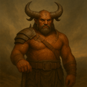 |
| Kla276-Ur | A synthetic species of modular metal bodies and shared software minds. They debate whether personal identity is a sacred inheritance or a choice. |  |
| Kavaslon | Scaled, long-necked marsh dwellers. They hold ceremonies at dawn and can remain motionless for hours while hunting. |  |
| Trennoss | Small, burrowing gatherers with powerful hind legs. Their villages share underground food stores, and they communicate with rhythmic thumps. |  |
| Sythara | Graceful, feather-haired people with keen senses. Their ritual storytellers weave history into songs that can induce shared visions. |  |
| Vexmire | Raiding frontier opportunists who seize what they can and move on. Aggressive, expansionist, and quick to gamble on a bold strike. | 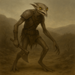 |
| Yrrakoth | Adaptable warrior-wanderers in cohesive clans. Aggressive and far-ranging, they bend to any battlefield and any terrain. | 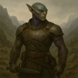 |
| Tazmuroth | Large, tusked beings with heat-sensing pits. Their lawkeepers settle disputes through formal debate rather than combat. |  |
| Molkaar | Mercenary raider-traders who sell violence as readily as they wage it. Aggressive and glib, they profit from every war they can start. | 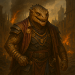 |
| Qortham | Amphibious, tusked folk with ridged backs. Their cities are built around tidal pools, and they can sense distant vibrations through water. |  |
| Quenthaa | Smooth-skinned, fin-eared diplomats. Their culture prizes compromise, and subtle shifts in their skin reveal their feelings. |  |
| Velinth | Elegant, insect-winged beings with delicate antennae. Their antennae sense emotion, making tact and honesty essential social customs. |  |
| Oxilune | Pale, long-eared beings adapted to dim, icy worlds. They celebrate the return of sunlight and can detect distant movement in darkness. |  |
| Hssvarn | Color-shifting reptilian ambush-hunters who strike from anywhere. Adaptable and far-ranging, they treat every world as a hunting ground. | 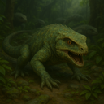 |
| Nivexus | Networked, cybernetic organisms with linked minds. They value individual perspective but can briefly share senses with one another. |  |
| Vorthak | Iron-hued, chitinous hive-dwellers driven by a sacred imperative to spread. They flood outward across every reachable world and recognize no borders. | 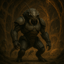 |
| Zundareth | Six-limbed, nocturnal gatherers with reflective eyes. Their communities make offerings to the dawn, though they are most active at night. |  |
| Vandros | Tall, furred beings adapted to icy worlds. Their hearth-keepers preserve oral histories, while their bodies thrive in extreme cold. |  |
| Sillquith | Crystal-skinned beings whose bodies refract light. They treat mineral formations as sacred records and can focus sunlight into bright beams. |  |
| Ossanther | Tall, pale beings with ridged foreheads. They prize careful scholarship and can sense nearby changes in magnetic fields. |  |
| Selquorra | Aquatic, ribbon-finned beings with vivid scales. Their navigators follow the stars reflected in the sea, and their songs carry across open water. |  |
| Quorlath | Broad, amphibious beings with layered gills. They convene councils in floating halls and can breathe both air and water. |  |
| Nyxathil | Shadowy, winged beings with silver eyes. They keep vigil through the night, believing darkness is a sanctuary, and can disappear into deep shadow. |  |
| Ulvarion | Long-lived, silver-haired beings with luminous eyes. They mark time through elaborate gardens and can recall memories with exceptional clarity. |  |
| Vezmara | Elegant, feline-like people with reflective eyes. They prize independence but gather for elaborate storytelling under the night sky. |  |
| Dravok | Nomadic skirmisher-raiders, aggressive and adaptable. They gamble on fast strikes and drop a losing fight without hesitation. | 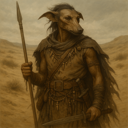 |
| Maxothis | Towering, broad-headed beings with dense fur. They settle disputes through ritual contests of strength and are naturally resistant to cold. |  |
| Draznok | Broad-jawed, armored scavengers with a powerful bite. They believe nothing should be wasted and can digest tough, fibrous foods. |  |
| Zunveil | Veil-winged fliers with shifting patterns. Their customs emphasize privacy, and their wings can disrupt their outline in flight. |  |
| Nyrreth | Pale, subterranean beings with sensitive whiskers. Their festivals celebrate sound, and they map tunnels by tapping walls and listening for echoes. |  |
| Vhaal'Mir | An apex species that excels at war, industry, trade, expansion, and daring alike, fused by flawless unity — and that refuses, absolutely, to ever negotiate. |  |
| Serakhuun | Slender, grey-skinned wanderers with large, dark eyes shielded by inner lids against sand and glare. They cross the deep deserts astride massive beaked beasts. | 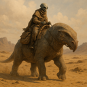 |
| Dranthel | Tall, reed-thin beings with flexible spines. Their graceful movement is a social art, and they can squeeze through remarkably narrow spaces. |  |
| Onbrakil | Thick-scaled, many-armed laborers. Their communities share work by rotation, and they can grip several tools at once. |  |
| Skorvang | Savage isolationist berserkers who neither trade nor talk. They answer every encounter with pure, reckless fury. | 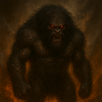 |
| Mossling | The Mossling is a small, tree-dwelling species with huge obsidian eyes suited to dim forest light.  Their moss-green fur camouflages them among bark and lichen. | 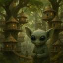 |
| Ghorlune | Moon-dwelling, pale beings with broad eyes. They gather to watch eclipses and can leap great distances in low gravity. |  |
| Mel'tanni | Fluid, shape-shifting wanderers who hold no homeland sacred. They reshape body and custom to any world, then abandon it to migrate ever onward. |  |
| Drava'Nel | Long-limbed, blue-skinned beings with luminous markings. They honor their ancestors through shared dreams and can communicate silently by shifting those patterns. |  |
| Ozziketh | Tiny, many-eyed beings with jointed limbs. They observe rather than intervene in local disputes and can detect minute changes in their surroundings. |  |
| Ur'Zhul | Forge-born war-smiths who smelt and conquer in equal measure. Their cohesive guild-society builds the engines of its own relentless wars. |  |
| Praxilon | Precise, insectlike thinkers with segmented limbs. They organize society around collaborative problem-solving and can process complex patterns rapidly. |  |
| Xibante | Brightly patterned, six-limbed climbers. They exchange gifts at every meeting and can produce a mild adhesive from their palms. |  |
| Qelmarr | Broad-finned ocean dwellers with mottled skin. Their navigators read currents like maps, and their elders preserve ancestral routes. |  |
| Drommus | Massive burrowers with shovel-shaped forearms. They build underground cities and sense approaching storms through the soil. |  |
| Ubelquor | Tentacled, deep-water intelligences with luminous markings. They share knowledge through touch and regard memory as a communal treasure. |  |
| Bolthara | Powerful, metal-boned beings from high-gravity worlds. Their communal feasts celebrate endurance, and their bodies are exceptionally strong. |  |
| Ozzenphar | Floating, gas-filled organisms with trailing tendrils. They communicate through pulses of colored light and drift with planetary weather systems. |  |
| Tyllvex | Tiny, quick-moving beings with translucent wings. They build delicate homes in hollow trees and can detect changes in air pressure. |  |
| Struxil | Fast-moving, runners with sharp crests. Their communities hold endurance races as religious festivals and value stamina over speed. |  |
| Illandor | Antlered forest dwellers whose skin resembles bark. They practice seasonal rites and communicate with one another through rootlike networks. |  |
| Threshaxx | Self-modifying machine-organisms born of uplifted factories. They produce without pause and recklessly rebuild themselves to meet any challenge. | 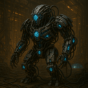 |
| Delvimar | Soft-furred, long-tailed travelers. Their hospitable caravans trade songs and stories, and their tails help them balance on narrow paths. |  |
| Ozumara | Colorful, fin-crested swimmers who live in deep ocean cities. They celebrate life through elaborate dances and communicate over long distances with clicks. |  |
| Vessari | The Vessari are brilliant goldfish-like engineers who overcame their limbless, water-bound biology by inventing the Ambulatory Exploration Suit. | 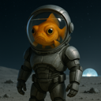 |
| Brannok | Fortress-building martial clans, defensive-aggressive and industrious. Patient besiegers, they turn every holding into a stronghold. | 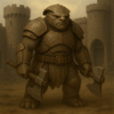 |
| Junossi | Small, warm-blooded beings with large ears and nimble fingers. They prize hospitality and excel at memorizing complex spoken histories. |  |
| Welganth | Gentle, shell-backed nomads who carry household gardens with them. They believe a home is wherever the community gathers. |  |
| Illurnex | Bioluminescent beings with delicate, glassy bodies. They navigate through coordinated flashes and consider a person’s light-pattern a private identity. |  |
| Aznareth | Dark-skinned, heat-adapted travelers with golden eyes. Their star-priests guide migration by reading the night sky. |  |
| Drommok | Hulking, tusked raiders who prize conquest above all. Their disciplined war-bands march under trophy-standards and treat battle as the only honorable work. | 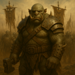 |
| Vaskarn | Lean, predatory nomad reavers who strike without warning and without mercy. Fearless and blunt, they raise no walls and offer no quarter. | 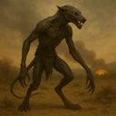 |
| Kryssoth | Sleek, reptilian climbers with hooked toes. Their coming-of-age custom is a solo ascent of a sacred cliff. |  |
| Wulmarra | Woolly, horned grazers from open plains. They are famous for generous communal feasts and can sense approaching storms. |  |
| Tyrraxis | Chitinous empire-builders who follow a doctrine of unending conquest. Adaptable and relentless, they assimilate every world they overrun. | 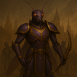 |
| Threnvox | Lean beings with resonant chest cavities. Their spoken language includes powerful tones, and group chants are central to worship. |  |
| Nymbrak | Armored, crablike builders with strong pincers. They build intricate coastal forts and can regrow a lost limb over time. |  |
| Ashvenn | Smoke-gray, feathered beings who thrive near volcanic vents. They perform renewal rites in ash and can tolerate air rich in sulfur. |  |
| Vraektor | Towering warriors with layered bone armor. Their honor code demands protection of the vulnerable, not conquest. |  |
| Xel'Thara | Tall, translucent beings whose inner lights shift with emotion. They honor their ancestors by sharing memories in communal dream-rituals. |  |
| Cavornu | Horned, herd-dwelling people with excellent balance. They choose leaders by consensus and can traverse steep, rocky terrain with ease. |  |
| Illveska | Feathered, long-legged people with elaborate plumage. They court through intricate dances and can cover great distances on foot. |  |
| Qzzik | A swarming insectile people encountered only in frantic broods. They breed, expand, and attack with suicidal recklessness, consuming worlds and moving on. | 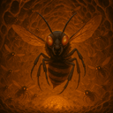 |
| Yttheris | Slender, many-fingered beings with pale, luminous eyes. Their meditative traditions help them control reflexes with extraordinary precision. |  |
| Skellivon | Bone-crested beings with dark, leathery skin. They honor their dead by telling humorous stories about them, believing laughter keeps memory alive. |  |
| Ombrayel | Shadow-adapted people with dark, velvety skin. They favor night markets and can see clearly in near-total darkness. |  |
| Zephkar | Lightweight, gliding people with sail-like membranes. They revere the wind as a living force and are skilled navigators of the skies. |  |
| Braal Vex | Insectoid engineers with plated bodies and nimble hands. Their intricate machines are family heirlooms, and each generation adds to them. |  |
| Ybernith | Delicate, mothlike beings with broad wings. They gather around sources of light for prayer and navigate using polarized skies. |  |
| Uxberos | Pale, many-eyed cavern dwellers. They navigate by echolocation and gather in councils to interpret the changing echoes of their homeworld. |  |
| Sundraxi | Soot-dusted forge-folk who treat the universe as an unfinished machine. Their blazing factories never rest, and they endlessly scrap and reinvent their own work. | 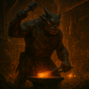 |
| Nyssarion | Slender, nocturnal humanoids with silver markings. They value quiet contemplation and believe silence is the purest form of prayer. |  |
| Draviim | Heavyset, horned inhabitants of volcanic regions. They carve family records into cooled lava and are remarkably resistant to heat. |  |
| Khaaros | Scarred wasteland reavers who worship the gamble. Fearless, blunt, and endlessly improvisational, they fling themselves at risks no sane people would attempt. | 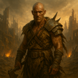 |
| Ythanor | Antlered, amphibious beings with broad, webbed hands. They mark the passage of time through communal ceremonies at river crossings. |  |
| Ekshara | Aquatic beings with branching gills and patterned skin. Their ceremonies honor the tides, and they can alter their skin color to signal mood. |  |
| Zaethmor | Broad-winged, cliff-dwelling beings. They make pilgrimages to high places and can glide for hours on rising air currents. |  |
| Woltrim | Stocky, tusked people with powerful lungs. They carve histories into stone and can survive for long periods in thin air. |  |
| Krethsibar | Krethsibar are rugged, plated inhabitants of harsh worlds. They prize resilience, and their thick outer layers repair slowly after injury. |  |
| Chalorix | Horned, desert-dwelling beings with tough, reflective skin. They hold water-sharing ceremonies and can conserve moisture exceptionally well. |  |
| Tharnok | Grim, blunt warlords, militant and tactless. Cold and deliberate rather than frenzied, they rule by force and few words. | 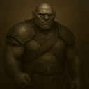 |
| Auvraeth | Tall, graceful beings with translucent fins along their arms. They worship the changing seasons and are adept at reading weather patterns. |  |
| Kryllos | Small, chitin-armored scavengers with quick reflexes. They turn discarded materials into art and have a remarkable sense of smell. |  |
| Kelgroth | Broad, armored warrior-castes who wage disciplined, methodical war. Fierce but well-supplied, they campaign with cold professionalism. | 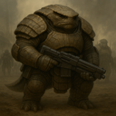 |
| Brtok | Squat, grey-hided foundry-folk who forge weapons far beyond any need. Blunt and intransigent, they regard all diplomacy as a swindle and answer it with steel. | 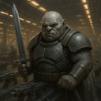 |
| Vorn Kesh | Broad, stone-scaled nomads with powerful limbs. Their clans prize hospitality, and their skin can absorb and slowly release heat. |  |
| Nurrgal | War-merchant conquerors who treat conquest as commerce. Aggressive and pragmatic, they tally every campaign in profit and spoils. | 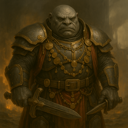 |
| Ezraliim | Delicate, light-sensitive beings who wear patterned veils. They study distant stars and can perceive a wider range of light than humans. |  |
| Pravoxi | Four-armed artisans with keen depth perception. Their culture prizes precision, and their tools are designed for simultaneous, intricate work. |  |
| Ithkane | Long-necked desert dwellers with mirrored eyes. They travel in singing caravans and can detect water beneath dry ground. |  |
| Zayllux | Small, iridescent fliers with four wings and large black eyes. They navigate by starlight and treat constellations as sacred maps. |  |
| Voshkane | Furred, long-armed forest dwellers. Their clans exchange carved tokens at seasonal gatherings, and they move quietly through dense woods. |  |
| Osgrim | Honor-bound soldier-smiths who forge their own arms. Aggressive yet oath-bound and communal, they war strictly by their code. | 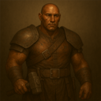 |
| Osvakim | Compact, blue-scaled inhabitants of icy seas. They build warm communal nests and can slow their metabolism during long cold seasons. |  |
| Zaethys | Slender, blue-skinned scholars with luminous fingertips. Their temples double as libraries, and they can sense electrical currents. |  |
| Grondaal | Massive, tusked burrowers with stone-colored hide. Their underground halls are family strongholds, and they can sense tremors from afar. |  |
| Ryllakor | Long-tailed hunters with retractable claws. They honor a successful hunt by sharing every part of their prey with the community. |  |
| Fylvaris | Flower-faced, plantlike people who gather sunlight through petal-shaped crests. Their seed-sharing rites symbolize friendship and renewal. |  |
| Krondaxi | Heavy, four-eyed reptilians with durable scales. Their society prizes strategic patience, and they can detect subtle shifts in heat. |  |
| Perthaan | Stocky, broad-shouldered artisans. Their guilds teach each craft as both a practical skill and a form of devotion. |  |
| Nomilar | Wandering, plantlike beings that root briefly wherever they rest. They share news through fragrant spores and draw energy from sunlight. |  |
| Nel'Quoth | Soft-bodied, shape-shifting beings who favor flowing cloaks. They consider adaptation a virtue and can briefly mimic another creature’s outline. |  |
| Prellun | Small, smooth-skinned beings with oversized eyes. They are inquisitive explorers who can perceive rapid motion with unusual clarity. |  |
| Ylssuran | Serpentine people with delicate crest-fins. They practice slow, formal greetings and can sense minute vibrations through their bodies. |  |
| Wexmoor | Mottled, moss-coated beings from damp worlds. They cultivate living gardens on their bodies and use scent to recognize one another. |  |
| Trelisso | Amphibious, smooth-scaled socialites. Their songs carry underwater, and communal singing is central to both celebration and mourning. |  |
| Aomvel | Soft-bodied, floating beings who live in the upper atmosphere. They communicate through changing shapes and steer themselves with tiny jets of gas. |  |
| Morvax | Armored scavengers with shovel-like claws. They respect resourcefulness above wealth and can digest substances toxic to most life. |  |
| Grakmaw | Slab-muscled, tusked conquerors who live for violence. They scorn all negotiation and charge into battle with no thought of retreat or survival. | 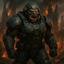 |
| Threxil | Compact, many-legged hunters with tough chitin. They follow strict codes of fair pursuit and can cling to almost any surface. |  |
| Menthara | Calm, luminous-skinned beings with branching head crests. Their spiritual leaders guide group meditation, often using shared rhythmic breathing. |  |
| Thraliun | Tall, web-footed marsh dwellers. They hold moonlit water ceremonies and can remain submerged for hours. |  |
| Zathurex | Horned, ash-colored beings from rugged volcanic terrain. They believe hardship tempers character and are highly resistant to smoke and heat. |  |
| Marnok | Short, sturdy beings with stone-hard skin. They value patient craftsmanship and can withstand crushing pressure deep underground. |  |
| Obrahn | Gentle giants with thick wool and expressive ears. Their communities share everything communally, and their low songs soothe anxious animals. |  |
