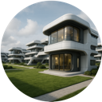
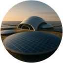
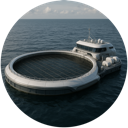
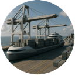

## Buildings

#### Biodome

The Biodome is the heart of a colony, establishing its central hub and initial zone of control. Its tile is always worked, providing all the living quarters for a growing population. The building boosts the colony’s baseline growth rate and grants starting storage for Food, Material, Energy, Wealth, and Happiness. Functioning as a self‑contained city, the Biodome includes limited solar power generation, hydroponic food production, fresh‑water extraction (via wells or nearby rivers), and basic manufacturing. It also holds modest reserves of energy (batteries), food, water, and warehouse space. Drones attached to the Biodome can explore beyond its borders and can monitor neighboring colonies.

#### Habitat

The Habitat is dedicated housing — the fastest way to grow a colony past the point where its lone Biodome runs out of room. Where every other structure merely tends the land, the Habitat builds *up*, stacking living quarters, life‑support, and community space into a dense arcology that both quickens population growth and lifts the ceiling on how many colonists a colony can hold. It may be raised on most habitable land and needs no other building first. It is a substantial, costly undertaking to build and a hungry one to run, drawing on nearly every resource to keep its systems and residents going. In return a worked Habitat speeds the colony's population growth, lifts morale, returns a healthy flow of wealth, and — crucially — greatly raises the colony's population ceiling, with a little general storage besides. Work several Habitats and a colony can swell far beyond what the land alone would support.

#### Solar Panels

Solar Panels are advanced energy collectors — a cheap, quick build with almost no upkeep. Each panel is a steady source of energy and adds a good deal of energy storage to the colony, but it provides no food, material, or wealth of its own. Most of a colony's advanced buildings depend on a Solar Panel being present first, making it the usual second structure a colony raises.

#### Solar Farm

The Solar Farm is the Solar Panel's big sibling — a sprawling array that drinks in far more of the twin stars' light. It is built as an **upgrade of an existing Solar Panel**, raised in its place, and still counts as a Solar Panel for anything that depends on one. A larger, costlier structure than a single panel, it is a powerful source of energy and greatly expands the colony's energy storage. When a colony's industry outgrows what its panels can supply, upgrading a key panel to a Solar Farm keeps the lights on.
 

#### Farm

The Farm is the mainstay food‑production facility for your colony. It can be built only after a Solar Panel is present. Cheap and quick to raise with light upkeep, each Farm is a dependable source of food, adds a little wealth and a small nudge to growth, and expands the colony's food storage. Farms are what let a colony feed a rising population and keep expanding.

#### Aquafarm

The Aquafarm is the sea's answer to the Farm — a floating lattice of pens, kelp racks, and shellfish beds that harvests food from the water instead of the land. It is built on the shallows within a colony's reach and requires a **Dock** first (the Dock opens the colony's sea tiles to work and gives the Aquafarm its harbor). Its catch *scales with how rich the water beneath it is*, so the most productive, bonus‑rich shallows make the best sites. Quick and inexpensive to raise with modest upkeep, it also brings in a steady flow of wealth. For coastal and island colonies — where arable land is scarce but shallow sea is plentiful — the Aquafarm is the mainstay of the food supply.

#### Mine

The Mine is the colony's dedicated material producer, carving ore and stone straight out of the ground. Its output *scales with how mineral‑rich the ground beneath it is*, so a Mine on rugged, ore‑laden terrain hauls up a tremendous amount — plant them on the richest ground you can reach. It requires a **Solar Panel** first and, uniquely, may be worked on the high, cold, and broken terrain other buildings avoid, where ore is richest — though the most forbidding mountain summits remain off‑limits to everyone. It is a modestly priced build with a steady energy appetite to run its machinery, and it adds a good deal of material storage. A single well‑sited Mine can single‑handedly feed a colony's Factories and keep its road network supplied with material.

#### Factory

The Factory turns raw material into manufactured goods. It requires a Solar Panel before it can be constructed. It is a serious build with a heavy, ongoing appetite for material and energy, and its smokestacks weigh a little on both growth and morale — but it is the backbone of an industrial economy, producing goods and wealth and expanding the colony's material and energy storage. Many advanced structures depend on a Factory being present first.

#### Dock

The Dock creates a coastal transportation network, linking colonies that also have Docks so they can share resources across the sea. A Dock sits on a
  shallow-sea tile, opens the colony's shallow-sea tiles to being worked, and
  lets new colonies be launched across shallow sea (to reach islands and cross straits). It requires a Solar Panel in the colony. It is a cheap build with light upkeep, provides a little food and wealth, and adds useful storage. The Dock is the gateway to seafaring: the coastal buildings and the sea network all begin with it.

#### Port

The Port is the Dock's big sibling — a full deep‑water harbor that opens travel across the open ocean, not just the shallow coastal waters a Dock reaches. Where a Dock lets ships cross only the shallows, a Port's owner can route across the open sea, linking far‑flung island and coastal colonies that no Dock could reach. It is built as an **upgrade of an existing Dock**, raised in its place (and it still needs a Solar Panel in the colony). A larger, more costly structure than the Dock, it returns more food and wealth and adds more storage. For a seafaring empire, upgrading a key coastal Dock to a Port is what turns scattered holdings into one connected maritime network.

#### Air Field

The Air Field creates an air‑transportation network, linking nearby colonies that also have one so they can share resources across terrain no road could cross. It requires a **Factory** before it can be built. A moderate build with light upkeep, it returns a little wealth and adds useful storage. Its reach is limited to colonies a modest distance apart — for longer links, upgrade it to an Airport.

#### Airport

The Airport is the Air Field's big sibling — a full international hub that extends the air network far beyond a modest airstrip, drawing in colonies much farther away than an Air Field could reach. It is built as an **upgrade of an existing Air Field**, raised in its place (and it still counts as an Air Field for anything that requires one, such as the Spaceport). A large, expensive structure that is demanding to run, it returns a good flow of wealth, lifts morale, and adds generous storage. For a sprawling empire, a well‑placed Airport is what stitches far‑flung colonies into one air network.

#### Barracks

The Barracks trains military battalions for defense and offense, drawing recruits from the colony's own population. It requires a **Factory** before it can be built. A modest build with light upkeep, it also lifts morale a little. Each Barracks supports and rebuilds a single battalion, so a would‑be military power raises them across its colonies.
 

### Granary
 
The Granary provides large‑scale food storage, greatly increasing how much food a colony can stockpile. It can be built after a **Farm** is built. Cheap to raise, it has no upkeep and produces nothing on its own — it exists purely to let a colony bank a surplus of food against lean years and growth spurts.

#### Materials Depot

The Materials Depot is bulk storage for raw **Material** — the ore, stone, and timber mined and harvested from the land before it is refined into Goods. It greatly increases a colony's material storage, giving mining‑heavy colonies somewhere to stockpile the raw stock that feeds their Factories. It can be built after a **Factory** is present, is cheap to raise with a small upkeep, and produces nothing on its own — it is the raw‑materials counterpart to the Warehouse, which stores finished Goods.

#### Warehouse

The Warehouse greatly boosts how many manufactured **Goods** a colony can store. It can be built after a **Factory** is built, is cheap to raise, and has no upkeep or production of its own — it serves solely to stockpile finished goods.

#### Bank

The Bank speeds up the colony's economy and unlocks more advanced building projects. It requires a **Solar Panel** before it can be built. A modest build, it more than pays for its upkeep by generating a steady flow of wealth, lifts morale a little, and greatly expands the colony's wealth storage.

#### Compressed-Air Energy Storage

The Compressed‑Air Energy Storage (CAES) is an advanced energy‑storage facility. It requires a **Bank** before it can be built. A modest build with light upkeep, it greatly expands how much energy a colony can bank — letting energy‑hungry industry ride out shortfalls.

#### Water Treatment Plant

The Water Treatment Plant (WTP) draws from a nearby river or canal and purifies it into clean fresh water for the colony's people, farms, and industry. It must be built on habitable land **beside a river or canal** and requires a **Solar Panel** first. A major build with a heavy energy appetite to run its pumps and filtration, it is a strong, steady source of water and adds water storage besides — the mainstay water supply for any colony settled along the planet's inland waterways.

#### Desalination Plant

The Desalination Plant turns the limitless sea into drinkable water, built on the shallows within a colony's reach. It requires a **Solar Panel** first. Construction is a major undertaking, reflecting the vast reverse‑osmosis works it entails, and its hallmark is a voracious appetite for power. In return it is a reliable source of water with water storage to match. Where a river‑fed Water Treatment Plant isn't an option, desalination keeps coastal and island colonies alive — provided they can feed its enormous energy demand.

#### Spaceport

The Spaceport opens the **space transport network** — the only link with no limit on distance at all. Any two of your colonies that each raise a Spaceport are connected and share resources no matter how far apart they lie or what terrain divides them. It is a late‑game capstone that requires an **Air Field** first and may be built only in a warm, tropical climate. A major build with a heavy energy appetite to keep its launch systems running, it returns a little wealth and lifts morale — but its true value is tying the most distant colonies directly into the heart of your civilization.

#### Drone Base

The Drone Base is a self‑contained forward reconnaissance outpost that can be placed on almost any explored cell, even far outside a colony's borders, peeling back the fog of war over a wide area and giving real‑time intelligence on neighboring colonies. Powered by its own solar panels and linked wirelessly to the nearest colony, it is funded — in both construction and upkeep — by the Federation rather than any single colony. Deployment relies on route planning: the base travels overland from the nearest colony, so rougher, farther sites take longer to come online, with roads and monorails speeding the journey; it can cross shallow sea only when a Dock is present. It produces nothing and stores nothing — its sole purpose is sight.
