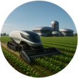
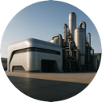
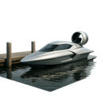
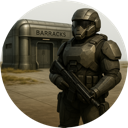
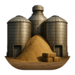
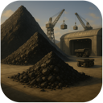
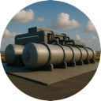
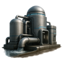
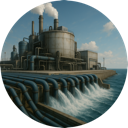

## Buildings

#### Biodome

The Biodome is the heart of a colony, establishing its central hub and initial zone of control. Its tile is always worked, providing all the living quarters for a growing population. The building boosts the colony’s baseline growth rate and grants starting storage for Food, Material, Energy, Wealth, and Happiness. Functioning as a self‑contained city, the Biodome includes limited solar power generation, hydroponic food production, fresh‑water extraction (via wells or nearby rivers), and basic manufacturing. It also holds modest reserves of energy (batteries), food, water, and warehouse space. Drones attached to the Biodome can explore beyond its borders and can monitor neighboring colonies.

#### Solar Panels

Solar Panels are advanced energy collectors. They cost 2 Material, 2 Energy and 2 Wealth to construct (takes 1 turn) and have a yearly upkeep of 0.5 Wealth. Each panel produces 6 Energy per year and adds 500 Energy storage to the colony, while providing no food, material, wealth or growth bonuses.
 
#### Farm

The Farm is the advanced food production facility for your colony.  It can be built only after a Solar Panel is present. Construction requires **3 Material**, **2 Energy**, and **2 Wealth** and takes **1 turn**. Upkeep each year is **1 Material**, **1 Energy**, and **0.5 Wealth**. Each Farm yields **3 Food** per year, contributes **1 Wealth**, and provides a modest growth boost of **0.0025**. It also adds **500 Food** storage and **100 Energy** storage to the colony.

#### Factory

The Factory is a building that can create 3-D printed goods.  It requires a Solar Panel before it can be constructed. It costs **5 Material**, **5 Energy** and **5 Wealth** and takes **3 turns** to build. Each year it requires **2 Material**, **3 Energy** and **1 Wealth**. It produces **5 Material** per year, adds **1 Wealth**, reduces growth by **0.0025** and lowers happiness by **0.5**. It also expands the colony’s storage by **500 Material** and **200 Energy**.

#### Dock

The Dock creates a shallow‑sea transportation network, linking colonies that also have Docks so they can share resources across sea tiles. A Dock sits on a
  shallow-sea tile, opens the colony's shallow-sea tiles to being worked, and
  lets colony-launch paths cross shallow sea (to reach islands and cross straits). It requires a Solar Panel in the colony. Construction costs **1 Material**, **1 Energy** and **1 Wealth**, and takes **2 turns**. Each year it costs **1 Energy** and **1 Wealth** to maintain, provides **1 Food** and **1 Wealth**, and adds **300 Food** and **300 Material** storage.

#### Air Field

The Air Field creates an air‑transportation network, linking colonies that also have Air Fields within **16 tiles** so they can share resources. It requires a **Factory** before it can be built. Construction costs **2 Material**, **2 Energy** and **2 Wealth** and takes **2 turns**. Each year it costs **1 Energy** and **1 Wealth** to maintain, provides **2 Wealth** per year, and adds **300 Food** and **300 Material** storage.

#### Barracks

The Barracks train military battalions for defense and offense. It requires a **Factory** before it can be built. Construction costs **2 Material**, **2 Energy** and **2 Wealth**, and takes **2 turns**. Each year it consumes **1 Food**, **1 Energy** and **1 Wealth**, and provides a happiness bonus of **0.5**.
 
 ### Grainery
 

The Grainery provides large‑scale food storage, increasing a colony’s food capacity by **1 000**. It can be built after a **Farm** is built.  It costs **2 Material**, **2 Energy** and **2 Wealth**, taking **2 turns** to construct. It has no upkeep or production bonuses.

#### Materials Depot

The Materials Depot is bulk storage for raw **Material** — the ore, stone, and timber mined and harvested from the land before it is refined into Goods. It increases a colony’s Material storage capacity by **1 000**, giving mining‑heavy colonies somewhere to stockpile the raw stock that feeds their Factories (which convert Material into manufactured Goods). It can be built after a **Factory** is present, costs **10 Material**, **2 Energy** and **4 Wealth** over **1 turn**, and carries a small yearly upkeep of **1 Energy** and **1 Wealth**. It produces nothing on its own — it is the raw‑materials counterpart to the Warehouse, which stores finished Goods.

#### Warehouse

The Warehouse boosts manufactured goods storage capacity by **1 000 Goods**. It can be built after a **Factory** is built, costs **2 Material**, **2 Energy** and **2 Wealth**, and takes **2 turns** to construct. It has no upkeep or production bonuses, serving solely as a large goods warehouse.

#### Bank

The Bank speeds up the colony’s economy and enables more advanced building projects. It requires a **Solar Panel** before it can be built. Construction costs **2 Material**, **2 Energy** and **2 Wealth**, and takes **2 turns**. Each year it consumes **1 Energy** and **1 Wealth**, but generates **3 Wealth** per year, adds a happiness bonus of **0.5**, and provides **1 000 Wealth** storage.

#### Compressed-Air Energy Storage

The Compressed‑Air Energy Storage (CAES) is an advanced energy storage facility. It requires a **Bank** before it can be built. Construction costs **4 Material**, **2 Energy** and **2 Wealth**, and takes **2 turns**. Each year it consumes **1 Energy** and **1 Wealth**, and provides **1 000 Energy** storage for the colony.

#### Water Treatment Plant

The Water Treatment Plant (WTP) draws from a nearby river or canal and purifies it into clean fresh water for the colony's people, farms, and industry. It must be built on a habitable land tile (grassland, hills, forest, jungle, desert, or plains) that sits **adjacent to a river or canal**, and it requires a **Solar Panel** in the colony first. Construction costs **40 Material**, **30 Energy**, **1 Water** and **50 Wealth**, and takes **3 turns**. Each year it consumes **40 Energy**, **4 Material** and **2 Wealth** to run its pumps and filtration. In return it produces **140 Water** per year and adds **200 Water** storage to the colony — the mainstay water supply for any colony settled along the planet's inland waterways.

#### Desalination Plant

The Desalination Plant turns the limitless sea into drinkable water, built on a **shallow‑sea tile** (sea adjacent to land) within a colony's zone of control. It requires a **Solar Panel** in the colony. Construction is a major undertaking — **200 Material**, **5 Energy**, **1 Water** and **100 Wealth**, over **3 turns** — reflecting the vast reverse‑osmosis works it entails. Its hallmark is a voracious appetite for power: each year it consumes **250 Energy**, along with **30 Material** and **5 Wealth** for membranes and upkeep. In return it delivers **70 Water** per year and provides **200 Water** storage. Where a river‑fed Water Treatment Plant isn't an option, desalination keeps coastal and island colonies alive — provided they can feed its enormous energy demand.

#### Spaceport

The Spaceport opens the **space transport network** — the only link with **no range limit at all**. Any two of your colonies that each raise a Spaceport are connected and share resources no matter how far apart they lie or what terrain divides them. It is a late‑game capstone that requires an **Air Field** first. Construction costs **100 Material**, **5 Energy**, **1 Water** and **50 Wealth** over **2 turns**, and each year it consumes **100 Energy**, **10 Material**, **0.5 Water** and **20 Wealth** to keep its launch systems running — in return it provides **15 Wealth** and a small happiness bonus. Spaceports can only be built in a **tropical** climate band. (Climate restrictions are configurable per building via a `climate` list in `config.json`.)

#### Drone Base

The Drone Base is a forward reconnaissance outpost that peels back the fog of war far beyond a colony's borders. Unlike every other structure, it is **not confined to a colony's zone of control** — it may be planted on **any visible cell** that doesn't lie inside another player's zone, letting you push drones out across unclaimed wilderness and right up to the frontier. Each base reveals the terrain around it (a **16‑tile visibility radius**), so a well‑placed string of Drone Bases lifts the fog over distant lands and, crucially, lets you **keep tabs on neighboring alien colonies** — watching their expansion, their buildings, and their movements long before they reach you.

A Drone Base is entirely **self‑contained**: it carries its own **solar panels** to recharge its drone fleet in the field, so it needs no power connection to a colony. The intelligence its drones gather is relayed back to the main colony over **wireless signals**, requiring no road, rail, or physical link — only line to the sky. Because it stands alone in the field, both its **construction and upkeep are funded by the Federation** rather than any single colony: the cost is drawn from, and the base is owned by, the owner's **nearest colony** on the Federation's behalf. Construction costs **10 Material**, **1 Energy** and **5 Wealth** and takes **1 turn**, and each year the Federation pays **1 Energy** and **3 Wealth** to keep its drones flying. It produces no resources and provides no storage — its sole purpose is sight.

Like founding a new colony, a Drone Base must be **carried to its site by route planning**. When you place one, its drones and parts travel overland from the cheapest‑reachable colony, so a base takes **build time plus travel time** to come online — the farther and rougher the route, the longer the wait. **Roads and monorails speed the journey** (monorails fastest), while **impassable terrain and rival zones of control block it entirely**. If the site sits across water, the route can cross **shallow sea only when a nearby colony has a Dock**; **deep‑sea crossings require a Deep Water Port** (a future building), so for now a drone base beyond deep water simply can't be reached. If no colony can plot a route to the cell, the base can't be built there at all.
