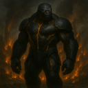
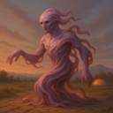
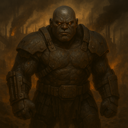

## Alien Species

| Species | Brief summary | |
| --- | --- | --- |
| [Kaebrax](aliens/Kaebrax.md) | Thick-shelled, six-eyed builders. Their communal architecture is renowned, and they can seal themselves inside their shells for protection. |  |
| [Vraddek](aliens/Vraddek.md) | Burly, tusked inhabitants of rugged highlands. They mark important promises with permanent tattoos and are skilled at climbing sheer rock. |  |
| [Yssibel](aliens/Yssibel.md) | Small, foxlike people with ringed tails. They value clever negotiation and can hear sounds too faint for most species. |  |
| [Ghorreth](aliens/Ghorreth.md) | Horned warrior-clans bound by a brutal honor code. Ferocious to outsiders yet fiercely loyal within the clan, they settle every debt in blood. |  |
| [Kla276-Ur](aliens/Kla276-Ur.md) | A synthetic species of modular metal bodies and shared software minds. They debate whether personal identity is a sacred inheritance or a choice. |  |
| [Kavaslon](aliens/Kavaslon.md) | Scaled, long-necked marsh dwellers. They hold ceremonies at dawn and can remain motionless for hours while hunting. |  |
| [Trennoss](aliens/Trennoss.md) | Small, burrowing gatherers with powerful hind legs. Their villages share underground food stores, and they communicate with rhythmic thumps. |  |
| [Sythara](aliens/Sythara.md) | Graceful, feather-haired people with keen senses. Their ritual storytellers weave history into songs that can induce shared visions. |  |
| [Vexmire](aliens/Vexmire.md) | Raiding frontier opportunists who seize what they can and move on. Aggressive, expansionist, and quick to gamble on a bold strike. |  |
| [Yrrakoth](aliens/Yrrakoth.md) | Adaptable warrior-wanderers in cohesive clans. Aggressive and far-ranging, they bend to any battlefield and any terrain. |  |
| [Tazmuroth](aliens/Tazmuroth.md) | Large, tusked beings with heat-sensing pits. Their lawkeepers settle disputes through formal debate rather than combat. |  |
| [Molkaar](aliens/Molkaar.md) | Mercenary raider-traders who sell violence as readily as they wage it. Aggressive and glib, they profit from every war they can start. |  |
| [Qortham](aliens/Qortham.md) | Amphibious, tusked folk with ridged backs. Their cities are built around tidal pools, and they can sense distant vibrations through water. |  |
| [Quenthaa](aliens/Quenthaa.md) | Smooth-skinned, fin-eared diplomats. Their culture prizes compromise, and subtle shifts in their skin reveal their feelings. |  |
| [Velinth](aliens/Velinth.md) | Elegant, insect-winged beings with delicate antennae. Their antennae sense emotion, making tact and honesty essential social customs. |  |
| [Oxilune](aliens/Oxilune.md) | Pale, long-eared beings adapted to dim, icy worlds. They celebrate the return of sunlight and can detect distant movement in darkness. |  |
| [Hssvarn](aliens/Hssvarn.md) | Color-shifting reptilian ambush-hunters who strike from anywhere. Adaptable and far-ranging, they treat every world as a hunting ground. |  |
| [Nivexus](aliens/Nivexus.md) | Networked, cybernetic organisms with linked minds. They value individual perspective but can briefly share senses with one another. |  |
| [Vorthak](aliens/Vorthak.md) | Iron-hued, chitinous hive-dwellers driven by a sacred imperative to spread. They flood outward across every reachable world and recognize no borders. |  |
| [Zundareth](aliens/Zundareth.md) | Six-limbed, nocturnal gatherers with reflective eyes. Their communities make offerings to the dawn, though they are most active at night. |  |
| [Vandros](aliens/Vandros.md) | Tall, furred beings adapted to icy worlds. Their hearth-keepers preserve oral histories, while their bodies thrive in extreme cold. |  |
| [Sillquith](aliens/Sillquith.md) | Crystal-skinned beings whose bodies refract light. They treat mineral formations as sacred records and can focus sunlight into bright beams. |  |
| [Ossanther](aliens/Ossanther.md) | Tall, pale beings with ridged foreheads. They prize careful scholarship and can sense nearby changes in magnetic fields. |  |
| [Selquorra](aliens/Selquorra.md) | Aquatic, ribbon-finned beings with vivid scales. Their navigators follow the stars reflected in the sea, and their songs carry across open water. |  |
| [Quorlath](aliens/Quorlath.md) | Broad, amphibious beings with layered gills. They convene councils in floating halls and can breathe both air and water. |  |
| [Nyxathil](aliens/Nyxathil.md) | Shadowy, winged beings with silver eyes. They keep vigil through the night, believing darkness is a sanctuary, and can disappear into deep shadow. |  |
| [Ulvarion](aliens/Ulvarion.md) | Long-lived, silver-haired beings with luminous eyes. They mark time through elaborate gardens and can recall memories with exceptional clarity. |  |
| [Vezmara](aliens/Vezmara.md) | Elegant, feline-like people with reflective eyes. They prize independence but gather for elaborate storytelling under the night sky. |  |
| [Dravok](aliens/Dravok.md) | Nomadic skirmisher-raiders, aggressive and adaptable. They gamble on fast strikes and drop a losing fight without hesitation. |  |
| [Maxothis](aliens/Maxothis.md) | Towering, broad-headed beings with dense fur. They settle disputes through ritual contests of strength and are naturally resistant to cold. |  |
| [Draznok](aliens/Draznok.md) | Broad-jawed, armored scavengers with a powerful bite. They believe nothing should be wasted and can digest tough, fibrous foods. |  |
| [Zunveil](aliens/Zunveil.md) | Veil-winged fliers with shifting patterns. Their customs emphasize privacy, and their wings can disrupt their outline in flight. |  |
| [Nyrreth](aliens/Nyrreth.md) | Pale, subterranean beings with sensitive whiskers. Their festivals celebrate sound, and they map tunnels by tapping walls and listening for echoes. |  |
| [Vhaal'Mir](aliens/Vhaal'Mir.md) | An apex species that excels at war, industry, trade, expansion, and daring alike, fused by flawless unity — and that refuses, absolutely, to ever negotiate. |  |
| [Serakhuun](aliens/Serakhuun.md) | Slender, grey-skinned wanderers with large, dark eyes shielded by inner lids against sand and glare. They cross the deep deserts astride massive beaked beasts. |  |
| [Dranthel](aliens/Dranthel.md) | Tall, reed-thin beings with flexible spines. Their graceful movement is a social art, and they can squeeze through remarkably narrow spaces. |  |
| [Onbrakil](aliens/Onbrakil.md) | Thick-scaled, many-armed laborers. Their communities share work by rotation, and they can grip several tools at once. |  |
| [Skorvang](aliens/Skorvang.md) | Savage isolationist berserkers who neither trade nor talk. They answer every encounter with pure, reckless fury. |  |
| [Mossling](aliens/Mossling.md) | The Mossling is a small, tree-dwelling species with huge obsidian eyes suited to dim forest light.  Their moss-green fur camouflages them among bark and lichen. |  |
| [Ghorlune](aliens/Ghorlune.md) | Moon-dwelling, pale beings with broad eyes. They gather to watch eclipses and can leap great distances in low gravity. |  |
| [Mel'tanni](aliens/Mel'tanni.md) | Fluid, shape-shifting wanderers who hold no homeland sacred. They reshape body and custom to any world, then abandon it to migrate ever onward. |  |
| [Drava'Nel](aliens/Drava'Nel.md) | Long-limbed, blue-skinned beings with luminous markings. They honor their ancestors through shared dreams and can communicate silently by shifting those patterns. |  |
| [Ozziketh](aliens/Ozziketh.md) | Tiny, many-eyed beings with jointed limbs. They observe rather than intervene in local disputes and can detect minute changes in their surroundings. |  |
| [Ur'Zhul](aliens/Ur'Zhul.md) | Forge-born war-smiths who smelt and conquer in equal measure. Their cohesive guild-society builds the engines of its own relentless wars. |  |
| [Praxilon](aliens/Praxilon.md) | Precise, insectlike thinkers with segmented limbs. They organize society around collaborative problem-solving and can process complex patterns rapidly. |  |
| [Xibante](aliens/Xibante.md) | Brightly patterned, six-limbed climbers. They exchange gifts at every meeting and can produce a mild adhesive from their palms. |  |
| [Qelmarr](aliens/Qelmarr.md) | Broad-finned ocean dwellers with mottled skin. Their navigators read currents like maps, and their elders preserve ancestral routes. |  |
| [Drommus](aliens/Drommus.md) | Massive burrowers with shovel-shaped forearms. They build underground cities and sense approaching storms through the soil. |  |
| [Ubelquor](aliens/Ubelquor.md) | Tentacled, deep-water intelligences with luminous markings. They share knowledge through touch and regard memory as a communal treasure. |  |
| [Bolthara](aliens/Bolthara.md) | Powerful, metal-boned beings from high-gravity worlds. Their communal feasts celebrate endurance, and their bodies are exceptionally strong. |  |
| [Ozzenphar](aliens/Ozzenphar.md) | Floating, gas-filled organisms with trailing tendrils. They communicate through pulses of colored light and drift with planetary weather systems. |  |
| [Tyllvex](aliens/Tyllvex.md) | Tiny, quick-moving beings with translucent wings. They build delicate homes in hollow trees and can detect changes in air pressure. |  |
| [Struxil](aliens/Struxil.md) | Fast-moving, runners with sharp crests. Their communities hold endurance races as religious festivals and value stamina over speed. |  |
| [Illandor](aliens/Illandor.md) | Antlered forest dwellers whose skin resembles bark. They practice seasonal rites and communicate with one another through rootlike networks. |  |
| [Threshaxx](aliens/Threshaxx.md) | Self-modifying machine-organisms born of uplifted factories. They produce without pause and recklessly rebuild themselves to meet any challenge. |  |
| [Delvimar](aliens/Delvimar.md) | Soft-furred, long-tailed travelers. Their hospitable caravans trade songs and stories, and their tails help them balance on narrow paths. |  |
| [Ozumara](aliens/Ozumara.md) | Colorful, fin-crested swimmers who live in deep ocean cities. They celebrate life through elaborate dances and communicate over long distances with clicks. |  |
| [Vessari](aliens/Vessari.md) | The Vessari are brilliant goldfish-like engineers who overcame their limbless, water-bound biology by inventing the Ambulatory Exploration Suit. |  |
| [Brannok](aliens/Brannok.md) | Fortress-building martial clans, defensive-aggressive and industrious. Patient besiegers, they turn every holding into a stronghold. |  |
| [Junossi](aliens/Junossi.md) | Small, warm-blooded beings with large ears and nimble fingers. They prize hospitality and excel at memorizing complex spoken histories. |  |
| [Welganth](aliens/Welganth.md) | Gentle, shell-backed nomads who carry household gardens with them. They believe a home is wherever the community gathers. |  |
| [Illurnex](aliens/Illurnex.md) | Bioluminescent beings with delicate, glassy bodies. They navigate through coordinated flashes and consider a person’s light-pattern a private identity. |  |
| [Aznareth](aliens/Aznareth.md) | Dark-skinned, heat-adapted travelers with golden eyes. Their star-priests guide migration by reading the night sky. |  |
| [Drommok](aliens/Drommok.md) | Hulking, tusked raiders who prize conquest above all. Their disciplined war-bands march under trophy-standards and treat battle as the only honorable work. |  |
| [Vaskarn](aliens/Vaskarn.md) | Lean, predatory nomad reavers who strike without warning and without mercy. Fearless and blunt, they raise no walls and offer no quarter. |  |
| [Kryssoth](aliens/Kryssoth.md) | Sleek, reptilian climbers with hooked toes. Their coming-of-age custom is a solo ascent of a sacred cliff. |  |
| [Wulmarra](aliens/Wulmarra.md) | Woolly, horned grazers from open plains. They are famous for generous communal feasts and can sense approaching storms. |  |
| [Tyrraxis](aliens/Tyrraxis.md) | Chitinous empire-builders who follow a doctrine of unending conquest. Adaptable and relentless, they assimilate every world they overrun. |  |
| [Threnvox](aliens/Threnvox.md) | Lean beings with resonant chest cavities. Their spoken language includes powerful tones, and group chants are central to worship. |  |
| [Nymbrak](aliens/Nymbrak.md) | Armored, crablike builders with strong pincers. They build intricate coastal forts and can regrow a lost limb over time. |  |
| [Ashvenn](aliens/Ashvenn.md) | Smoke-gray, feathered beings who thrive near volcanic vents. They perform renewal rites in ash and can tolerate air rich in sulfur. |  |
| [Vraektor](aliens/Vraektor.md) | Towering warriors with layered bone armor. Their honor code demands protection of the vulnerable, not conquest. |  |
| [Xel'Thara](aliens/Xel'Thara.md) | Tall, translucent beings whose inner lights shift with emotion. They honor their ancestors by sharing memories in communal dream-rituals. |  |
| [Cavornu](aliens/Cavornu.md) | Horned, herd-dwelling people with excellent balance. They choose leaders by consensus and can traverse steep, rocky terrain with ease. |  |
| [Illveska](aliens/Illveska.md) | Feathered, long-legged people with elaborate plumage. They court through intricate dances and can cover great distances on foot. |  |
| [Qzzik](aliens/Qzzik.md) | A swarming insectile people encountered only in frantic broods. They breed, expand, and attack with suicidal recklessness, consuming worlds and moving on. |  |
| [Yttheris](aliens/Yttheris.md) | Slender, many-fingered beings with pale, luminous eyes. Their meditative traditions help them control reflexes with extraordinary precision. |  |
| [Skellivon](aliens/Skellivon.md) | Bone-crested beings with dark, leathery skin. They honor their dead by telling humorous stories about them, believing laughter keeps memory alive. |  |
| [Ombrayel](aliens/Ombrayel.md) | Shadow-adapted people with dark, velvety skin. They favor night markets and can see clearly in near-total darkness. |  |
| [Zephkar](aliens/Zephkar.md) | Lightweight, gliding people with sail-like membranes. They revere the wind as a living force and are skilled navigators of the skies. |  |
| [Braal Vex](aliens/Braal_Vex.md) | Insectoid engineers with plated bodies and nimble hands. Their intricate machines are family heirlooms, and each generation adds to them. |  |
| [Ybernith](aliens/Ybernith.md) | Delicate, mothlike beings with broad wings. They gather around sources of light for prayer and navigate using polarized skies. |  |
| [Uxberos](aliens/Uxberos.md) | Pale, many-eyed cavern dwellers. They navigate by echolocation and gather in councils to interpret the changing echoes of their homeworld. |  |
| [Sundraxi](aliens/Sundraxi.md) | Soot-dusted forge-folk who treat the universe as an unfinished machine. Their blazing factories never rest, and they endlessly scrap and reinvent their own work. |  |
| [Nyssarion](aliens/Nyssarion.md) | Slender, nocturnal humanoids with silver markings. They value quiet contemplation and believe silence is the purest form of prayer. |  |
| [Draviim](aliens/Draviim.md) | Heavyset, horned inhabitants of volcanic regions. They carve family records into cooled lava and are remarkably resistant to heat. |  |
| [Khaaros](aliens/Khaaros.md) | Scarred wasteland reavers who worship the gamble. Fearless, blunt, and endlessly improvisational, they fling themselves at risks no sane people would attempt. |  |
| [Ythanor](aliens/Ythanor.md) | Antlered, amphibious beings with broad, webbed hands. They mark the passage of time through communal ceremonies at river crossings. |  |
| [Ekshara](aliens/Ekshara.md) | Aquatic beings with branching gills and patterned skin. Their ceremonies honor the tides, and they can alter their skin color to signal mood. |  |
| [Zaethmor](aliens/Zaethmor.md) | Broad-winged, cliff-dwelling beings. They make pilgrimages to high places and can glide for hours on rising air currents. |  |
| [Woltrim](aliens/Woltrim.md) | Stocky, tusked people with powerful lungs. They carve histories into stone and can survive for long periods in thin air. |  |
| [Krethsibar](aliens/Krethsibar.md) | Krethsibar are rugged, plated inhabitants of harsh worlds. They prize resilience, and their thick outer layers repair slowly after injury. |  |
| [Chalorix](aliens/Chalorix.md) | Horned, desert-dwelling beings with tough, reflective skin. They hold water-sharing ceremonies and can conserve moisture exceptionally well. |  |
| [Tharnok](aliens/Tharnok.md) | Grim, blunt warlords, militant and tactless. Cold and deliberate rather than frenzied, they rule by force and few words. |  |
| [Auvraeth](aliens/Auvraeth.md) | Tall, graceful beings with translucent fins along their arms. They worship the changing seasons and are adept at reading weather patterns. |  |
| [Kryllos](aliens/Kryllos.md) | Small, chitin-armored scavengers with quick reflexes. They turn discarded materials into art and have a remarkable sense of smell. |  |
| [Kelgroth](aliens/Kelgroth.md) | Broad, armored warrior-castes who wage disciplined, methodical war. Fierce but well-supplied, they campaign with cold professionalism. |  |
| [Brtok](aliens/Brtok.md) | Squat, grey-hided foundry-folk who forge weapons far beyond any need. Blunt and intransigent, they regard all diplomacy as a swindle and answer it with steel. |  |
| [Vorn Kesh](aliens/Vorn_Kesh.md) | Broad, stone-scaled nomads with powerful limbs. Their clans prize hospitality, and their skin can absorb and slowly release heat. |  |
| [Nurrgal](aliens/Nurrgal.md) | War-merchant conquerors who treat conquest as commerce. Aggressive and pragmatic, they tally every campaign in profit and spoils. |  |
| [Ezraliim](aliens/Ezraliim.md) | Delicate, light-sensitive beings who wear patterned veils. They study distant stars and can perceive a wider range of light than humans. |  |
| [Pravoxi](aliens/Pravoxi.md) | Four-armed artisans with keen depth perception. Their culture prizes precision, and their tools are designed for simultaneous, intricate work. |  |
| [Ithkane](aliens/Ithkane.md) | Long-necked desert dwellers with mirrored eyes. They travel in singing caravans and can detect water beneath dry ground. |  |
| [Zayllux](aliens/Zayllux.md) | Small, iridescent fliers with four wings and large black eyes. They navigate by starlight and treat constellations as sacred maps. |  |
| [Voshkane](aliens/Voshkane.md) | Furred, long-armed forest dwellers. Their clans exchange carved tokens at seasonal gatherings, and they move quietly through dense woods. |  |
| [Osgrim](aliens/Osgrim.md) | Honor-bound soldier-smiths who forge their own arms. Aggressive yet oath-bound and communal, they war strictly by their code. |  |
| [Osvakim](aliens/Osvakim.md) | Compact, blue-scaled inhabitants of icy seas. They build warm communal nests and can slow their metabolism during long cold seasons. |  |
| [Zaethys](aliens/Zaethys.md) | Slender, blue-skinned scholars with luminous fingertips. Their temples double as libraries, and they can sense electrical currents. |  |
| [Grondaal](aliens/Grondaal.md) | Massive, tusked burrowers with stone-colored hide. Their underground halls are family strongholds, and they can sense tremors from afar. |  |
| [Ryllakor](aliens/Ryllakor.md) | Long-tailed hunters with retractable claws. They honor a successful hunt by sharing every part of their prey with the community. |  |
| [Fylvaris](aliens/Fylvaris.md) | Flower-faced, plantlike people who gather sunlight through petal-shaped crests. Their seed-sharing rites symbolize friendship and renewal. |  |
| [Krondaxi](aliens/Krondaxi.md) | Heavy, four-eyed reptilians with durable scales. Their society prizes strategic patience, and they can detect subtle shifts in heat. |  |
| [Perthaan](aliens/Perthaan.md) | Stocky, broad-shouldered artisans. Their guilds teach each craft as both a practical skill and a form of devotion. |  |
| [Nomilar](aliens/Nomilar.md) | Wandering, plantlike beings that root briefly wherever they rest. They share news through fragrant spores and draw energy from sunlight. |  |
| [Nel'Quoth](aliens/Nel'Quoth.md) | Soft-bodied, shape-shifting beings who favor flowing cloaks. They consider adaptation a virtue and can briefly mimic another creature’s outline. |  |
| [Prellun](aliens/Prellun.md) | Small, smooth-skinned beings with oversized eyes. They are inquisitive explorers who can perceive rapid motion with unusual clarity. |  |
| [Ylssuran](aliens/Ylssuran.md) | Serpentine people with delicate crest-fins. They practice slow, formal greetings and can sense minute vibrations through their bodies. |  |
| [Wexmoor](aliens/Wexmoor.md) | Mottled, moss-coated beings from damp worlds. They cultivate living gardens on their bodies and use scent to recognize one another. |  |
| [Trelisso](aliens/Trelisso.md) | Amphibious, smooth-scaled socialites. Their songs carry underwater, and communal singing is central to both celebration and mourning. |  |
| [Aomvel](aliens/Aomvel.md) | Soft-bodied, floating beings who live in the upper atmosphere. They communicate through changing shapes and steer themselves with tiny jets of gas. |  |
| [Morvax](aliens/Morvax.md) | Armored scavengers with shovel-like claws. They respect resourcefulness above wealth and can digest substances toxic to most life. |  |
| [Grakmaw](aliens/Grakmaw.md) | Slab-muscled, tusked conquerors who live for violence. They scorn all negotiation and charge into battle with no thought of retreat or survival. |  |
| [Threxil](aliens/Threxil.md) | Compact, many-legged hunters with tough chitin. They follow strict codes of fair pursuit and can cling to almost any surface. |  |
| [Menthara](aliens/Menthara.md) | Calm, luminous-skinned beings with branching head crests. Their spiritual leaders guide group meditation, often using shared rhythmic breathing. |  |
| [Thraliun](aliens/Thraliun.md) | Tall, web-footed marsh dwellers. They hold moonlit water ceremonies and can remain submerged for hours. |  |
| [Zathurex](aliens/Zathurex.md) | Horned, ash-colored beings from rugged volcanic terrain. They believe hardship tempers character and are highly resistant to smoke and heat. |  |
| [Marnok](aliens/Marnok.md) | Short, sturdy beings with stone-hard skin. They value patient craftsmanship and can withstand crushing pressure deep underground. |  |
| [Obrahn](aliens/Obrahn.md) | Gentle giants with thick wool and expressive ears. Their communities share everything communally, and their low songs soothe anxious animals. |  |