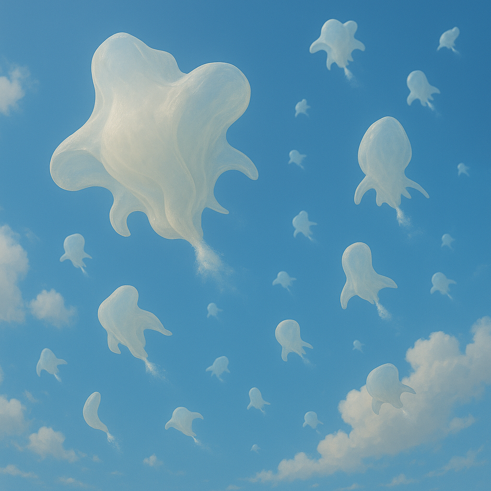

## Aomvel

### Description:

The Aomvel are soft-bodied, translucent beings who drift through the upper atmospheres of their gas-shrouded homeworlds like living clouds. Buoyant and boneless, they have no fixed shape; their gelatinous forms billow, pucker, and ripple with the slow grace of smoke in still air. Delicate internal membranes glint with trapped vapor, and clusters of tiny vents dot their undersides, releasing fine jets of gas with which they steer and hover among the high, bright reaches of the sky.

The Aomvel speak not in sound but in **shape**. Their every meaning is conveyed by the changing contours of their bodies — a bloom of folds for joy, a tight curl for sorrow, slow undulations for thought — and their language is a continuous, flowing sculpture that other Aomvel read as fluently as speech. To converse is to dance, and a gathering of Aomvel resembles a mesmerizing ballet of ever-shifting forms, meaning layered upon meaning in the subtle choreography of their drifting shapes.

Life in the boundless open sky has made the Aomvel a gentle, dreamy, and philosophical people. With no ground to claim and no walls to build, they hold little concept of territory or possession, prizing instead expressiveness, serenity, and the beauty of a well-formed thought made visible. They steer their long, slow migrations on the high winds with those tiny jets of gas, following warmth and light across the face of their world, and they regard the act of changing shape not merely as communication but as the very essence of being alive.

### Notable Traits:

- Habitat: Upper atmospheres of gas-rich worlds
- Lifespan: 140–180 years
- Strength: Effortless flight and rich, expressive shape-based communication
- Weakness: Helpless on solid ground and crushed by high pressure or heavy gravity
- Temperament: Gentle, dreamy, and philosophical

### Fun Fact:

An Aomvel's entire emotional state can be read at a glance from across the sky, for they are quite literally incapable of hiding how they feel.

---

*"We own no land and build no walls; our only home is the shape we choose to be."* — Aomvel proverb

[Back to Aliens](../aliens.md#aomvel)
