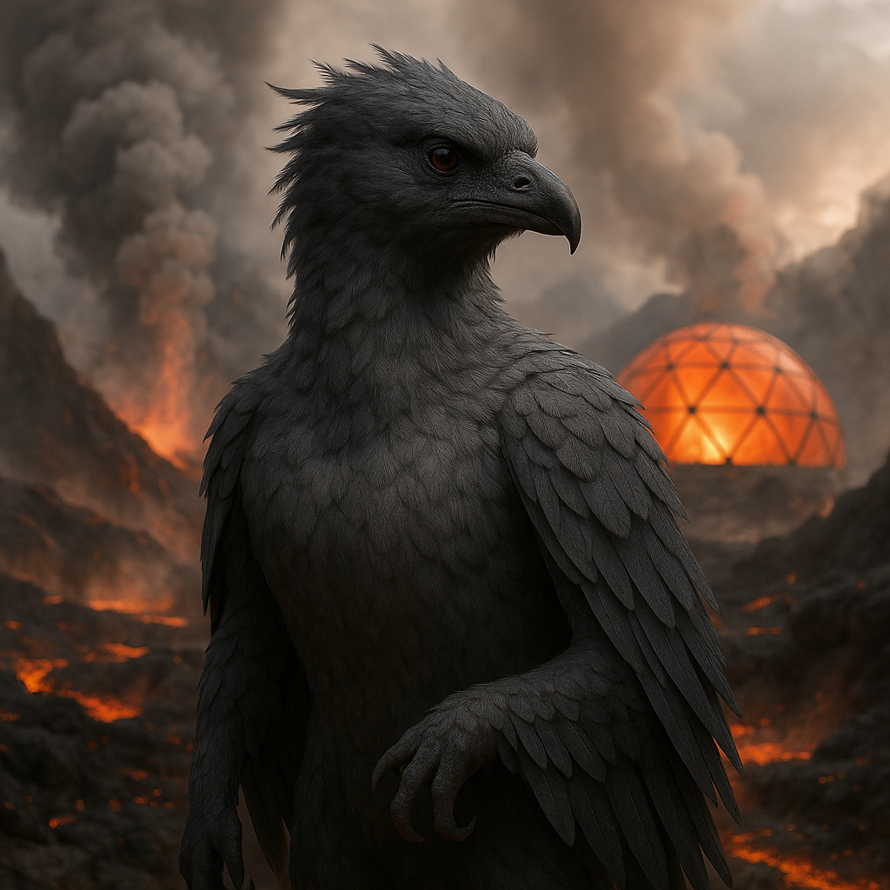

## Ashvenn

### Description:

The Ashvenn are smoke-gray, feathered beings who make their homes amid the fury of volcanic lands, nesting on the warm slopes and fuming ridges where other species dare not tread. Their plumage is the color of ash and ember, layered in sooty grays shot through with the dull red of banked coals, and specialized membranes shield their lungs and eyes from the choking fumes that pour from the vents around them. To the Ashvenn the reek of sulfur is the smell of home, and the glow of molten rock is as comforting as a hearth-fire.

Fire and ash lie at the center of Ashvenn belief. They see the volcano not as a destroyer but as the great engine of renewal — the force that burns away the old and tired so that the new may rise from the scorched ground. More than most peoples, the Ashvenn harness that engine directly, raising forges, kilns, and vent-driven apparatus over the fuming ridges to smelt metal and glass and work tirelessly in the volcano's heat. Their most sacred ceremonies are the renewal rites, performed in beds of fresh volcanic ash, in which an Ashvenn bathes in the gray dust to symbolically shed an old self and emerge reborn. These rites mark every great transition of life, and the ashfall after an eruption is regarded not as a calamity but as a blessing, a cleansing from which fertile new life will inevitably spring.

Their tolerance for sulfurous, superheated air shapes a culture of resilience and transformation. The Ashvenn do not fear destruction, for they have built their entire worldview on the certainty that what burns away makes room for what grows. This gives them a startling equanimity in the face of loss and disaster; where other species see ruin, the Ashvenn see the necessary clearing of ground. They rebuild without lament, treating each eruption that buries their homes as simply another turn of the great wheel of renewal.

Ashvenn society is organized around their fire-temples, tended by ash-priests who read the moods of the volcanoes and time the great rites to the rhythms of the earth. They are a solemn, resilient, strangely serene people, hardened by the harsh beauty of their world yet warmed by a deep faith in rebirth. Slow to despair and quick to begin again, the Ashvenn carry the quiet confidence of those who have learned that even fire is a kind of gift.

### Notable Traits:

- Habitat: Volcanic slopes, geothermal vents, and ash-fields
- Lifespan: 85 years
- Strength: Tolerance for sulfurous, superheated air and remarkable resilience; skilled at harnessing volcanic heat for forging and industry
- Weakness: Uncomfortable and sluggish in cold, clean, lowland climates
- Temperament: Solemn, resilient, and faithful in renewal

### Fun Fact:

After an eruption buries an Ashvenn settlement, the inhabitants celebrate rather than mourn, treating the fresh ash as fertile holy ground on which to build anew.

---

*"Let the old world burn; from its ashes we rise cleaner than before."* — Ashvenn proverb

[Back to Aliens](../aliens.md#ashvenn)
