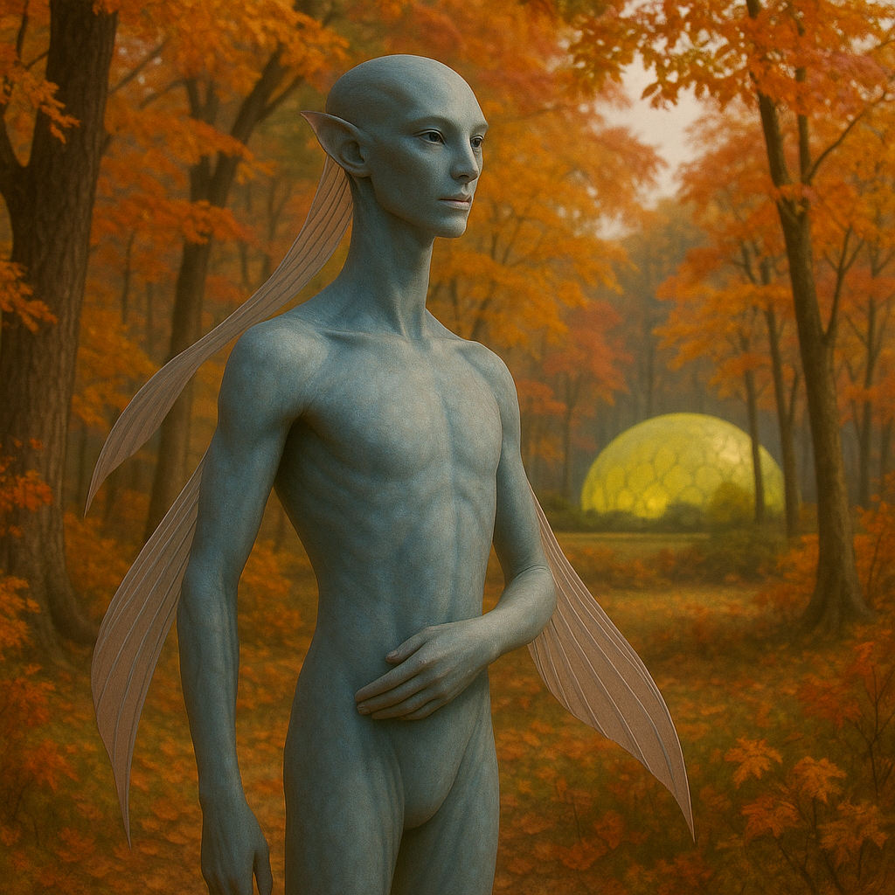

## Auvraeth

### Description:

The Auvraeth are tall and graceful, willowy beings who seem to move through the world like reeds swaying in a gentle current. Along the length of each arm runs a delicate translucent fin, veined with faint color, that fans open to catch the wind or folds close against the body in repose. When an Auvraeth lifts its arms to the sky those fins glow softly with the light passing through them, and a gathering in open motion resembles a slow, shimmering dance of living stained glass.

The Auvraeth worship the turning of the seasons, holding each change of the year as a sacred passage to be greeted with ceremony. Their calendar is a cathedral of festivals — the first thaw, the longest day, the falling of the leaves, the first killing frost — each marked by elaborate rites in which the whole community moves together in flowing, fin-spread dances meant to honor and welcome the coming season. To them, change itself is holy, and the cardinal sin is to cling stubbornly to what has passed when the world has plainly moved on.

Their translucent fins are not merely beautiful but exquisitely sensitive instruments, reading the shifting pressure, moisture, and temperature of the air with uncanny precision. From the faintest change in the wind an Auvraeth can forecast the coming weather days in advance, and their weather-readers are indispensable guides, consulted before any planting, journey, or festival. This gift binds their reverence for the seasons to practical mastery: they do not merely worship the turning year, they understand it, feeling its approach in the fins along their arms.

Auvraeth society is fluid, graceful, and loosely knit, organized into small autonomous bands that move and resettle with the rhythms of the land and sky and defer to no central authority. Status flows from artistry — in dance, in weather-reading, in the composition of the great seasonal rites — and leadership passes naturally to those whose readings prove truest and whose ceremonies move the people most deeply. Serene and adaptable, the Auvraeth meet upheaval with a dancer's poise, bending where others would break, confident that every season, however harsh, will in time turn once more into another.

### Notable Traits:

- Habitat: Temperate coasts, river valleys, and wind-swept open highlands
- Lifespan: Long — around 120 years
- Strength: Precise weather prediction and graceful adaptability to change
- Weakness: Fragile physique; fins easily torn in violent storms
- Temperament: Serene, artistic, and adaptable

### Fun Fact:

An Auvraeth can feel a storm three days off as a faint tingling in the fins of its arms.

---

*"Do not mourn the leaf that falls; the branch is already dreaming of spring."* — Auvraeth season-rite

[Back to Aliens](../aliens.md#auvraeth)
