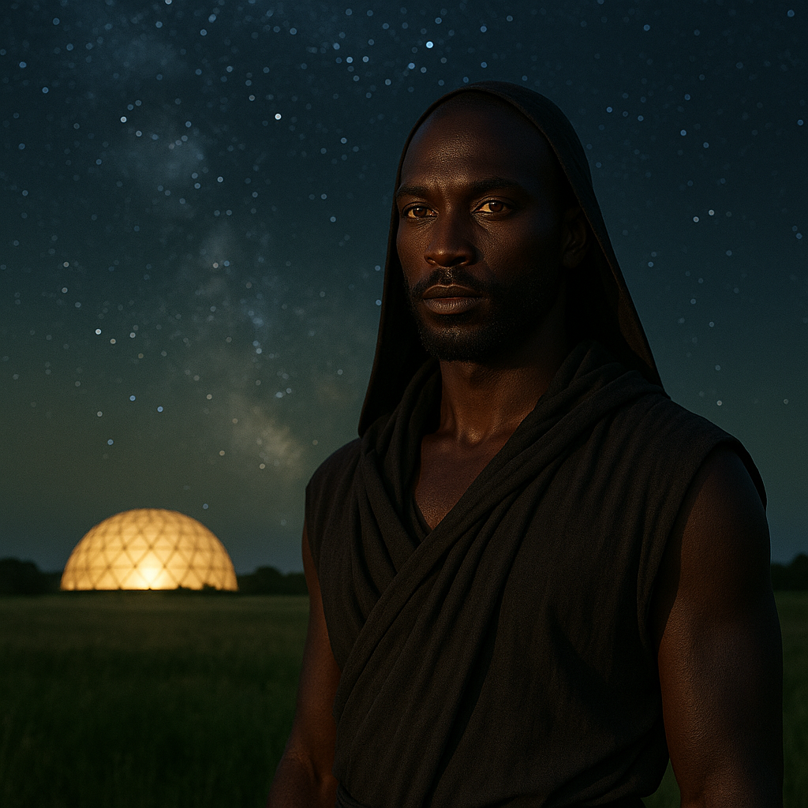

## Aznareth

### Description:

The Aznareth are a lean, enduring people of the sun-scorched lands, their dark skin drinking in the fierce light that would blister other beings and radiating the heat harmlessly back into the burning air. Golden eyes, slit against the glare, gleam from beneath heavy brows, and their spare, sinewy frames are built for the long march across blistering flats. Draped in sun-bleached robes stitched with threads of beaten metal that scatter the heat, the Aznareth cross their punishing homeworld with a tireless, loping stride that eats the horizon.

The Aznareth are migrants by sacred necessity, forever following the slow retreat of the habitable bands across their harsh world, never settling long in any one place. Their lives are a perpetual journey, and their most revered figures are the star-priests, the Nightwardens, who alone hold the knowledge of how to read the night sky and chart the people's course. By day the sun is too cruel to travel; it is in the cool of the night, beneath the wheeling constellations, that the Aznareth move, and so the stars have become both their map and their scripture, the Nightwardens their navigators and their clergy in one.

Their faith holds that the stars are the eyes of ancestors gone before, watching over the march and lighting the way to the next haven, and that to stray from the star-charted path is to abandon the dead who guide them. Each migration is a pilgrimage, each campsite a temple raised and struck again by dawn. The Nightwardens memorize vast celestial litanies, passing them down through rigorous apprenticeships, and a people's survival hangs on their accuracy. Resilient, devout, and quietly fatalistic, the Aznareth measure wealth not in possessions — which only weigh down the march — but in the richness of the sky-lore they carry, and in having reached the next oasis before the killing sun returns.

### Notable Traits:

- Habitat: Scorching deserts and sun-blasted flats
- Lifespan: 105 years
- Strength: Extreme heat tolerance; masterful celestial navigation
- Weakness: Perpetually rootless; dependent on their star-priests
- Temperament: Resilient, devout, and stoic

### Fun Fact:

An Aznareth would sooner lose its last water-skin than its Nightwarden, for water buys a day but the star-lore buys every day after.

---

*"The sun drives us on; the stars tell us where to run."* — Aznareth Nightwarden's litany

[Back to Aliens](../aliens.md#aznareth)
