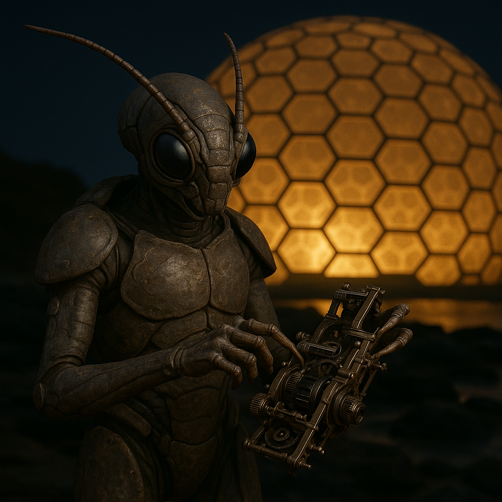

## Braal Vex

### Description:

The Braal Vex are an insectoid people sheathed in segmented plates of a dark, resinous chitin that shifts in color with their mood and the ambient temperature. From their compact thoraxes extend four delicate, many-jointed hands, each tipped with fine manipulators capable of work finer than any watchmaker's. Twin antennae crown their heads, trembling with constant sensitivity to vibration and scent, and their faceted eyes gleam with a cold, calculating patience. They are born tinkerers, and a Braal Vex at rest is a Braal Vex quietly disassembling and reassembling whatever lies within reach.

To the Braal Vex, a machine is never finished. Their most treasured possessions are the great family engines — intricate, generations-spanning contraptions of gears, lenses, and whispering mechanisms that each lineage has built and rebuilt across centuries. A newborn is presented to the family engine before it is given a name, and in its final years each Braal Vex adds some improvement, refinement, or entirely new subsystem before passing stewardship to its heirs. These heirloom machines serve no single purpose; they are at once genealogy, art, scripture, and the beating mechanical heart of the household.

Their society is organized into Workshops — great extended clans bound by shared engineering traditions rather than blood alone. Status is earned through craft, and the highest honor a Braal Vex can achieve is to have a component of their own invention adopted into another family's engine, spreading their ingenuity down the generations. Their faith is a quiet reverence for the Prime Mechanism, a cosmic machine they believe underlies all existence, of which every family engine is a humble model. To understand how a thing works, the Braal Vex say, is to glimpse the mind of the Maker — and so they take apart the universe lovingly, one piece at a time.

### Notable Traits:

- Habitat: Hive-cities and workshop warrens
- Lifespan: 90 years
- Strength: Unmatched precision engineering and manual dexterity
- Weakness: Obsessive; struggle to leave a problem unsolved
- Temperament: Methodical, inquisitive, and devoted to craft

### Fun Fact:

Some Braal Vex family engines are so old and so modified that no living member fully understands what every part does — a mystery they consider sacred rather than troubling.

---

*"A thing left unimproved is a thing left unloved."* — inscription on a Braal Vex family engine

[Back to Aliens](../aliens.md#braal-vex)
