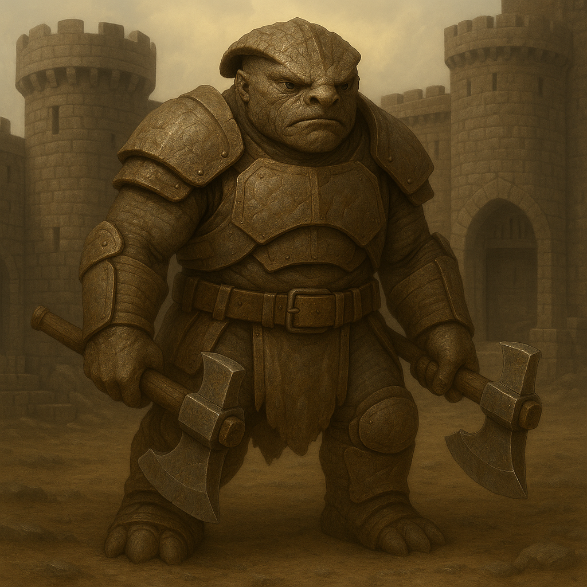

## Brannok

### Description:

The Brannok are stout, deep-chested beings with hide the gray-brown of weathered stone and hands wide enough to grip two haft-weapons at once. Their skulls are crested with a ridge of bone that thickens with age, so that the eldest clan-fathers wear a natural helm of their own growing. They speak in short, rumbling syllables and build everything — their homes, their shrines, their very bodies through hard labor — to last. A Brannok at rest still looks braced for impact, shoulders squared, feet planted, as though the ground itself might one day have to be defended.

Brannok life revolves around the clan-hold, a fortress-settlement raised stone upon stone over generations and never truly finished. Walls are always being thickened, gates always being reinforced, cisterns always being deepened against siege. This industrious, communal spirit binds every Brannok to the hold: masons, smiths, farmers, and warriors labor shoulder to shoulder, and the greatest shame is not cowardice in battle but letting the walls fall into disrepair. They are deeply loyal to kin and suspicious of outsiders, holding that a stranger at the gate is a threat until proven otherwise, and often well after.

The Brannok are aggressive, but theirs is the aggression of the anvil rather than the hammer — they would rather an enemy break against their walls than chase them across open ground. When they do march to war, it is to seize chokepoints, ford-crossings, and high ground they can then fortify, extending their holds outward like a slowly closing fist. They are patient besiegers and merciless defenders, and a Brannok clan that has decided a piece of land is theirs will dig in and bleed any attacker white rather than yield a single course of stone. Their calculation lies in knowing exactly which ground is worth dying on — and refusing, with granite stubbornness, to spend lives on any that is not.

### Notable Traits:

- Habitat: Ever-growing fortress-holds built on crags, fords, and chokepoints
- Lifespan: 140 years
- Strength: Masterful fortification and tireless communal industry
- Weakness: Overly cautious; slow to seize fleeting opportunities in the open
- Temperament: Defensive-aggressive and territorial, but patient and calculating

### Fun Fact:

Every Brannok clan-hold keeps an unfinished wall by tradition, for a hold that is complete is said to be a hold that has stopped believing in tomorrow.

---

*"Let them come. The stone was here before them and will remain after."* — Brannok gate-oath

[Back to Aliens](../aliens.md#brannok)