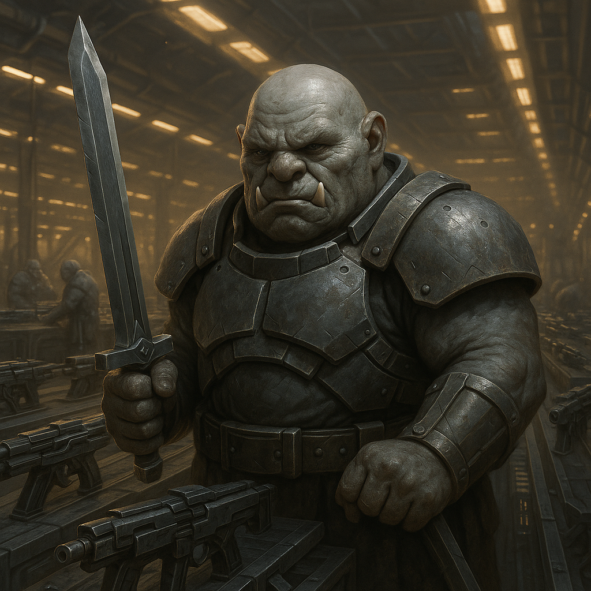

## Brtok

### Description:

The Brtok are a dense, graceless people, squat and heavy-boned, with blunt faces and thick grey hide pitted from a lifetime of labor near furnace and anvil. Their hands are enormous and callused, their voices a flat grinding monotone that wastes no breath on pleasantry. A Brtok speaks only when there is a thing that must be said, and says it in the fewest words the thing requires — usually fewer than courtesy would like.

The Brtok live for the work of the forge, and theirs is an industry turned almost entirely toward armament. Where other builder-peoples craft for comfort or trade, the Brtok smelt and hammer in service of a single conviction: that a people are only as safe as the walls they raise and the weapons they stockpile. Their underground manufactories run day and night, disgorging engines of war in numbers far beyond any apparent need, for the Brtok trust nothing they have not themselves fortified and no promise they have not themselves made unnecessary with steel. Their cities are arsenals, their homes are bunkers, and their proudest festivals are displays of newly forged munitions.

What the Brtok lack, entirely and by choice, is any gift for diplomacy. They regard negotiation as a confidence trick practiced by the weak to rob the strong of what their labor has earned, and they meet envoys with flat refusals, grunted ultimatums, or stony silence. A Brtok does not flatter, does not compromise, and does not pretend to a goodwill they do not feel; ask one for a concession and you will receive, at best, a blunt accounting of exactly why you will not get it. They are not quick to attack — but they are quick to arm, quicker to take offense at a perceived slight, and entirely willing to let their stockpiled weapons do the talking their tongues refuse to.

### Notable Traits:

- Habitat: Fortified subterranean foundry-cities
- Lifespan: 120 years
- Strength: Prodigious war-industry and total self-sufficiency
- Weakness: Tactless and intransigent; incapable of goodwill or compromise
- Temperament: Gruff, suspicious, and belligerently blunt

### Fun Fact:

The Brtok word for "treaty" and the Brtok word for "ambush" differ by a single grunt — and the Brtok maintain this is appropriate.

---

*"Words bend. Steel does not. We deal in steel."* — Brtok foundry-warden

[Back to Aliens](../aliens.md#brtok)
