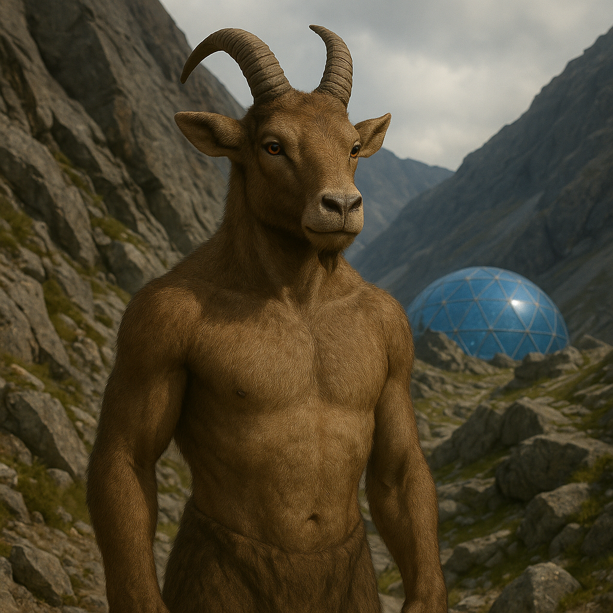

## Cavornu

### Description:

The Cavornu are a tall, broad-shouldered people crowned with sweeping, spiraled horns that curl back from their brows like the crests of mountain rams. Their legs end in cloven, gripping hooves perfectly suited to loose scree and sheer stone, and their bodies carry a low, confident center of gravity that lets them stand sure on ledges where other species would tumble. Thick manes run along their necks and spines, insulating them against the thin, cold air of the high country they call home.

Cavornu live in great migratory **herds**, and the herd is the fundamental unit of their identity. No Cavornu thinks of themselves as truly alone; to be apart from the herd is to be unmoored. Yet their social order is strikingly egalitarian — decisions of any weight are reached through long, deliberate **consensus-gatherings** in which every adult has a voice, and no leader may act against the settled will of the whole. Those who guide the herd do so by earning trust and speaking wisely, not by command, and a leader who loses the herd's confidence simply ceases to lead.

Their peerless balance shapes everything from their architecture to their art. Cavornu build their switchback settlements across cliff faces and high passes, linked by narrow ledge-paths that only they can safely tread, and their coming-of-age rites involve crossing treacherous ridgelines unaided. They prize steadiness in all things — of foot, of judgment, of temper — and consider recklessness a danger not only to oneself but to the whole herd that depends on each member's sureness.

### Notable Traits:

- Habitat: Mountains, high plateaus, and rocky uplands
- Lifespan: 100–130 years
- Strength: Superb balance and the ability to traverse steep, broken terrain with ease
- Weakness: Uncomfortable and indecisive when forced to act alone
- Temperament: Communal, steady, and deliberate

### Fun Fact:

A Cavornu herd can cross a cliff-face trail single-file in the dark without a single misstep, guided only by the sound of the hooves ahead.

---

*"One hoof may slip; the herd never falls."* — Cavornu proverb

[Back to Aliens](../aliens.md#cavornu)
