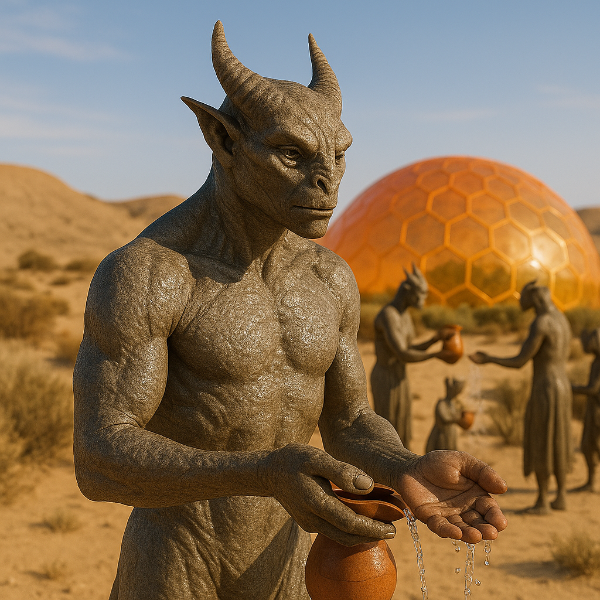

## Chalorix

### Description:

The Chalorix are horned, desert-dwelling beings whose tough, mirror-bright skin reflects the brutal sun back into the sky, keeping the furnace-heat of their homeland at bay. A ridge of pale, curving horns crowns each broad head, and their heavy-lidded eyes peer out from faces weathered like sun-baked stone. Built low and sturdy, they conserve their strength in the heat of the day and come alive in the cool of evening, when the dunes glow amber and the first stars prick the darkening sky.

Water is life, scripture, and currency among the Chalorix, and their most sacred rite is the water-sharing ceremony. When two parties meet — whether old friends or wary strangers — the exchange of a measured draught of water is the first and most binding act of trust, a promise that neither will let the other perish of thirst. To share water is to become, however briefly, kin; to refuse it is a declaration of enmity. Their greatest festivals revolve around the ceremonial filling and sharing of the communal cisterns, and generosity with water is the surest measure of a Chalorix's honor.

Their bodies are miracles of conservation, able to wring the last drop of moisture from their food and to go for weeks on what would leave other creatures withered husks. This biological thrift shapes a culture of profound discipline and foresight: the Chalorix plan generations ahead, waste nothing, and regard impulsiveness and extravagance as grave moral failings. Yet paradoxically, this same scarcity makes them extravagantly generous within the bounds of the water-rite, for a people who know the true cost of a drink understand exactly what it means to give one away.

Chalorix society is built around the cisterns and the clans that tend them, but each clan guards its own cistern and keeps its own counsel, meeting others only to settle the careful water-debts and water-gifts that pass between otherwise separate, self-reliant families. Elders who keep the records of these obligations wield quiet authority, and marriages, alliances, and feuds are all conducted in the language of shared or withheld water. Stoic, dignified, and slow to anger, the Chalorix are formidable when wronged but endlessly patient in peace, carrying themselves with the gravity of a people who have made survival itself into an art.

### Notable Traits:

- Habitat: Scorching deserts and the deep cisterns beneath them
- Lifespan: Long — around 140 years
- Strength: Extraordinary moisture conservation and endurance under heat
- Weakness: Suffers in cold or waterlogged climates; slow-moving in the day's heat
- Temperament: Stoic, disciplined, and ceremonially generous

### Fun Fact:

A Chalorix can survive a full month on the water a traveler would drink in a single thirsty afternoon.

---

*"Share your water, and you will never die alone in the sand."* — Chalorix cistern-blessing

[Back to Aliens](../aliens.md#chalorix)
