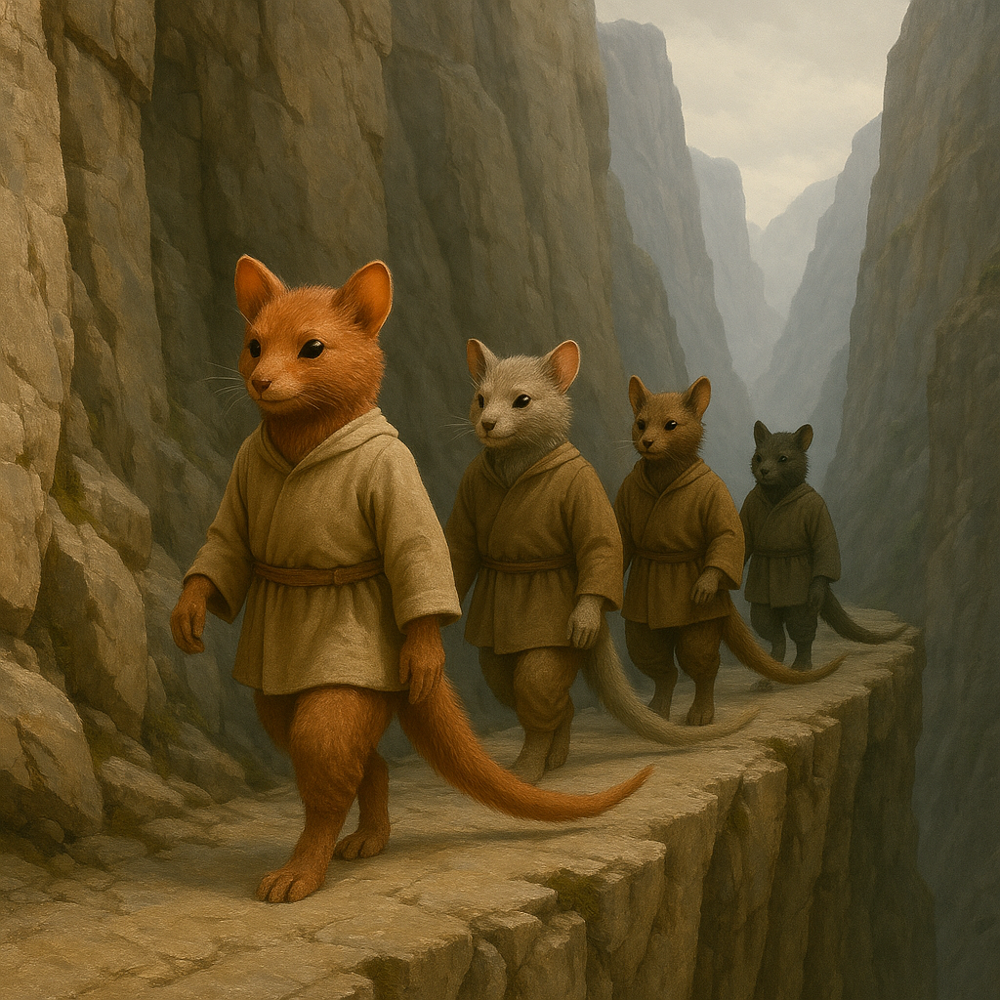

## Delvimar

### Description:

The Delvimar are a soft-furred, long-tailed people, lithe and quick-eyed, with plush coats that range from warm russet to dusky grey and a sweeping prehensile tail that serves them as rudder, counterweight, and third hand all at once. Everything about them speaks of the road: their lean frames, their nimble feet, their habit of carrying their whole lives in cleverly packed bundles. The Delvimar are wanderers by nature and by choice, and few of them die within a hundred leagues of where they were born. To settle permanently in one place strikes them as a slow kind of surrender, a giving-up on all the horizons one has not yet seen.

Their society travels in caravans — great cheerful trains of beasts and carts and chattering families that wind across the continent's trade roads, mountain passes, and river fords. A Delvimar caravan is famous wherever it appears, for it trades not only in goods but in songs and stories, and the arrival of one is an occasion for a whole village to turn out in welcome. They are a hospitable people to the point of extravagance, holding that any stranger met upon the road is a guest sent by fortune, and the surest way to insult a Delvimar is to refuse the food, the fire, and the tale it presses upon you. Their long memories are libraries of borrowed stories, each one picked up in some far settlement and carried on to the next, so that a single caravan may be the only thread connecting a dozen distant peoples who have never otherwise met.

That remarkable tail shapes both their bodies and their beliefs. With it a Delvimar can walk a mountain ledge no wider than a hand, snatch a falling child, or dangle happily from a bridge-rail to haggle with the boats below; the tail is the organ of their fearlessness, and a Delvimar deprived of it by injury is thought to have lost not merely balance but a measure of its very soul. They prize agility, adaptability, and the grace to recover from a stumble, and their proverbs are full of the wisdom of the sure-footed. Yet for all their restlessness they are not a shallow people; the Delvimar believe that movement is itself a kind of devotion, that to keep traveling is to keep the world's far-flung peoples stitched together, and that a story carried faithfully from stranger to stranger is the most sacred cargo any caravan can bear.

### Notable Traits:

- Habitat: Trade roads, mountain passes, and the margins of every settled land
- Lifespan: 90–120 years, most of them spent on the move
- Strength: Superb balance and agility; gifted traders and keepers of stories
- Weakness: Restless and rootless; wither in confinement or forced settlement
- Temperament: Warm, hospitable, and incurably wanderlust-struck

### Fun Fact:

A Delvimar never tells its own best story — it saves that one to give away, believing a tale only truly lives once it belongs to someone else.

---

*"We own no land and so we own every road; the horizon is the only home that never shrinks."* — Delvimar caravan song

[Back to Aliens](../aliens.md#delvimar)
