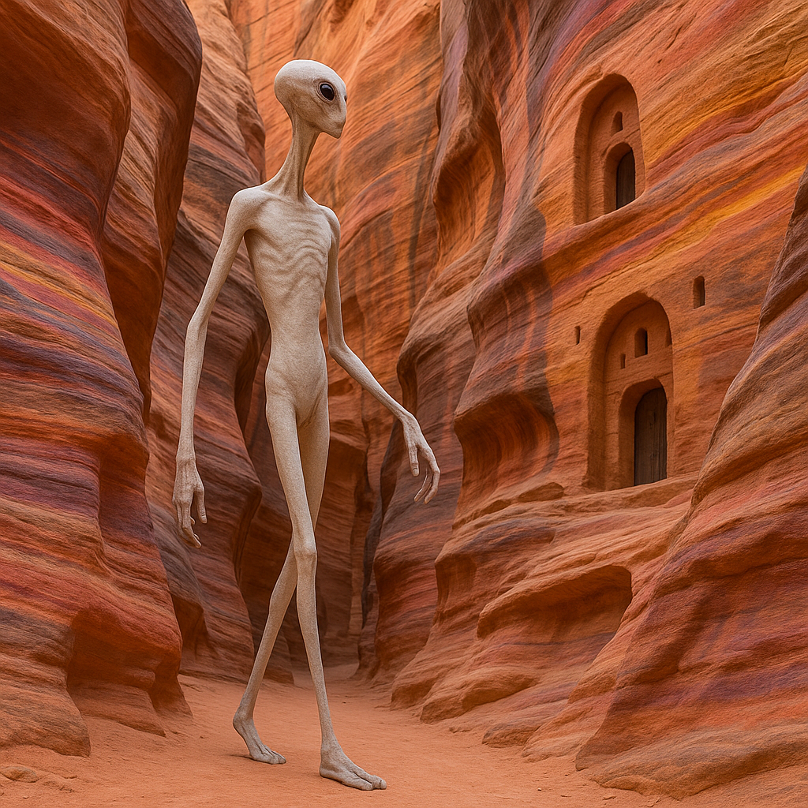

## Dranthel

### Description:

The Dranthel are tall, reed-thin beings whose remarkably flexible spines let their bodies bend, coil, and sway like wind-stirred grass. Elongated and gracile, they seem almost too slender to stand, yet their supple frames possess a quiet strength, and they move with a fluid, undulating elegance that other species find mesmerizing to watch. Their long limbs and pliant joints give them an extraordinary range of motion, allowing them to fold and compress their bodies into spaces that appear far too small to admit them.

For the Dranthel, movement itself is the highest **social art**. The way one carries oneself, the grace of a bow, the eloquence of a gesture — these are the measures of refinement in their culture, more telling than any spoken word. From childhood they study the disciplines of motion the way other peoples study rhetoric or music, and their great gatherings feature intricate ceremonial dances in which status, courtesy, emotion, and even argument are expressed entirely through choreographed movement. A clumsy or graceless Dranthel is pitied; a supremely elegant one is adored.

Their flexibility is both practical and philosophical. Able to **squeeze through remarkably narrow spaces**, the Dranthel build soaring, labyrinthine cities full of slim passages and tight apertures that only they can comfortably traverse, and they prize adaptability and suppleness in temperament as much as in body. They distrust rigidity in all its forms — of posture, of thought, of custom — holding that the stiff thing breaks while the supple thing endures. To bend, to flow, to yield gracefully and spring back is, to the Dranthel, the very secret of a life well lived.

### Notable Traits:

- Habitat: Spire-cities, canyon lands, and tall reed-wetlands
- Lifespan: 120–150 years
- Strength: Extreme flexibility, grace, and the ability to pass through tight spaces
- Weakness: Physically frail with little raw strength
- Temperament: Graceful, adaptable, and refined

### Fun Fact:

A Dranthel can slip through a gap barely wider than its own head, folding its flexible spine like a ribbon drawn through a ring.

---

*"The rigid reed snaps in the storm; the supple one bows and rises again."* — Dranthel proverb

[Back to Aliens](../aliens.md#dranthel)
