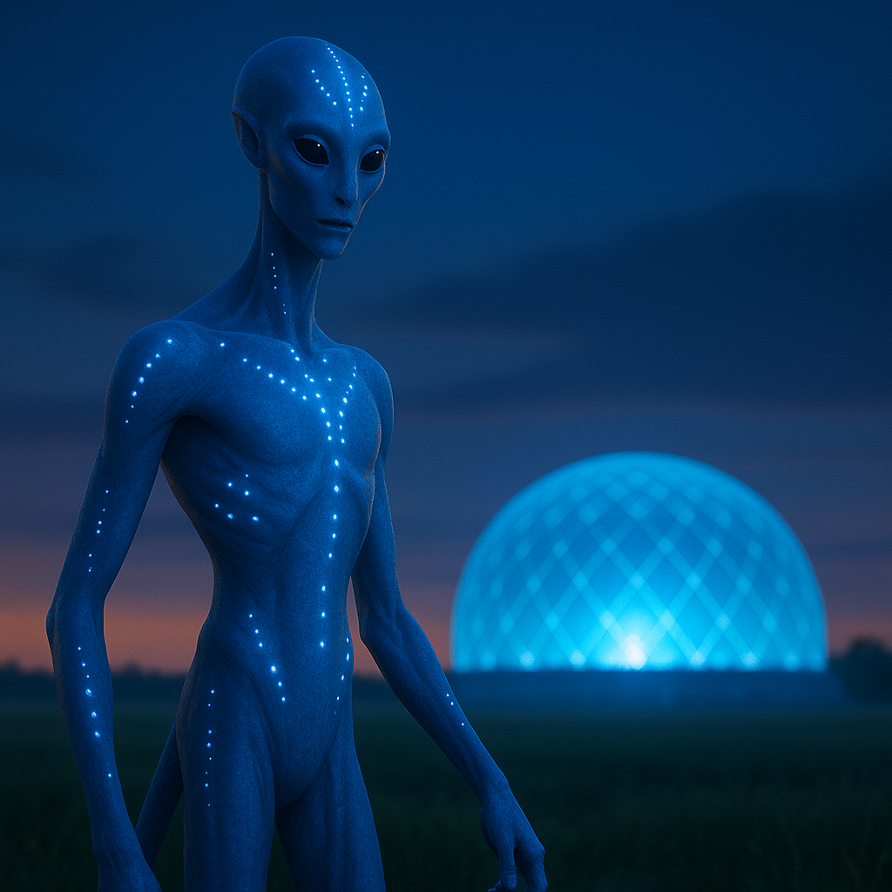

## Drava'Nel

### Description:

The Drava'Nel are tall, long-limbed beings whose smooth skin ranges across every shade of blue, from pale sky to deep midnight. Across that skin run luminous markings — rivers of soft light that pulse and drift like slow constellations, brightening with emotion and dimming in repose. In darkness a gathering of Drava'Nel resembles a field of wandering stars, each pattern as individual as a fingerprint, each shift of glow a word in a language without sound.

For the Drava'Nel, the dead are never truly gone. They believe that when a Drava'Nel passes, its memories dissolve into the great shared dreaming that every member of the species enters in sleep. Through these ancestral dreams the living commune with those who came before, seeking counsel, comfort, and the accumulated wisdom of generations. Dream-tenders, revered figures who can guide and interpret the collective sleep, hold a place of honor somewhere between priest and historian, and the most sacred ceremonies are conducted not in waking life but in the shared dark behind closed eyes.

Their luminous markings are far more than decoration. By consciously shifting the patterns of light across their skin, the Drava'Nel communicate silently and swiftly, conveying nuance that spoken words would blunt. Whole conversations pass between them in utter silence, glows rippling in call and response. This silent language shapes a culture that prizes subtlety, honesty of feeling (for the markings are difficult to falsify), and the quiet intimacy of understanding without speech. Lies are rare among the Drava'Nel, not from superior virtue but because deception glows plainly for all to see.

Socially the Drava'Nel organize into dream-lineages rather than bloodlines, extended communities bound by the ancestors they share in sleep. Status flows from the richness of one's dream-memory and the clarity of one's light. They are contemplative and inward by nature, given to long silences and sudden, luminous bursts of shared feeling, and they regard the hurried, noisy ways of other species with gentle bafflement. To be alone and dark — cut off from both the dreaming and the glowing conversation of one's kin — is, to a Drava'Nel, the loneliest fate imaginable.

### Notable Traits:

- Habitat: Shadowed valleys and night-blooming forests
- Lifespan: Long — 160 years or more
- Strength: Silent luminous communication and access to ancestral dream-wisdom
- Weakness: Markings betray their emotions, making concealment nearly impossible
- Temperament: Contemplative, honest, and quietly devoted

### Fun Fact:

A Drava'Nel courtship is conducted entirely in silence, two lovers slowly synchronizing the drifting lights across their skin.

---

*"The ancestors do not sleep; they dream through us."* — Drava'Nel dream-tender's words

[Back to Aliens](../aliens.md#dravanel)
