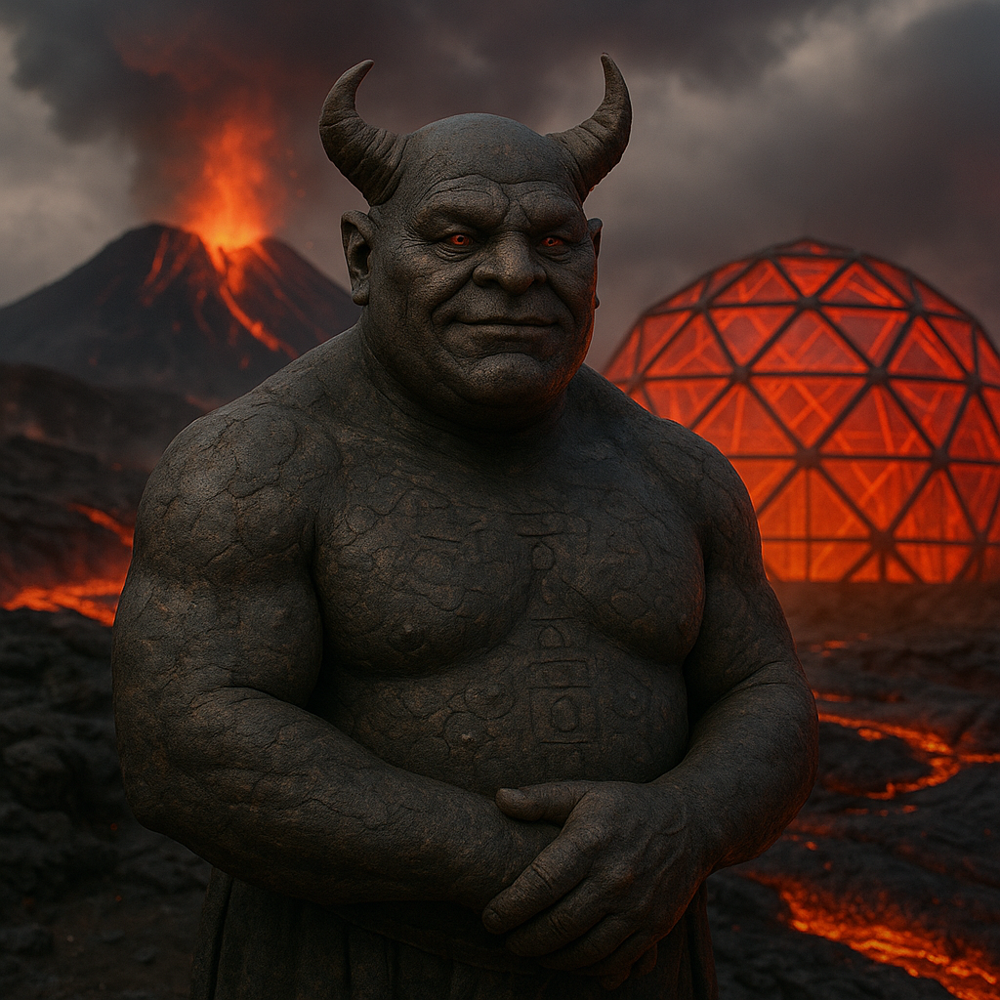

## Draviim

### Description:

The Draviim are a heavyset, slow-moving people hewn, it seems, from the very mountains they inhabit. Their thick hides are the deep red-black of cooled basalt, cracked here and there to reveal a faint inner glow, and great curving horns of volcanic glass sweep back from their broad skulls. They dwell in the smoking calderas and lava-fields of their homeworld, utterly unbothered by heat that would scorch other beings to ash, and they wade through molten rivers as casually as a Qortham through surf.

For the Draviim, the land itself is their book. They keep no paper and few metals, for nothing endures like stone; instead they are master lavastone masons and forge-smiths, quarrying and shaping the cooling flows into dwellings, tools, and towering monuments, and carving the records of their families — births, bonds, feuds, and deeds — directly into fresh-cooled lava, letting each eruption lay down a new blank page for the next generation to inscribe. Their cities are vast archives of carved stone layered atop one another across the ages, so that to walk through a Draviim settlement is to read downward through centuries of history, the oldest records buried deepest beneath the hardened flows.

Their faith reveres the Deep Fire, the molten heart of the world, which they believe is the source of all life and the forge in which souls are tempered. Eruptions are not disasters but sacraments — the world speaking, offering fresh stone upon which to write the future. Draviim elders, called Stonewardens, are charged with reading the ancient carvings and settling disputes by appeal to the deeds of ancestors literally set in stone. Patient, deliberate, and immensely proud of their lineages, the Draviim measure their worth not in gold or conquest but in how many generations of their blood are preserved, legibly, in the living rock.

### Notable Traits:

- Habitat: Volcanic calderas and lava fields
- Lifespan: 200 years
- Strength: Near-total heat resistance; immense durability; prodigious lavastone forging and masonry
- Weakness: Slow, ponderous, and ill-suited to cold
- Temperament: Stoic, traditional, and proud of lineage

### Fun Fact:

The Draviim consider a volcanic eruption near their city a blessing, rushing to carve new family records into the fresh lava before it fully hardens.

---

*"Stone remembers what flesh forgets."* — Draviim Stonewarden's maxim

[Back to Aliens](../aliens.md#draviim)
