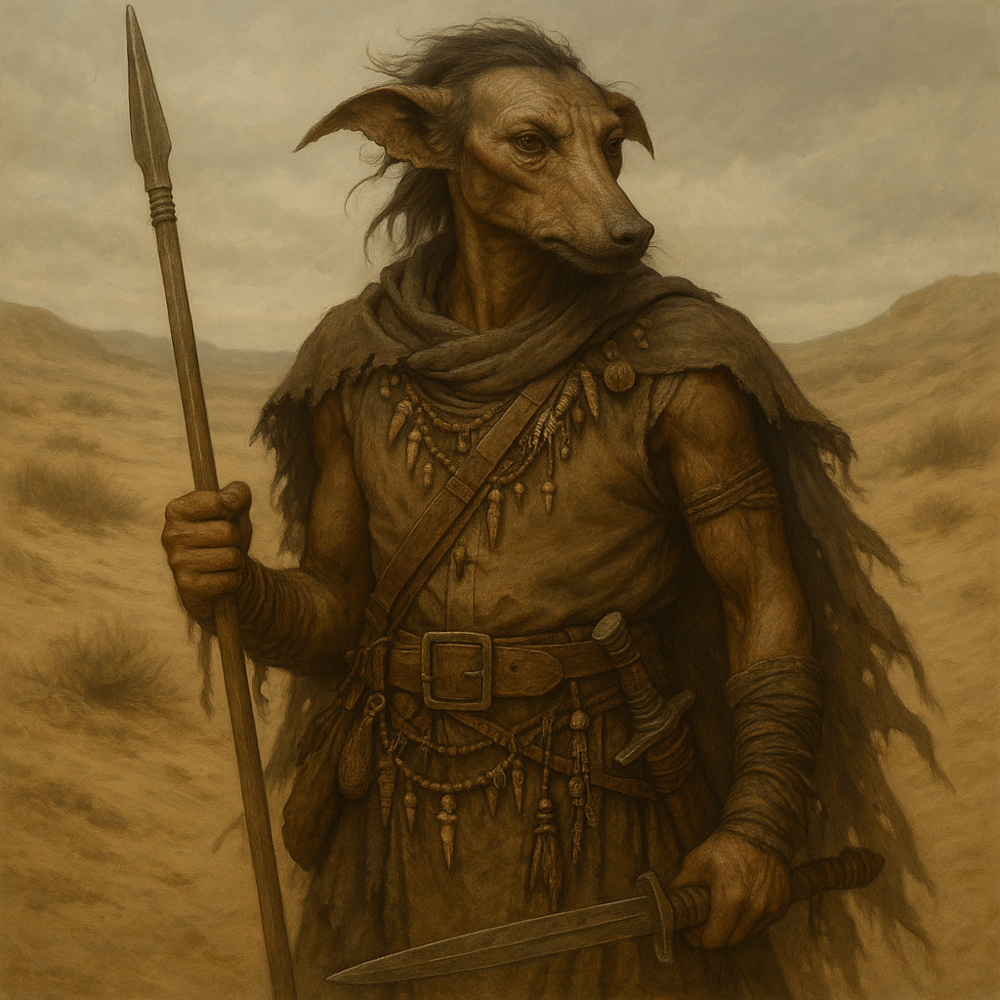

## Dravok

### Description:

The Dravok are wiry, weather-hardened nomads whose dust-colored hides are seamed with the creases of a life spent under open sky. Lean and tireless, they are built for the long ride and the sudden strike, with narrow faces, flattened ears that lie back in the wind, and keen dark eyes forever scanning the land for sign and spoor. They festoon themselves with the trophies and trinkets of a hundred roamings — bone charms, scavenged metal, braided cords marking each raid survived — so that a Dravok rider jingles faintly with the sum of their own history.

Dravok life is the life of the moving camp, forever following water, game, and opportunity across the wild margins of the world. They own nothing they cannot carry and prize nothing they cannot defend from a saddle, and their famed adaptability lets them thrive where settled peoples starve. Their society is fluid and meritocratic — leaders rise by cunning and daring and fall the moment their luck or judgment fails — and their lore is a vast oral map of trails, fords, hiding-places, and the weaknesses of every people they have ever skirmished against. To the Dravok, roots are a trap and walls are a coffin; freedom is the open distance ahead.

The Dravok fight as skirmisher-raiders, striking the flanks and stragglers of larger forces, harrying supply lines, and vanishing into country no heavy army can follow. Their aggression is bold and risk-hungry — a Dravok war-leader will stake a camp's survival on a daring night-raid without hesitation — yet it is always leavened by their adaptability, for they will drop a losing fight and reshape their whole plan in an afternoon. They do not seek to hold ground, only to bleed and loot those who do, and their genius is in knowing when a gamble has gone wrong and melting away before the cost comes due. Pure recklessness, they say, is for peoples with somewhere to be buried.

### Notable Traits:

- Habitat: Roaming camps across steppe, badland, and open frontier
- Lifespan: 70 years
- Strength: Unmatched mobility, adaptability, and skirmishing cunning
- Weakness: Cannot take or hold fortified ground; fractures into feuding bands
- Temperament: Aggressive and risk-taking, but adaptable and quick to change course

### Fun Fact:

A Dravok measures distance not in leagues but in "sleeps," and the greatest insult among them is to call someone "a people of one sleep" — those too settled to ever move again.

---

*"The dead own land. The living own the road."* — Dravok trail-saying

[Back to Aliens](../aliens.md#dravok)