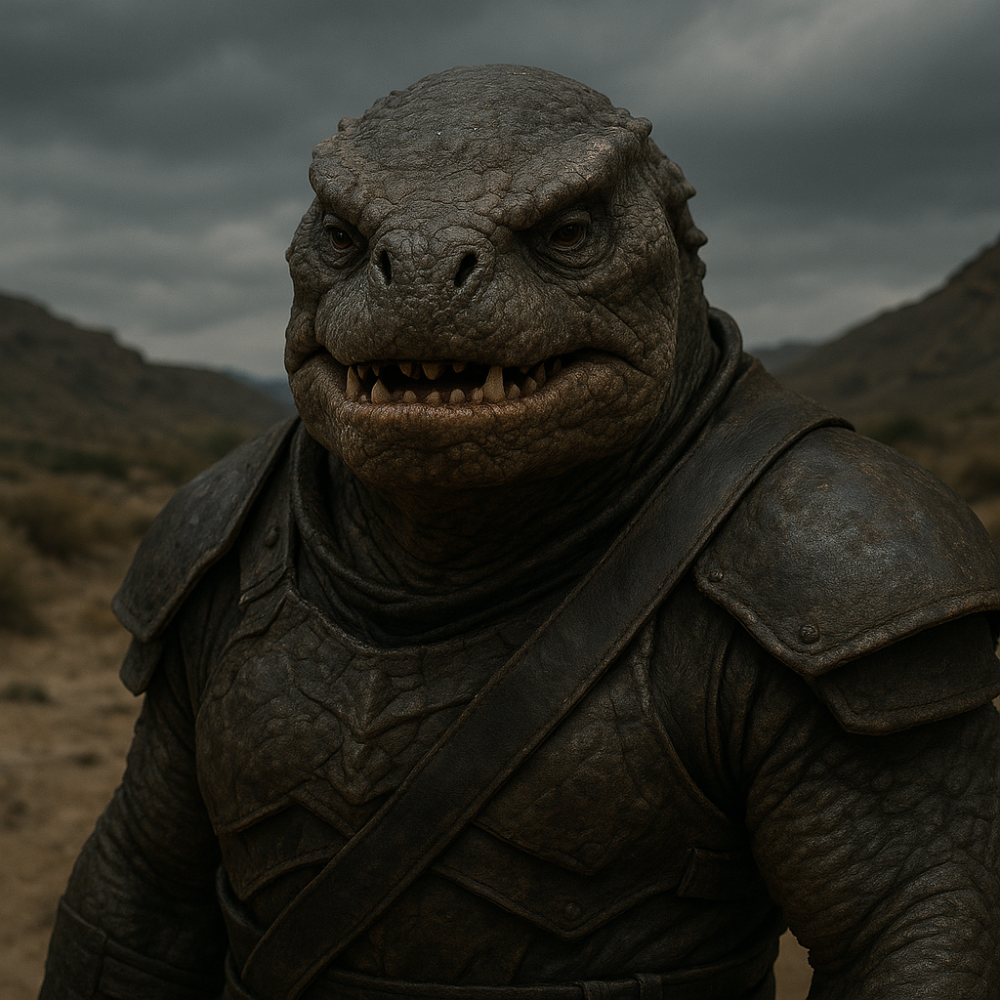

## Draznok

### Description:

The Draznok are broad-jawed, heavily armored scavengers whose squat, overlapping plates of chitinous bone give them the appearance of walking rockslides. Their faces are dominated by immense, hinged jaws lined with grinding ridges rather than teeth, capable of exerting a crushing force that can splinter petrified wood and crack open the toughest seed-pods. Low to the ground and powerfully built, a Draznok moves with a deliberate, rolling gait, their small eyes set beneath heavy brow-shields that protect against the dust and grit of the ruined lands they favor.

Central to Draznok culture is the sacred principle that **nothing should be wasted**. Where other species see refuse, the Draznok see unclaimed abundance. Their settlements rise atop the discarded and the forgotten — middens reclaimed, carcasses rendered down to the marrow, fibrous husks and bitter rinds that no other digestion could tolerate broken down by the Draznok's famously resilient gut. To waste food, to abandon a usable scrap, is considered among the gravest of social sins, and children are taught the Litany of the Last Morsel before they can walk.

This frugality shapes every tier of their society. The most honored members of a Draznok clan are not warriors or chieftains but the **Renderers**, elders who know how to extract value from the seemingly valueless, and the **Gatherers**, who range far to recover what others have left behind. Feasts are communal affairs where a single discarded harvest can sustain an entire warren, and the host who serves a meal with zero remainder earns tremendous prestige. Their powerful digestion is not merely a biological trait but a cultural cornerstone — the Draznok believe their stomachs are a gift that obliges them to redeem what the galaxy throws away.

### Notable Traits:

- Habitat: Scrublands, badlands, and ruined terrain
- Lifespan: 90–120 years
- Strength: Powerful crushing bite and the ability to digest tough, fibrous, otherwise-inedible matter
- Weakness: Slow-moving and poorly suited to delicate or precise work
- Temperament: Gruff, pragmatic, and fiercely protective of their stores

### Fun Fact:

A Draznok can subsist for a full season on a diet of woody bark and bitter rind that would be lethal to nearly any other species.

---

*"The hungry fool discards the rind; the wise Draznok dines upon it twice."* — Draznok proverb

[Back to Aliens](../aliens.md#draznok)
