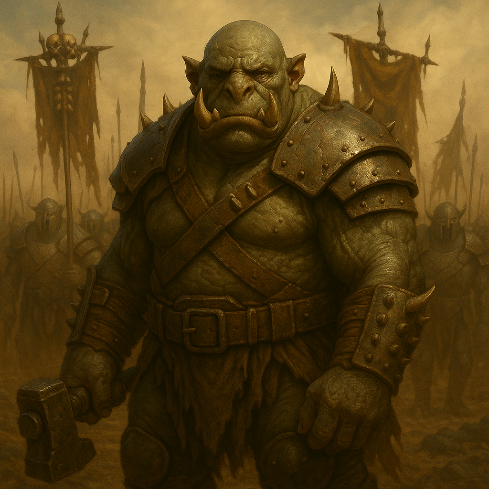

## Drommok

### Description:

The Drommok are mountains that have learned to march. Broad as doorways and twice as heavy, their grey-green hides hang in thick folds over slabs of muscle, and a pair of upward-curving tusks frame a blunt, patient face. Smaller tusks and bony knobs stud their knuckles and brow, each one filed and polished, for a Drommok's body is itself a record of its deeds. They move without hurry, the way a landslide is in no hurry, and when a Drommok war-band crests a ridge in formation the ground is said to answer with a low drumming before the first horn ever sounds.

Where lesser raiders attack in a frenzy, the Drommok attack on schedule. Their war-bands are disciplined to the bone, drilled through long winters in the warren-forts until a hundred warriors move as one deliberate animal. Rank is earned and displayed through trophies: a tusk-ring for a broken fortress, a notched collar for a slain champion, a cloak of hide for an enemy war-leader bested in single combat. A Drommok with a bare collar is a Drommok with everything still to prove, and nothing is more dangerous than a young Drommok hungry for its first ring. Their trophy-halls are vast, cold galleries where the glories of generations hang in careful rows, and to walk them is to understand that for the Drommok, war is not chaos but craft.

Their warlike nature springs not from blind rage but from conviction. The Drommok believe that worth cannot be inherited, declared, or bought — it can only be taken from a worthy foe, in the open, before witnesses. A people who sit behind walls and grow soft are, to the Drommok, already dead; raiding them is less an act of malice than a kind of grim mercy, a reminder that strength is the only currency the universe honors. They prepare for years and strike for days, methodical and unstoppable, and when the fighting ends they take their trophies, salute the fallen, and begin preparing for the next campaign. There is no cruelty in it, and no pause.

### Notable Traits:

- Habitat: Fortified warren-forts carved into cold highland stone
- Lifespan: 90 years
- Strength: Disciplined, armored war-bands that fight as a single deliberate machine
- Weakness: Methodical to a fault — slow to adapt once a campaign is set in motion
- Temperament: Relentlessly aggressive, but cold, patient, and calculating in its violence

### Fun Fact:

A Drommok's social rank can be read at a glance from the number of tusk-rings on its collar, and challenging one to combat requires first touching the ring you intend to win.

---

*"The soft call it war. We call it the harvest, and we are never late."* — Drommok trophy-hall inscription

[Back to Aliens](../aliens.md#drommok)
