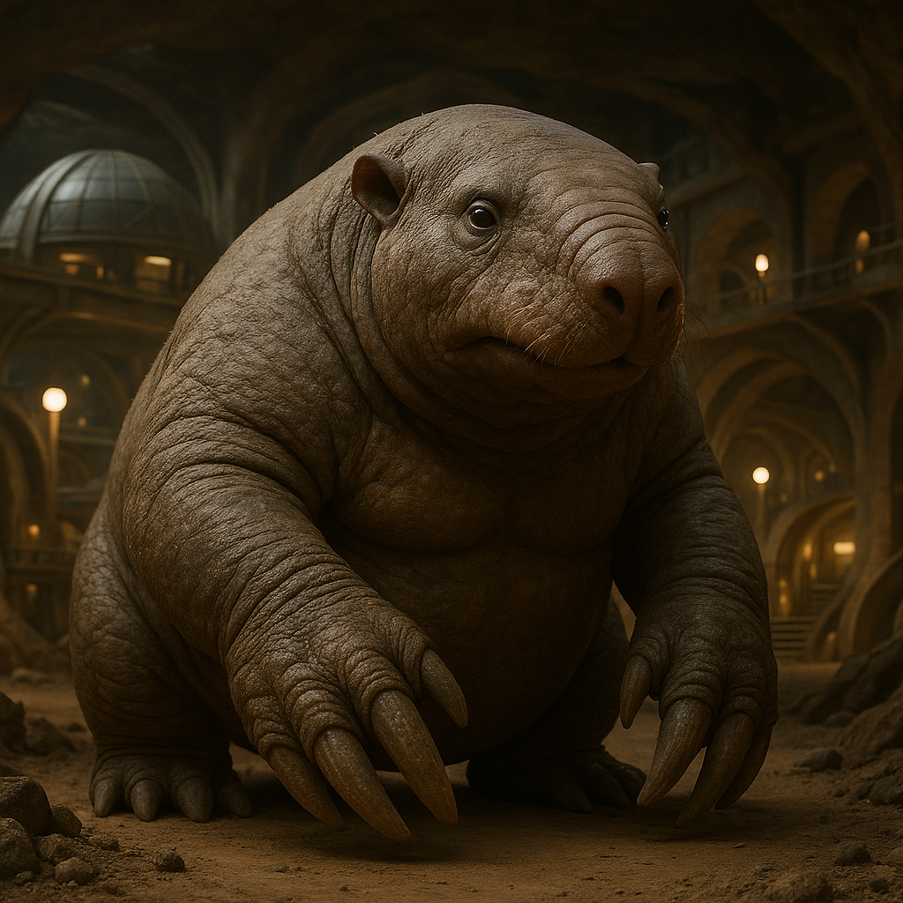

## Drommus

### Description:

The Drommus are massive, powerfully built burrowers, their hunched bodies rippling with muscle and sheathed in thick, dust-colored hide. Their forelimbs end in broad, shovel-shaped claws capable of moving tremendous volumes of earth, and their small, nearly vestigial eyes are shielded beneath heavy brows, for the Drommus live in a world of darkness where sight matters little. What they lack in vision they more than repay in a staggering sensitivity to vibration: a Drommus feels the world through the soil, reading the tremors of distant movement, the shifting of water tables, and the subtle pressure-waves that herald an approaching storm long before the first cloud darkens the surface.

Beneath the plains and hills of their world, the Drommus have carved cities of breathtaking scale — vast cathedral-caverns linked by miles of smooth-bored tunnels, chambers for dwelling, growing, and gathering, all excavated and shaped over generations by patient claw. These underground metropolises are engineering marvels, perfectly ventilated and precisely graded to drain away floodwater, and the Drommus navigate them not by light but by memory and the familiar hum of home conducted through the living rock. To surface-dwellers the tunnels seem a lightless maze; to the Drommus they are as legible as a map.

Their storm-sense shapes a culture of foresight and preparation. A Drommus community reacts to a tremor in the earth days before danger arrives — sealing tunnels, shoring up chambers, moving the young to high ground within the depths. This gift has made them cautious, methodical planners who distrust haste and plan generations ahead; a Drommus elder may begin digging a chamber whose purpose will only be understood by grandchildren not yet born. They measure wisdom by how far ahead one can feel the coming shape of things.

Drommus society is communal and deeply cooperative, for no single digger can carve a city alone. Labor is shared, wealth is pooled, and the great works of excavation are collective undertakings that bind entire generations together. Slow to trust outsiders and uneasy in open spaces beneath the naked sky, the Drommus are nonetheless steadfast and loyal once a bond is formed, and their underground halls have sheltered many a refugee from storms both literal and otherwise.

### Notable Traits:

- Habitat: Deep subterranean cities beneath plains and hills
- Lifespan: 120 years
- Strength: Prodigious digging power and the ability to sense storms and movement through the soil
- Weakness: Poor eyesight and acute discomfort in open, exposed surface terrain
- Temperament: Methodical, cautious, and communal

### Fun Fact:

Drommus can feel a storm coming through their feet days in advance, and their phrase for someone wise and far-sighted translates literally as "one who feels the far thunder."

---

*"Dig slowly, and dig for those who will walk the tunnels after you are gone."* — Drommus proverb

[Back to Aliens](../aliens.md#drommus)
