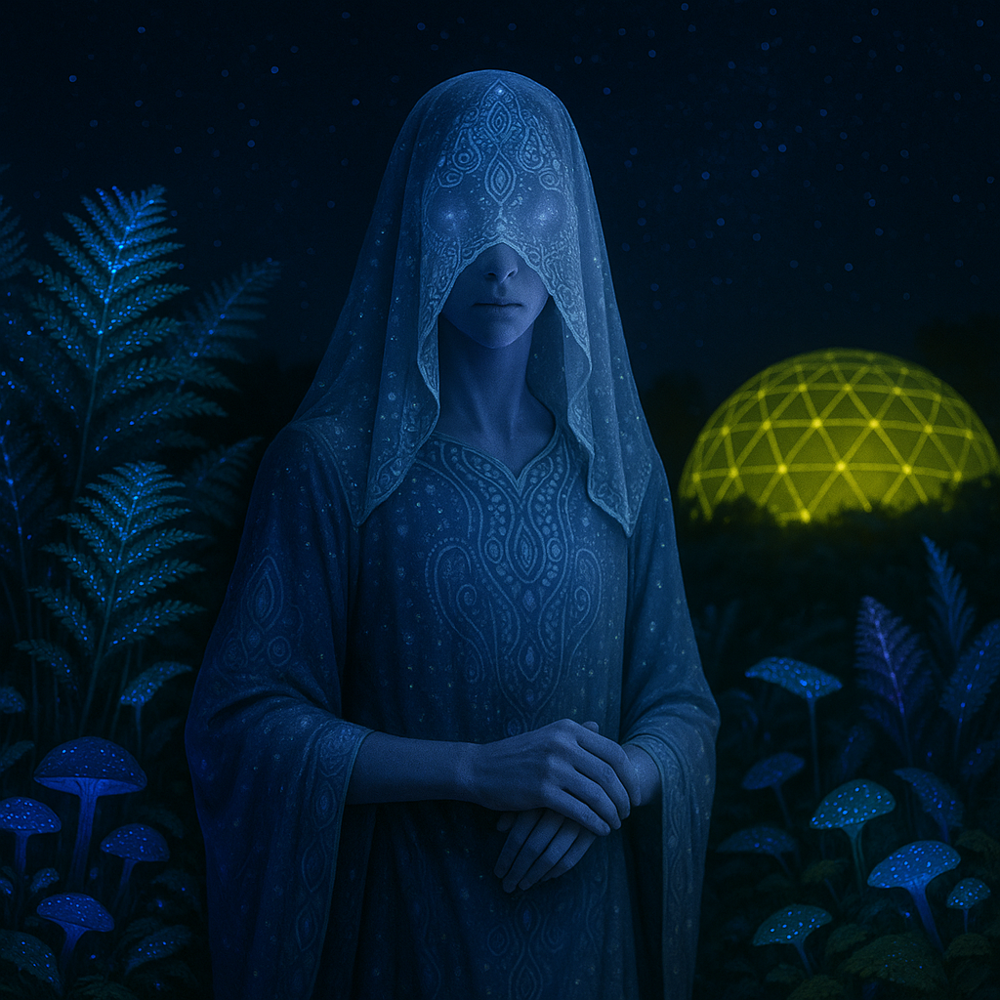

## Ezraliim

### Description:

The Ezraliim are delicate, fine-limbed beings whose large, jewel-faceted eyes drink in light across a spectrum far wider than most species can imagine. Because their sight is so acute, direct glare is painful to them, and so they wrap themselves in flowing, intricately **patterned veils** — gauzy layers whose geometric motifs encode family lineage, personal history, and the position of favored stars. To an Ezraliim, a bare face is a kind of nakedness, and the veil is both shelter and signature.

They are, above all, a people of the sky. Ezraliim civilization is built around the study of the heavens, and their great observatory-cities perch atop windswept mesas and dark, cloudless deserts where the stars burn clearest. Able to perceive infrared and ultraviolet light invisible to others, they read the night sky as a vast and living text, charting the slow dance of distant suns and whispering nebulae. Their calendars, their prophecies, their very names are drawn from the constellations, and a child is given the name of the star that stood at zenith on the night of their birth.

This devotion to light and distance makes the Ezraliim contemplative and far-seeing in temperament. Their scholars, the **Veil-Readers**, hold enormous respect, and their decisions are made with an eye toward consequences generations away — for a people who measure time by the light of dead stars, patience comes naturally. Yet they are fragile in body and shy of the harsh, bright present, preferring the cool hush of twilight and the quiet company of the cosmos to the clamor of crowds.

### Notable Traits:

- Habitat: High deserts, mesas, and observatory-cities
- Lifespan: 160–200 years
- Strength: Extraordinarily wide light perception and keen astronomical insight
- Weakness: Light-sensitive and physically delicate
- Temperament: Contemplative, soft-spoken, and far-sighted

### Fun Fact:

An Ezraliim can read the temperature of a distant fire by the color of its glow alone, long before its heat can be felt.

---

*"We are named for stars already dead; so too shall our names outlive us."* — Ezraliim proverb

[Back to Aliens](../aliens.md#ezraliim)
