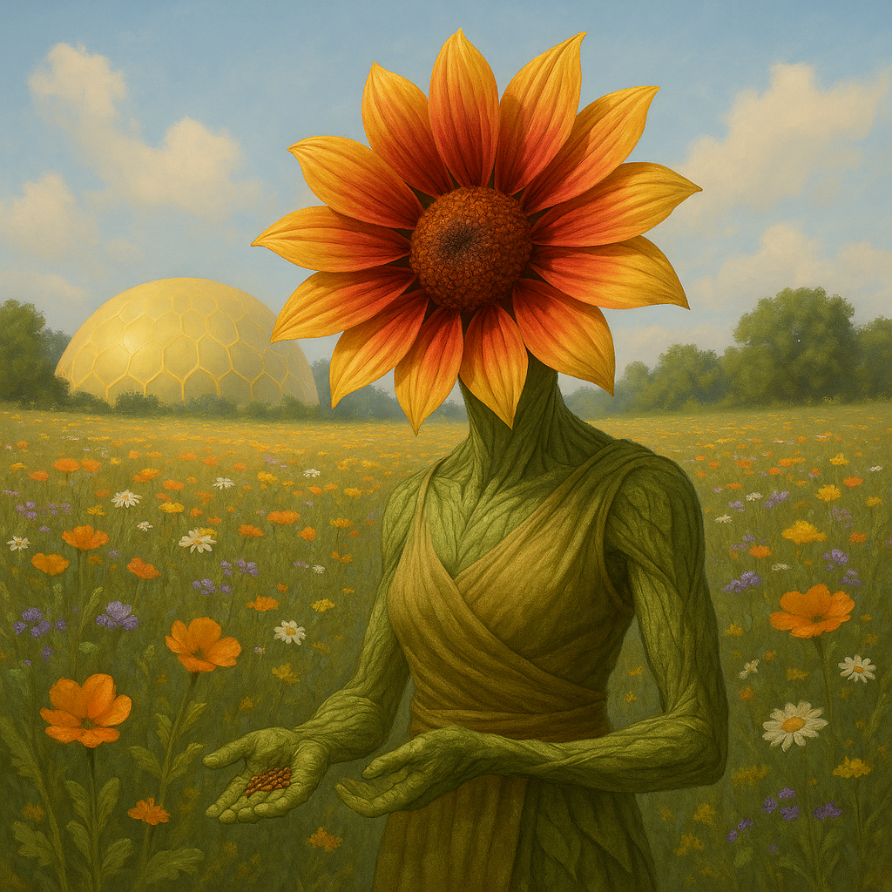

## Fylvaris

### Description:

The Fylvaris are a flower-faced, plantlike people, graceful and slow-moving, whose heads bloom into great petaled crests that open and close with the passing of the sun. Their skin is a supple green shading to the browns and golds of bark and autumn leaf, and the crowning crests — ringed in petals of every hue, like living chrysanthemums — serve as both face and organ, drinking in sunlight to feed the gentle fire of their lives. A Fylvaris does not eat as other peoples do; it stands in the light and grows quietly brighter, and a well-sunned Fylvaris in full bloom is one of the loveliest sights the continent has to offer.

Theirs is a culture rooted, almost literally, in growth and renewal. The Fylvaris reproduce by seed, and the central sacrament of their society is the seed-sharing rite, in which friends and allies exchange the precious seeds of their own flowering as the deepest possible gesture of trust and affection. To give another your seed is to give a piece of your future, a promise that your line and theirs will grow intertwined, and these rites bind the Fylvaris into vast overlapping networks of kinship and obligation that span whole regions. Friendship, among them, is not spoken but planted; a Fylvaris counts its truest companions by the gardens of shared seed it tends, and a betrayal is spoken of as "letting a given seed wither" — the cruelest phrase their gentle tongue possesses.

Because they live by light and renew by seed, the Fylvaris think in slow, cyclical, and deeply optimistic terms. Death holds little terror for a people who scatter their seed before they fade, trusting to rise again in the next generation's bloom, and so they face endings with a serenity that other peoples find almost unnerving. They are pacifists by temperament, abhorring the sudden violence that cuts a life off before its seeding, and they prize patience, gentleness, and the long view above all other virtues. Yet they are not weak: a people who can wait out any winter, who measure time in seasons and lineages rather than mere years, possess a quiet resilience that no sudden force can break. Burn a Fylvaris field, and the Fylvaris will only reply, with maddening calm, that the ash makes excellent soil.

### Notable Traits:

- Habitat: Sunlit meadows, river valleys, and warm fertile lowlands
- Lifespan: 100–200 years, renewed through seed across generations
- Strength: Photosynthetic self-sufficiency; patient, resilient, and renewing
- Weakness: Slow-moving and sun-dependent; wither in prolonged darkness or drought
- Temperament: Gentle, patient, and relentlessly hopeful

### Fun Fact:

A Fylvaris wedding is marked by the planting of a single shared seed, and the couple's bond is read in the health of the plant that grows from it ever after.

---

*"Give freely of your seed, for a friendship planted outlives the hand that planted it."* — Fylvaris seed-sharing vow

[Back to Aliens](../aliens.md#fylvaris)
