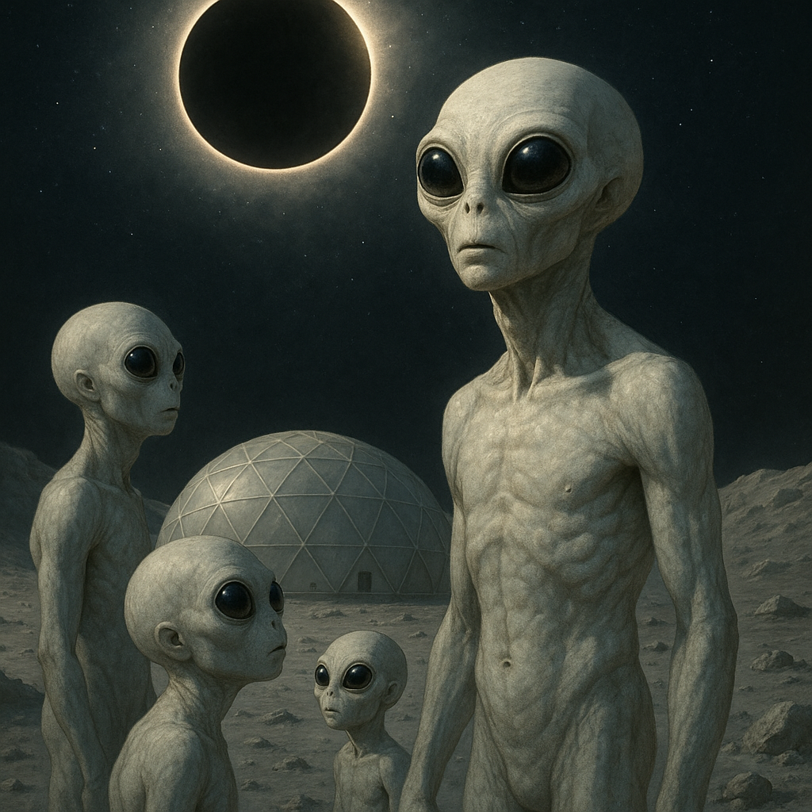

## Ghorlune

### Description:

The Ghorlune are a pale, long-limbed people who evolved beneath the dim light of a great moon, in the low gravity of a world that drifts in the shadow of its gas-giant parent. Their skin is the color of bone and ash, nearly translucent in places, and their eyes are enormous dark pools that drink in the faintest glimmers of starlight. Those broad eyes give them extraordinary night vision but make daylight painful; a Ghorlune abroad under a bright sun shields its gaze and moves with a hushed, careful reticence, waiting for the comfort of dusk.

In the gentle pull of their moon-world, the Ghorlune have become creatures of the leap. A single bound carries them soaring across chasms and up sheer cliffs, and their settlements are built vertically — slender towers and bridgeless platforms connected by nothing but open air, crossed in long, floating arcs. To watch Ghorlune move through their cities is to watch a slow, silent dance, bodies drifting between perches with an unhurried elegance that would be impossible under heavier gravity. Children learn to leap before they learn to walk steadily, and the greatest athletes among them can cross distances that leave visiting species breathless.

The Ghorlune are, above all, watchers of the sky. Their religion, their calendar, and their art all revolve around the slow mechanics of the heavens, and no event stirs them like an eclipse. When their world passes into the great planet's shadow, every Ghorlune gathers in the open — on rooftops, cliff-ledges, and high platforms — to witness the darkness fall and lift again in reverent silence. These eclipse-vigils are the holiest moments of their lives, occasions for reflection, reconciliation, and the quiet renewal of vows. A Ghorlune measures the span of a life not in years but in the number of eclipses they have beheld.

Theirs is a contemplative, soft-spoken culture that prizes patience, observation, and the long view. They make decisions slowly, as befits a people accustomed to watching the heavens turn, and they regard the frantic haste of other species with gentle bewilderment. Yet beneath their quiet lies a deep communal warmth, bound together by shared skies and the certainty that every darkness, in time, gives way to light.

### Notable Traits:

- Habitat: Low-gravity moon-worlds and dim, shadowed terrain
- Lifespan: 100 years
- Strength: Remarkable leaping ability and superb low-light vision
- Weakness: Painfully sensitive to bright light and clumsy under heavy gravity
- Temperament: Contemplative, patient, and reverent

### Fun Fact:

The Ghorlune count their ages not in years but in eclipses witnessed, and to say someone has "seen many shadows" is their highest term of respect for the wise.

---

*"Watch the shadow fall without fear, for the light has always returned."* — Ghorlune proverb

[Back to Aliens](../aliens.md#ghorlune)
