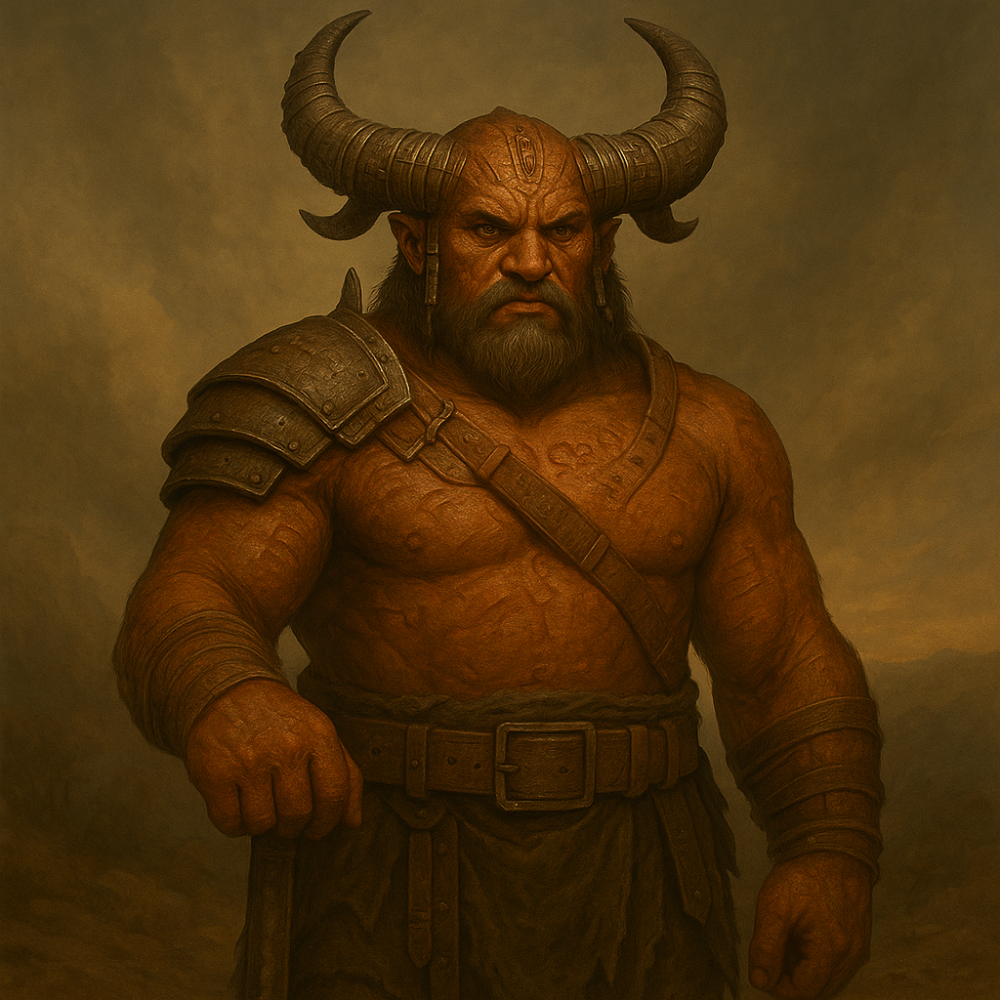

## Ghorreth

### Description:

The Ghorreth are a horned people, and the horns tell their whole story. Sweeping back from a heavy ridged skull, dark and spiraled and often banded with carved bone or beaten metal, a Ghorreth's horns grow longer and more ornate with age and achievement until the eldest clan-mothers wear crowns of their own living bone. Beneath them the Ghorreth are stocky and powerful, their rust-colored hides marked with ritual scarring that reads, to those who can parse it, like a ledger of oaths kept and foes bested. They stand square and still when they speak, meeting every gaze head-on, for among the Ghorreth to look away is to lie.

Within the clan, the Ghorreth are startlingly warm — a tight, loud, embracing people who share food from a common fire, raise one another's young without distinction, and sing their histories late into the night in deep harmonizing drones. But that warmth stops hard at the clan's edge. The Ghorreth live by a brutal and intricate honor code, the *Vrokha*, which governs every slight, every debt, and every drop of blood owed. An insult to one Ghorreth is an insult to the whole clan, and the *Vrokha* permits only one answer: the challenge, called openly, settled in blood before witnesses. Grudges are inherited like heirlooms, carried down the generations with the horns, and a Ghorreth clan will march to war over a wrong done to an ancestor none of them ever met.

Their aggression, then, is ritual made flesh. The Ghorreth do not raid for plunder or sport; they fight to balance the ledger, and the ledger is never, ever balanced for long. Every victory incurs a fresh debt of vengeance from the defeated, every defeat an obligation to answer, so that the clans spin in an endless, formalized storm of challenge and reprisal. There is a terrible courtesy to Ghorreth war — foes are named, challenges are announced, the forms are observed to the letter — but within those forms the violence is total and the mercy is nil. To wrong a Ghorreth is to bind yourself to them forever, in the only way they truly understand.

### Notable Traits:

- Habitat: Walled clan-holds around a sacred common fire
- Lifespan: 110 years, their horns growing all the while
- Strength: Ferocious clan loyalty and an inexhaustible appetite for blood-debt vengeance
- Weakness: Bound by the rigid *Vrokha* code; honor can be used to bait them into ruinous fights
- Temperament: Fiercely, ritually aggressive — every slight is a declaration of war

### Fun Fact:

A Ghorreth clan keeps a knotted cord called the blood-ledger recording every unavenged wrong, and no feast may be held while a single knot remains untied.

---

*"Within the fire, my blood is yours. Beyond it, your blood is the ledger's."* — opening line of the Vrokha

[Back to Aliens](../aliens.md#ghorreth)
