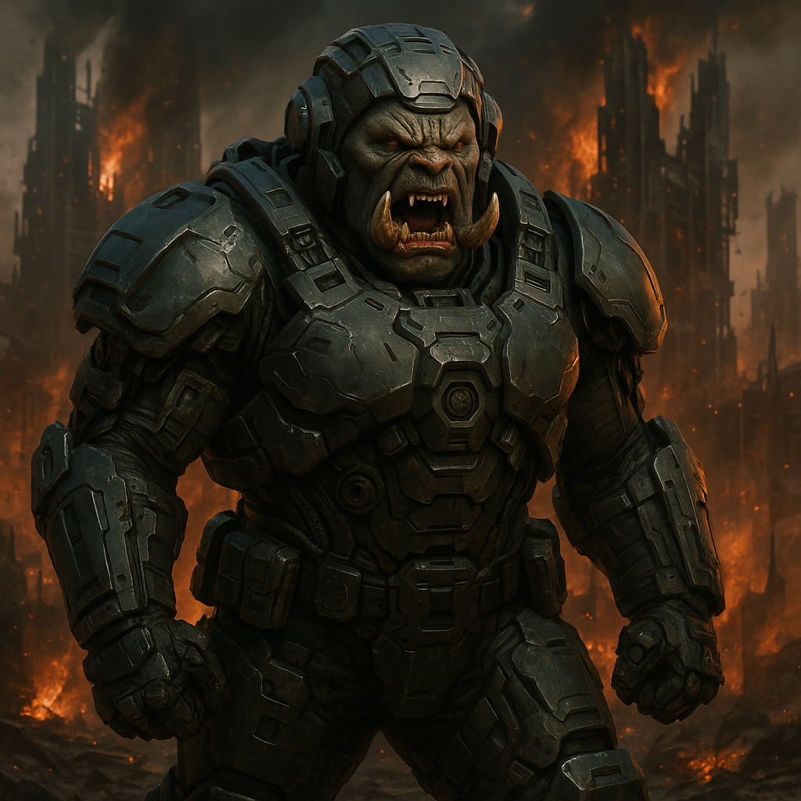

## Grakmaw

### Description:

The Grakmaw are a species built for violence, slab-muscled and crimson-hided, their jaws crowded with tusks that jut past their lips even when closed. Bony spurs erupt from their forearms and shoulders, and their small, bloodshot eyes sit deep beneath a shelf of scarred brow. They do not walk so much as advance, each footfall landing with the certainty of a creature that has never once considered retreat. To meet a Grakmaw is to understand, instantly and in the gut, that negotiation was never on the table.

Grakmaw society is a furnace of perpetual conquest. Their every institution — the war-moots, the trophy-halls, the brand-rites burned into a warrior's hide for each foe broken — exists to feed an appetite for dominance that borders on the religious. They hold that the universe belongs to whoever is strong enough to take it, and that mercy is simply weakness that hasn't yet been punished. Diplomats sent to the Grakmaw rarely return; those who do bring back only a single carved tusk, the Grakmaw's traditional reply to the very idea of a treaty. Words, to them, are the noise prey makes before it is silenced.

What makes the Grakmaw truly dangerous is not merely their ferocity but their utter indifference to survival. A Grakmaw war-band will hurl itself at a fortified position with no plan of retreat and no concern for losses, because to die charging is the highest honor their creed allows and to die cautiously is no honor at all. Their chieftains are chosen by the simplest contest imaginable, and the reign of a Grakmaw warlord lasts exactly as long as no one stronger has yet challenged them. They expand not through settlement but through the raw momentum of ruin, pouring over borders because standing still, to a Grakmaw, is a slow and shameful death.

### Notable Traits:

- Habitat: Scorched warrens and the smoking ruins of others' colonies
- Lifespan: 50 years (fewer, for the ambitious)
- Strength: Overwhelming ferocity and total fearlessness in battle
- Weakness: Reckless to the point of self-destruction; incapable of diplomacy
- Temperament: Belligerent, domineering, and utterly without restraint

### Fun Fact:

The Grakmaw language has no word for "surrender" — the nearest equivalent translates literally as "the laughter before the end."

---

*"Talk is the sound of the beaten. We prefer the quiet after."* — Grakmaw war-moot saying

[Back to Aliens](../aliens.md#grakmaw)
