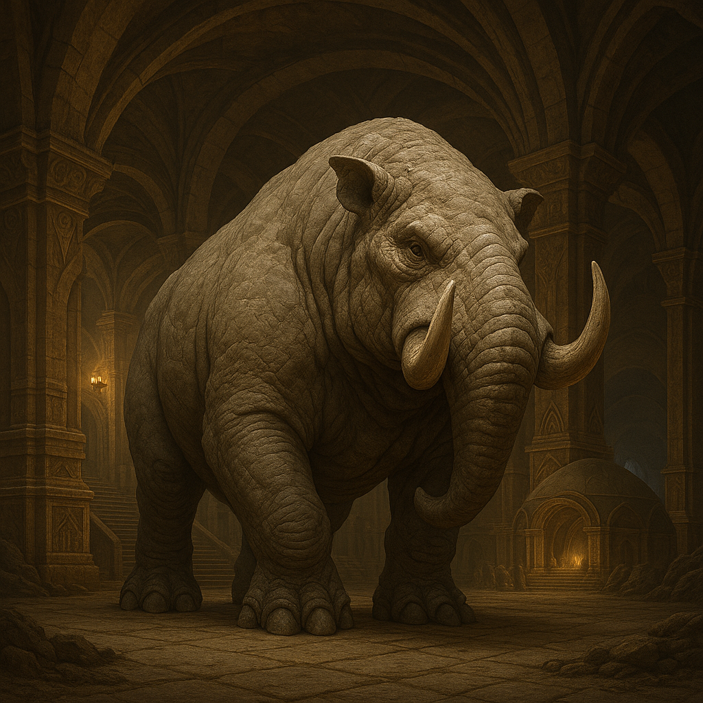

## Grondaal

### Description:

The Grondaal are massive, tusked burrowers whose stone-colored hide is so thick and craggy that a resting Grondaal can be mistaken for an outcrop of living rock. Immense claws, broad as shovels, carve through earth and stone with tireless power, and their heavy, low-slung bodies are built to push through the deep dark. Blunt tusks and armored brows shield them as they dig, and their small eyes matter little in the lightless halls where they spend their lives — for the Grondaal perceive the world not by sight but by the trembling of the earth itself.

Able to **sense tremors from afar**, the Grondaal feel the approach of a visitor, a landslide, or a distant quake through the stone long before it arrives, reading the ground as a living map of vibration. This gift makes them watchful and hard to surprise, and it lies at the root of their reputation as steadfast guardians of the deep. Their vast **underground halls** are the pride of their people — sprawling, cathedral-like networks of chambers and tunnels, carved over generations, that serve as **family strongholds** passed from ancestor to descendant.

To a Grondaal, lineage and the hall are inseparable. A family's identity is bound up in the stone it has shaped, the depth it has reached, and the ancestors interred within its walls, and the deepest, oldest halls command the greatest respect. They are a proud, rooted, and intensely loyal people, quick to bristle and immovable once roused in defense of their own. Measuring wealth in halls hewn and kin sheltered, the Grondaal hold that a family without its stronghold is a family without a soul, and they labor across lifetimes to deepen the strongholds their children will one day inherit.

### Notable Traits:

- Habitat: Deep tunnels, mountain roots, and underground strongholds
- Lifespan: 170–210 years
- Strength: Immense digging power and the ability to sense distant tremors
- Weakness: Poor eyesight and ill at ease in open, surface spaces
- Temperament: Proud, loyal, and steadfast

### Fun Fact:

A Grondaal can feel the footsteps of an approaching visitor through solid rock from a great distance, and will often have the welcoming hall prepared before the guest even arrives.

---

*"A family is only as deep as the hall it has carved."* — Grondaal proverb

[Back to Aliens](../aliens.md#grondaal)
