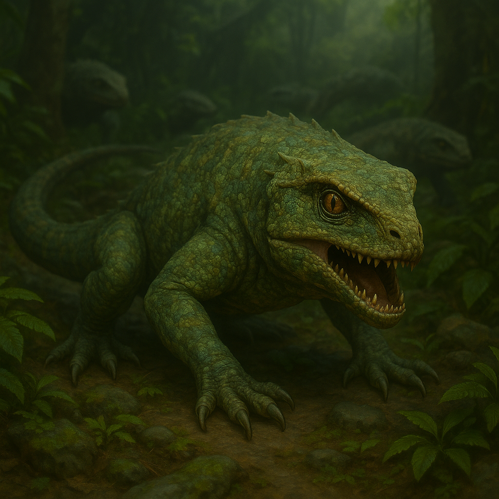

## Hssvarn

### Description:

The Hssvarn are reptilian and all but invisible until the instant they decide not to be. Low-slung and sinuous, their overlapping scales shift color to drink in whatever surrounds them — the mottled green of jungle shadow, the dun of dry scrub, the dappled grey of broken stone — so that a Hssvarn hunting-pack can lie in plain sight across open ground and never be seen. Twin pits beneath their slitted eyes read the heat of living things through fog and darkness, and their jaws unhinge around rows of recurved teeth. They move in a liquid, boneless silence, and the first and often last sign of a Hssvarn is the one already closing its jaws.

The Hssvarn are ambush-hunters raised to the level of a civilization, and their defining trait is a near-boundless adaptability. They range impossibly far and thrive impossibly wide — stalking the deep jungles, basking in the deserts, slipping through wetland reeds, even denning in frozen uplands when the hunt leads there — reshaping their tactics to each new ground as effortlessly as their scales reshape their color. They build no fixed strongholds worth the name; instead they seed the whole continent with hidden dens and watch-posts, a diffuse web of patient predators who always seem to already be wherever the fighting is about to happen. To make war on the Hssvarn is to discover there is no front line, no safe rear, and no border they have not already quietly crossed.

Their aggression is the cold, total aggression of the ambush predator — not hot-blooded fury but the patient, inevitable violence of a thing that has decided you are prey. The Hssvarn do not charge; they wait, they encircle, they appear from the one direction no one was watching, and they strike with overwhelming speed before melting back into the land. They feel no need to announce themselves, hold no ground they cannot vanish from, and pursue their foes across any terrain and any distance until the matter is settled on their terms. A people who can strike from anywhere, adapt to anything, and are seen only when they wish to be make for the most insidious conquerors the continent has ever had to fear.

### Notable Traits:

- Habitat: Everywhere and nowhere — hidden dens seeded across every biome of the continent
- Lifespan: 120 years of patient hunting
- Strength: Adaptable, far-ranging ambushers who strike from any terrain, unseen, with no warning
- Weakness: Few fixed holdings to defend, but a drawn-out open battle robs them of their one great edge
- Temperament: Coldly, patiently aggressive — predators who regard every rival as prey

### Fun Fact:

A Hssvarn can hold perfectly still, color-matched to its surroundings, for days at a time, and their language has a distinct word for the exact moment prey realizes it has already been surrounded.

---

*"You will not see us coming. By the custom of our kind, that is only polite."* — Hssvarn hunting-proverb

[Back to Aliens](../aliens.md#hssvarn)
