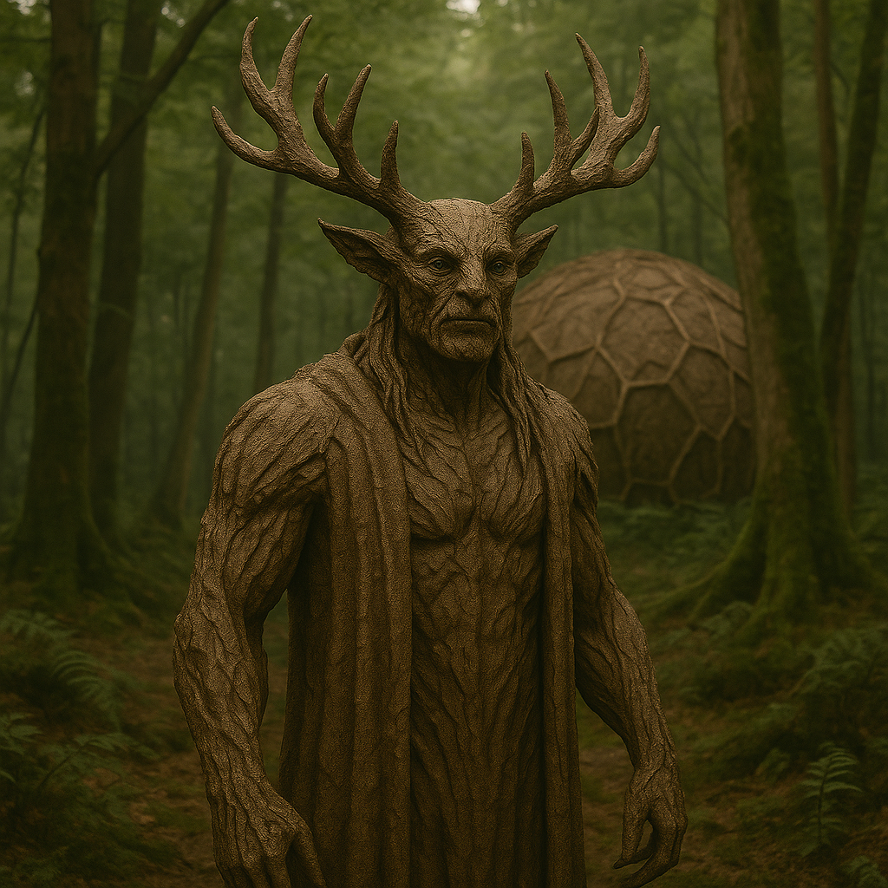

## Illandor

### Description:

The Illandor are tall, deliberate forest-dwellers whose skin has the texture and hue of weathered bark, grey-brown and furrowed, so that a motionless Illandor is nearly indistinguishable from the ancient trees among which they live. Great branching antlers rise from their brows, leafing and shedding with the turning of the seasons, and mossy growths soften their shoulders. They move slowly and rarely in haste, their long lives measured not in days but in the slow breath of the woodland itself.

Beneath the forest floor, the Illandor are joined by a living web. Fine, root-like tendrils extend from their feet and lower limbs, and when at rest they sink these into the soil to merge with the great mycelial networks that lace their homeworld. Through this rootweb the Illandor commune — sharing not words but sensations, nutrients, warnings, and dreams, so that the whole forest-people think together in a slow, patient, distributed consciousness. An Illandor standing alone is only half a self; it is in the rooted communion of the grove that they feel truly whole, their individual thoughts dissolving into the murmuring chorus of the wood.

Their lives turn upon the wheel of the seasons, each marked by solemn rites conducted in the deep groves. The spring Quickening, the high-summer Flourish, the autumn Shedding, and the long winter Stillness together form the sacred cycle around which all Illandor life is ordered. They worship no distant god but the forest itself, the Greatwood, of which they consider themselves living extensions rather than separate beings. To fell a tree without need is their gravest crime; to plant one, their holiest act. Patient almost beyond the comprehension of quicker peoples, the Illandor plan in centuries, nurture saplings they will never see grown, and regard the hasty ambitions of other species with gentle, rooted pity.

### Notable Traits:

- Habitat: Ancient forests and deep groves
- Lifespan: 400 years
- Strength: Rootweb communion; near-perfect woodland camouflage
- Weakness: Slow, immobile when rooted, and lost when far from forest
- Temperament: Patient, communal, and deeply contemplative

### Fun Fact:

An Illandor can "fall asleep" rooted in place for an entire winter, waking in spring with the shared dreams of the whole grove woven into its memory.

---

*"We do not speak across the grove; we are the grove, speaking to itself."* — Illandor rite of the Flourish

[Back to Aliens](../aliens.md#illandor)
