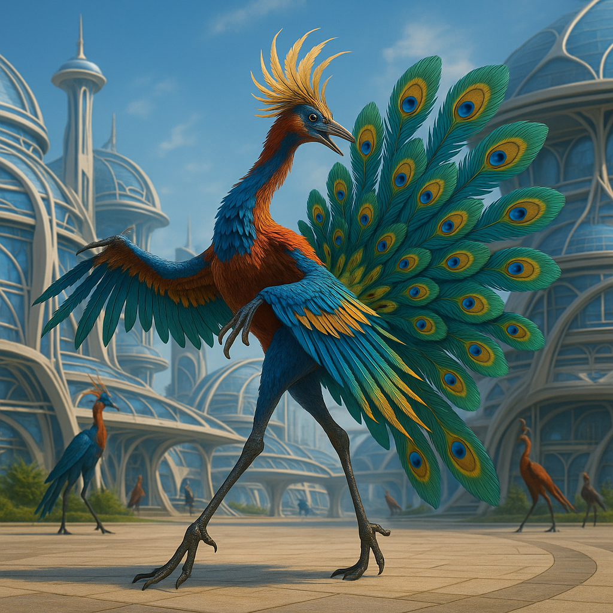

## Illveska

### Description:

The Illveska are a feathered, long-legged people, tall and striding, their slender bodies sheathed in plumage of extravagant beauty — crests and ruffs and sweeping tail-fans in iridescent blues, scarlets, and golds that catch the sun and scatter it in a shimmer of color. They walk upon elegant stilt-like legs built for distance, and even at rest they hold themselves with the poised, head-high alertness of creatures accustomed to seeing far across open country. There is nothing drab about an Illveska; display is woven into their very biology, and a dull-feathered individual is as rare and pitiable among them as a mute would be among a people who prize song.

Courtship is the great art and central drama of Illveska life, and they conduct it through dance. When the season turns, the open plains of their world fill with dancers — individuals and whole troupes spreading their brilliant plumage and performing intricate, exhausting courtship displays, leaping and spinning and bowing in patterns passed down and endlessly refined across generations. These dances are breathtaking spectacles, judged by discerning crowds, and an Illveska's standing in society rests heavily upon the grace and invention of its display. But the dance is more than mating; it is their highest form of expression, used to mark alliances, celebrate victories, mourn the dead, and seal agreements, so that an Illveska might truthfully be said to settle its most important business on its feet, mid-leap, in a flash of flung color.

Those same long legs that make them such dazzling dancers make them tireless travelers, able to cover enormous distances overland at a smooth, ground-eating stride that few other peoples can match or follow. The Illveska are a far-ranging folk, running their displays and their trade across whole continents, and they measure a life well-lived partly in the sheer distance it has covered. Their culture celebrates both motion and beauty as two faces of the same virtue — the belief that to move gracefully through the world, seen and admired, is the finest thing a creature can do. To stay still, drab, and unseen is, to the Illveska mind, hardly to have lived at all.

### Notable Traits:

- Habitat: Open plains, savannas, and broad grassy uplands
- Lifespan: 90–120 years
- Strength: Can run vast distances tirelessly; dazzling, expressive dancers
- Weakness: Vain and display-driven; poorly suited to confined or hidden life
- Temperament: Flamboyant, graceful, and fiercely self-displaying

### Fun Fact:

An Illveska that is too tired or too plain to dance at a gathering is politely said to be "resting its feathers" — a kindly fiction everyone agrees to believe.

---

*"The feet that will not dance and the feathers that will not shine have forgotten what they are for."* — Illveska courtship-master's teaching

[Back to Aliens](../aliens.md#illveska)
