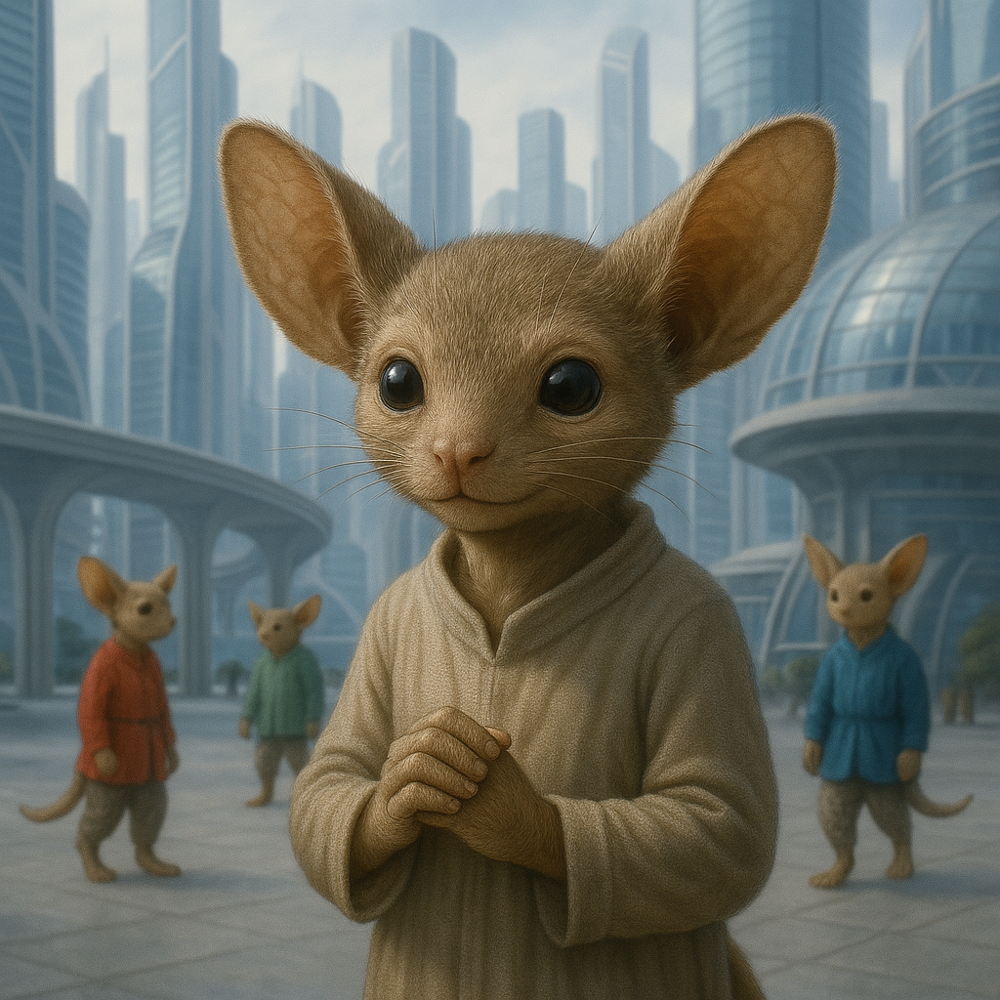

## Junossi

### Description:

The Junossi are small, warm-blooded beings with soft fur, oversized rounded ears, and remarkably nimble fingers. Barely half the height of most spacefaring peoples, they make up in warmth and wit what they lack in stature, and their enormous ears — forever twitching and turning — give them both acute hearing and an irresistibly expressive face. Their clever hands are never still, forever busy with some small task, gesture, or craft, and their bright eyes shine with an open, welcoming friendliness.

Hospitality is the sacred heart of Junossi culture. To the Junossi, there is no higher calling than the welcoming of a guest, and no greater disgrace than to turn a traveler away cold and hungry. Their homes are built around the hearth and the table, always with room for one more, and a stranger who comes to a Junossi door is received not as an intruder but as an honored visitor to be fed, warmed, and made comfortable before any question of business is raised. The elaborate rituals of welcome — the offering of food, the sharing of the fire, the exchange of pleasantries — are performed with genuine delight, for the Junossi believe that how one treats a guest is the truest measure of one's worth.

The Junossi are also the galaxy's great rememberers of the spoken word. Lacking any tradition of writing until recent ages, they developed prodigious memories and an art of oral history so refined that a trained Junossi loremaster can recite genealogies, treaties, and epic sagas stretching back thousands of years without a single error. These living archives are revered figures, and the great gatherings at which they recite the accumulated memory of their people are the high festivals of Junossi life. A complex history recited flawlessly from memory is, to them, a work of art as fine as any sculpture.

Junossi society is close-knit, warm, and intensely social, organized around extended family-hearths that compete good-naturedly to be the most welcoming and the most learned. They are curious, talkative, and generous to a fault, delighting in the company of strangers and the stories they bring. Small and physically unimposing, the Junossi have survived and thrived not through strength but through kindness, memory, and the simple, powerful magic of an open door.

### Notable Traits:

- Habitat: Snug hearth-villages in temperate valleys and foothills
- Lifespan: 70 years
- Strength: Prodigious memory for oral history and warm, disarming hospitality
- Weakness: Small and physically weak, easily imposed upon by the ungenerous
- Temperament: Warm, hospitable, and curious

### Fun Fact:

A Junossi loremaster can recite genealogies and sagas stretching back thousands of years entirely from memory, and losing even one line is considered a profound dishonor.

---

*"No door is too small to welcome a stranger, and no memory too long to keep a kindness."* — Junossi proverb

[Back to Aliens](../aliens.md#junossi)
