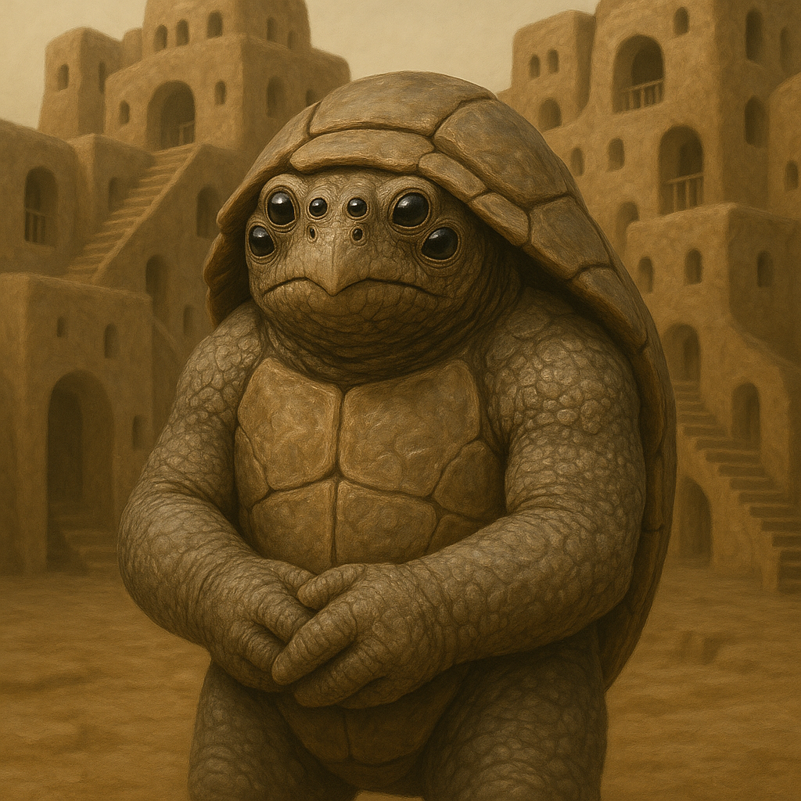

## Kaebrax

### Description:

The Kaebrax are thick-shelled, six-eyed builders, squat and armored beings encased in segmented carapaces of mottled brown and ochre. Six eyes — three to a side — grant them a wide, overlapping field of vision ideal for the precise work of construction, and their many-jointed limbs can wield tools, haul loads, and fit stone with equal ease. When threatened, a Kaebrax can withdraw entirely into its shell and seal the openings, becoming an impregnable living fortress that can wait out danger for days in perfect safety.

Building is the Kaebrax calling, and their communal architecture is renowned across the stars. They do not build as individuals but as colonies, vast cooperative efforts in which thousands of workers labor together to raise structures of staggering intricacy — honeycombed hive-cities, soaring vaulted halls, and sprawling complexes grown organically over centuries, every chamber fitted to the next with the precision of a puzzle-box. A Kaebrax city is a single collective masterpiece, never finished, forever extended and refined by each new generation, and to contribute a well-made chamber to the whole is the proudest achievement of a Kaebrax life.

Their ability to seal themselves within their shells shapes a culture of security and self-sufficiency. A Kaebrax need never fear being caught defenseless, and this deep-seated sense of safety frees them to be patient, deliberate, and unhurried in all things. It also makes them superb at weathering sieges, disasters, and hard times — when calamity strikes, the Kaebrax simply withdraw, seal up, and wait, emerging unharmed to rebuild once the danger has passed. Their architecture reflects this ethos, honeycombed with sealed refuges and designed to protect the colony through any catastrophe.

Kaebrax society is intensely communal and cooperative, organized around the great collective building-works that bind the colony together. Individual ambition is channeled entirely into the glory of the whole, and status is earned by the quality and usefulness of one's contribution to the shared structure. Industrious, patient, and defensive by nature, the Kaebrax are not aggressive — they build walls, not weapons — but they are nearly impossible to dislodge, for a people who can seal themselves in stone and wait have little to fear from those who cannot.

### Notable Traits:

- Habitat: Communal hive-cities built into hillsides and cliff-faces
- Lifespan: 90 years
- Strength: Masterful collective construction and the ability to seal into an armored shell
- Weakness: Slow and defensive, poorly suited to rapid offense or open mobility
- Temperament: Industrious, communal, and defensive

### Fun Fact:

During disasters a Kaebrax colony seals itself into its shell-chambers and can wait out catastrophe for days, emerging unharmed to rebuild from the first stone upward.

---

*"A wall built by one is a wall; a wall built by all is a home."* — Kaebrax proverb

[Back to Aliens](../aliens.md#kaebrax)
