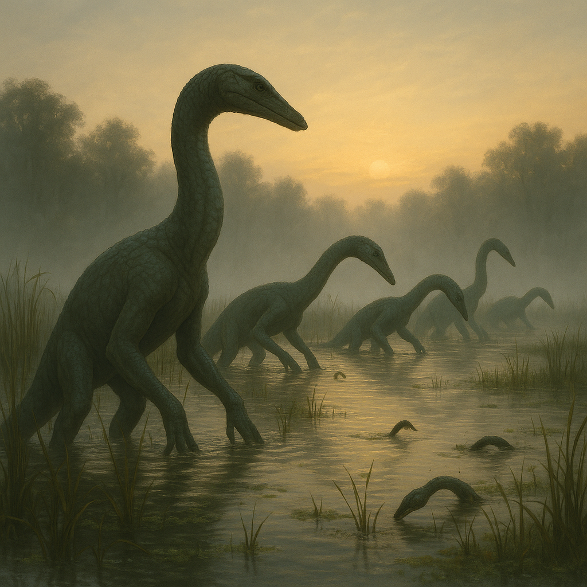

## Kavaslon

### Description:

The Kavaslon are scaled, long-necked dwellers of the great marshes, their bodies sheathed in overlapping plates of olive and umber that shed water and mud with equal ease. A grown Kavaslon stands tall on four splayed, webbed feet, its sinuous neck rising like a reed above the waterline, crowned by a narrow head with slitted golden eyes set for watching the horizon. They move through the wetlands with slow, deliberate steps, and in stillness they are nearly indistinguishable from the drowned logs and standing reeds around them.

Theirs is a culture of patience elevated to sacrament. At each dawn the Kavaslon gather at the water's edge for the Rite of Mist, standing motionless as the sun burns the fog from the marsh, offering silent thanks for another day of plenty. These ceremonies can last from first light until the mist is wholly gone, and to break stillness before the sun has done its work is a mark of profound disrespect. From these dawn vigils the Kavaslon draw their defining virtue: the ability to remain utterly motionless for hours, a discipline honed first in worship and perfected in the hunt.

That capacity for stillness shapes everything about Kavaslon life. Their hunters wade into the shallows and simply wait, becoming part of the landscape until prey drifts within reach of a single lightning strike of the neck. Children are taught the Long Wait before they are taught to swim, and a Kavaslon's social standing is measured less by what they do than by how calmly they can refrain from doing it. Impulsiveness is regarded as a kind of illness, soothed with communal breathing and the slow telling of marsh-tales.

Kavaslon society is loosely woven into "pools" — extended family groups that share a stretch of wetland and govern themselves by consensus reached over long, unhurried deliberations. Elders are revered not for strength but for the depth of their stillness, and the eldest among them, said to have "gone quiet," are believed to perceive the slow truths of the world that hurried minds miss. Outsiders often mistake Kavaslon calm for aloofness, but within their pools they are warm, loyal, and endlessly tolerant of one another's silences.

### Notable Traits:

- Habitat: Wetlands, marshes, and the margins of slow rivers
- Lifespan: Long — 150 to 200 years
- Strength: Perfect stillness and patience, both in hunting and in council
- Weakness: Slow to react to sudden change; poor on dry, open ground
- Temperament: Calm, deliberate, and deeply patient

### Fun Fact:

A Kavaslon hunter once held so still that a flock of marsh-birds nested on its back before it finally struck.

---

*"The reed that waits outlasts the storm that hurries."* — Kavaslon dawn-saying

[Back to Aliens](../aliens.md#kavaslon)
