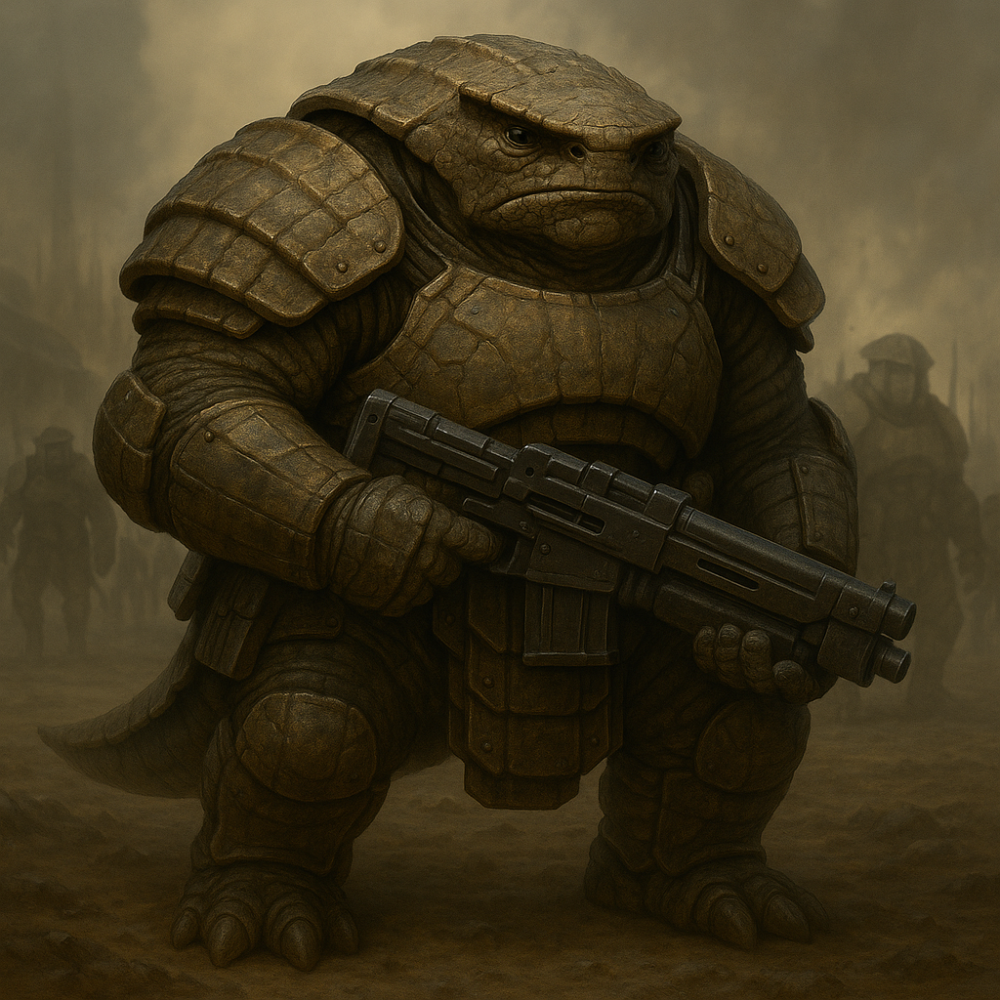

## Kelgroth

### Description:

The Kelgroth are broad, low-slung creatures whose bodies seem poured from the same molds as their armor. Thick plates of keratin grow in overlapping bands across their shoulders, chest, and spine, so that a mature Kelgroth looks less like a living thing and more like a siege engine draped in hide. Their faces are flat and expressionless beneath heavy brow-ridges, their four eyes arranged in a wide arc that misses nothing on a battlefield. They move in step, always in step, the rhythm of a marching column so deep in their blood that even Kelgroth children fall into cadence when they walk together.

Kelgroth society is organized into warrior-castes, each one a rigid tier with its own duties, insignia, and inherited honors. From the shield-bearers of the lowest rank to the iron marshals who command whole armies, every Kelgroth knows precisely where they stand and whom they must obey. This is not a culture of individual glory-seekers but of disciplined militarism — campaigns are planned in cold detail, supply lines are respected as sacred, and a soldier who breaks formation for personal valor is punished as harshly as a deserter. Beyond the battlefield the Kelgroth are surprisingly balanced, tending their foundries and grain-terraces with the same methodical patience they bring to war, for an army that cannot feed itself has already lost.

Their aggression is real and relentless, but it is the aggression of a professional army rather than a mob. The Kelgroth conquer because expansion is the stated policy of their high command, and they prosecute that policy with brutal efficiency, taking ground, fortifying it, and only then advancing again. They will offer terms to a foe who is clearly beaten — not from mercy, but because a surrendered enemy costs fewer soldiers than a cornered one. To the Kelgroth, war is a trade like any other, demanding mastery, planning, and the sober acceptance that every maneuver has its price.

### Notable Traits:

- Habitat: Terraced garrison-cities ringed by drilling-yards and foundries
- Lifespan: 90 years
- Strength: Iron discipline and coordinated, well-supplied campaigns
- Weakness: Rigid chains of command slow to adapt when a plan collapses
- Temperament: Aggressive and expansionist, yet methodical and ruled by its officers

### Fun Fact:

A Kelgroth marshal's rank is recorded not in titles but in the number of campaign-bands fused into their armor, each one earned by a war concluded without breaking the supply chain.

---

*"The charge that is not fed is a funeral with drums."* — Kelgroth marshal's maxim

[Back to Aliens](../aliens.md#kelgroth)