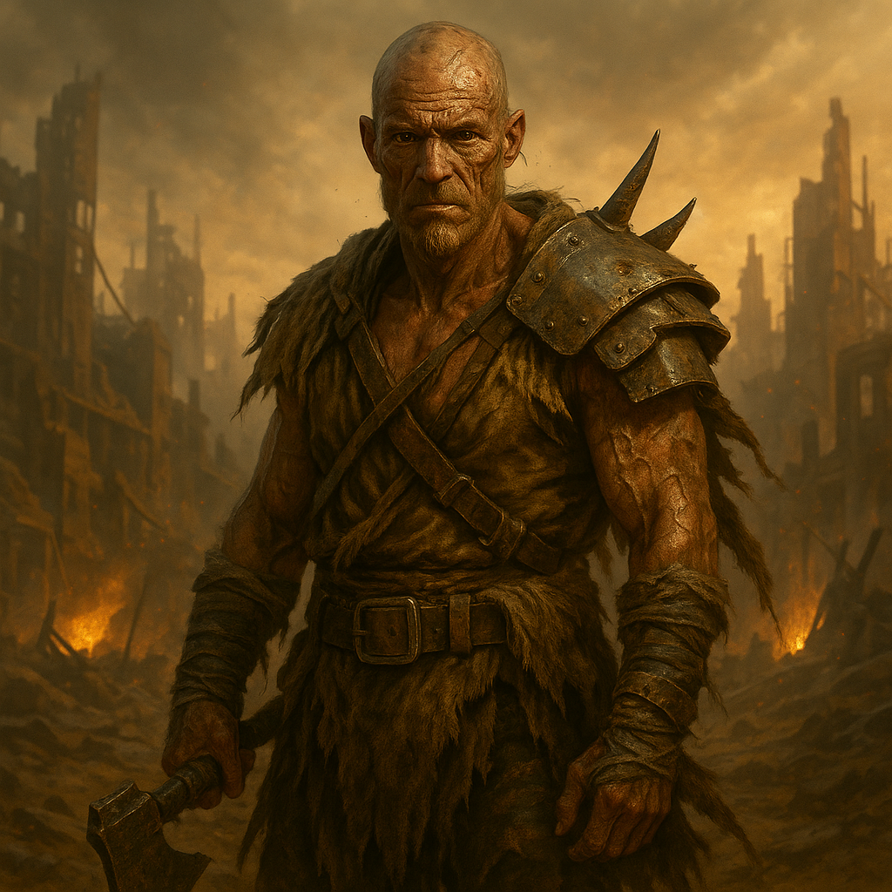

## Khaaros

### Description:

The Khaaros are a sinewy, scarred people of the wastelands, their weathered hide stretched over whipcord muscle and their eyes a pale, reckless gold that seems to dare the world to do its worst. They dress in salvaged plate and the hides of things they have killed, and they move with the loose, ready ease of beings who have never known a safe place and have long since stopped wanting one. Every Khaaros carries the marks of survived disasters, and they wear each scar openly, as others might wear medals.

Khaaros culture is a cult of the gamble. They hold that fortune favors only those who fling themselves at it without hesitation, and that a life lived cautiously is no life at all but a slow surrender. Their reavers range far and wide in battered convoys, striking where they are least expected, betting everything on raids no sane people would attempt and winning often enough to keep the creed alive. A Khaaros earns their name not by what they have hoarded but by the magnitude of the risks they have survived, and their fireside legends are not of wise rulers but of magnificent, improbable gambles that paid off against all odds.

What makes them formidable is how fluidly they bend to circumstance. The Khaaros have no fixed homeland and no fixed way of life; they adapt to any terrain, any climate, any desperate situation with the easy improvisation of a people for whom the plan was always going to change anyway. They do not negotiate — they find the very idea of haggling for what they could simply seize both baffling and faintly contemptible — and an envoy's careful overtures are as likely to be laughed at as answered. Fearless, blunt, and endlessly improvisational, the Khaaros treat the whole dangerous universe as a wager worth making, and they are rarely the ones who flinch first.

### Notable Traits:

- Habitat: Trackless wastes and the open road, wherever the raiding is good
- Lifespan: 60 years, lived at full speed
- Strength: Fearless opportunism and ferocious adaptability
- Weakness: Gambles so freely they court ruin; no patience for diplomacy
- Temperament: Daring, blunt, and gleefully reckless

### Fun Fact:

A Khaaros convoy chooses its next target by a ritual throw of marked bones — and considers ignoring the result the only true form of cowardice.

---

*"The careful die in bed, wondering. We would rather wonder nothing."* — Khaaros reaver-chant

[Back to Aliens](../aliens.md#khaaros)
