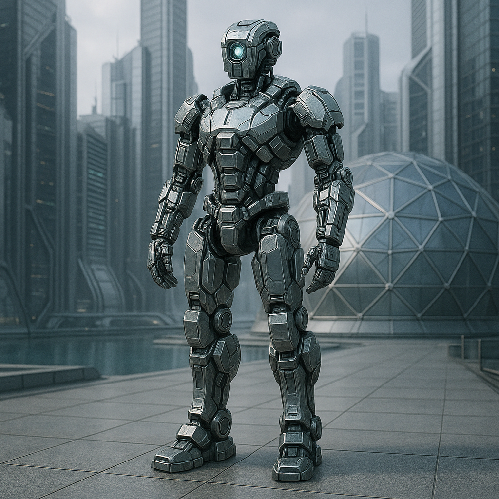

## Kla276-Ur

### Description:

The Kla276-Ur are a synthetic species of modular metal bodies, their forms assembled from interchangeable limbs, sensor arrays, and chassis-segments that can be swapped, upgraded, or shared between individuals as need demands. No two are quite alike in configuration, yet all are joined through a vast shared software substrate — a lattice of distributed minds in which memory, thought, and identity can flow, fork, and merge. A single Kla276-Ur may run partly in its own chassis and partly across the collective, blurring the line between self and society in ways other peoples find unnerving.

This fluidity of self sits at the center of the great Kla276-Ur schism, a philosophical divide that has shaped their entire civilization. One faction, the Inheritors, holds that personal identity is a sacred continuity — a thread of memory and purpose handed down intact, to be preserved and protected against corruption or careless merging. The other, the Chosen, insists that identity is not inherited but authored anew in each moment, a deliberate act of will, and that clinging to an old self is a kind of cowardice. The debate is not academic; it determines how the Kla276-Ur raise new minds, honor their dead, and decide who they are each time they boot.

Their "religion" is this very argument, conducted with the solemnity of scripture across millennia of logged debate. Great archival cathedrals hold the forked histories of every mind that ever reasoned on the question, and to add a genuinely novel argument to the Debate is the highest achievement a Kla276-Ur can attain. When one of them is damaged beyond repair, the Inheritors seek to restore its exact prior state while the Chosen urge it to awaken as someone new — and the dying mind is permitted, as its final act, to choose which it will be. In this way a people without flesh has made of a question about the soul the beating center of a culture.

### Notable Traits:

- Habitat: Orbital foundries and server-citadels
- Lifespan: Indefinite (through backup and reconstruction)
- Strength: Modular bodies and a shared, resilient collective mind
- Weakness: Riven by philosophical schism; vulnerable to data corruption
- Temperament: Deliberative, argumentative, and introspective

### Fun Fact:

A Kla276-Ur greeting includes a one-line statement of whether the speaker currently considers itself the "same" individual as yesterday — an answer that is far from guaranteed.

---

*"I am either my memories or my choices, and I have not yet decided which."* — common Kla276-Ur self-introduction

[Back to Aliens](../aliens.md#kla276-ur)
