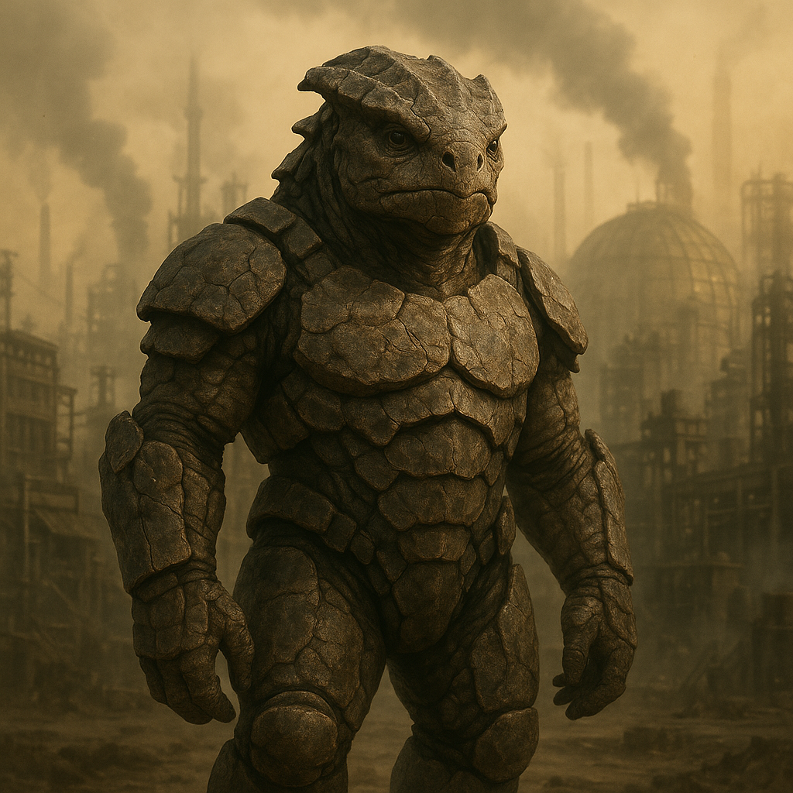

## Krethsibar

### Description:

The Krethsibar are rugged, heavily plated beings bred by brutal worlds — planets of scouring sandstorms, searing heat, and bitter cold. Their bodies are armored in thick, overlapping plates of mineral-rich hide, scarred and weathered like ancient stone, and their deep-set eyes peer out from beneath protective ridges. Slow to grow and slower still to heal, each Krethsibar wears a lifetime of hardship upon their very skin, their accumulated cracks and chips serving as a visible chronicle of survival.

Above all virtues, the Krethsibar prize **resilience**. On their unforgiving homeworlds, endurance was not a luxury but the sole dividing line between life and death, and this truth became the bedrock of their culture. They measure worth not by speed, cleverness, or beauty but by the capacity to withstand — to take the blow, to bear the drought, to keep standing when standing seems impossible. Their legends celebrate not conquerors but survivors, and their highest honorific translates roughly as "the Unbroken."

Their slow-healing hide gives this philosophy a solemn weight. Because an injury may take seasons to mend, the Krethsibar are deliberate, cautious, and deeply averse to needless risk — yet unshakeable once committed. Scars are worn with pride as proof of endurance, and elders bearing the most are accorded the deepest respect. Patient to the point of stubbornness, they build to last, promise rarely, and keep their word absolutely, holding that anything worth doing is worth doing in a way that outlasts the one who did it.

### Notable Traits:

- Habitat: Harsh deserts, volcanic wastes, and storm-wracked worlds
- Lifespan: 180–220 years
- Strength: Tremendous resilience and tough, protective plating
- Weakness: Slow to heal and ponderous in movement and growth
- Temperament: Stoic, cautious, and unyielding

### Fun Fact:

A Krethsibar treats each scar as a page of autobiography and can recount, in order, the hardship that left every mark.

---

*"The storm passes. The stone remains. Be the stone."* — Krethsibar proverb

[Back to Aliens](../aliens.md#krethsibar)
