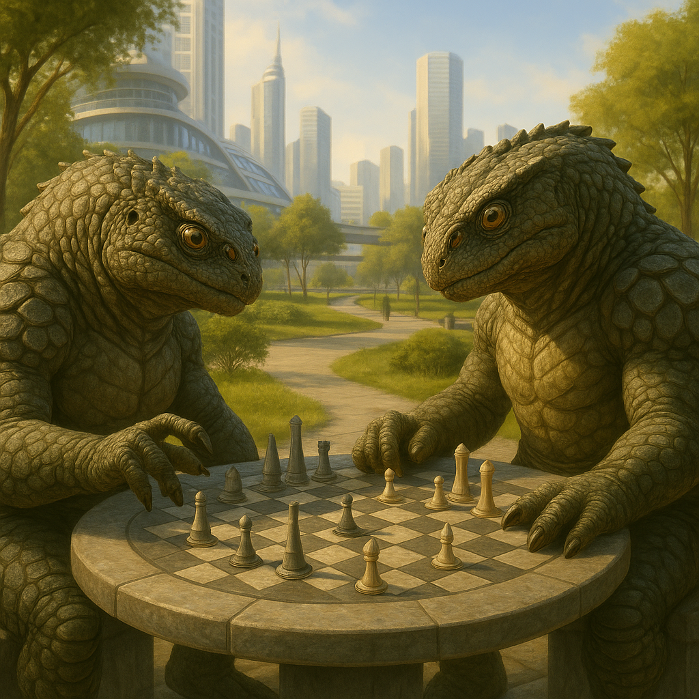

## Krondaxi

### Description:

The Krondaxi are heavy, four-eyed reptilians, massive and deliberate, armored head to tail in thick overlapping scales the color of old swamp-iron. Two of their four eyes face forward in the ordinary way; the other two sit higher and wider, sensitive not to light but to heat, so that a Krondaxi sees the world twice over — once in color and once in the glowing reds and blues of warmth and cold. They move slowly and settle heavily, with the unhurried gravity of creatures who have never in their lives needed to rush, and when a Krondaxi fixes all four eyes upon you there is a disconcerting sense of being very thoroughly observed.

Patience is the Krondaxi's cardinal virtue, elevated almost to a religion. They are a people of long games and longer memories, who regard haste as the mother of every blunder and who will happily wait out a rival across years or decades to secure an advantage that a quicker folk would have grasped and spoiled in an afternoon. Their society runs on carefully laid plans, generational strategies, and alliances measured in lifetimes; a Krondaxi makes no important move until it has considered every angle, and it considers angles the way a river considers the sea — slowly, inevitably, and with no doubt whatsoever about where it is going. To outsiders this makes them seem ponderous or even dull, right up until the long-prepared plan snaps shut and they understand, far too late, that the slow reptile was three moves ahead the whole time.

Their heat-sensing eyes feed directly into this strategic cast of mind. A Krondaxi can read the warmth of a body across a dark room, sense the lingering heat of a hand upon a lately-touched object, feel the subtle thermal shift of a lie-flushed face or a hidden fever, and track warm prey through the blackest night. Little escapes a people who can quite literally see what others only feel, and the Krondaxi have built their culture around the quiet confidence of the perfectly informed. They distrust theatrics and bluster, trusting instead the steady true signal of heat, and their proverbs counsel always to watch the warmth beneath the words. Cold-blooded in body and famously cool in temper, the Krondaxi are formidable precisely because they are so very hard to hurry and so very hard to deceive.

### Notable Traits:

- Habitat: Warm wetlands, sun-baked marshes, and sluggish river deltas
- Lifespan: 250–300 years, ample time for the longest plans
- Strength: Sense subtle shifts in heat; masters of patience and long strategy
- Weakness: Slow and cold-sluggish; sometimes outpaced by swifter rivals
- Temperament: Patient, calculating, and imperturbably cool

### Fun Fact:

A Krondaxi can tell when a guest is lying by the heat rising in its face, which is why their diplomats are impossible to bluff and their card games are never played for money.

---

*"The swift seize the hour; the patient inherit the age. Watch the heat beneath the words, and wait."* — Krondaxi strategist's counsel

[Back to Aliens](../aliens.md#krondaxi)
