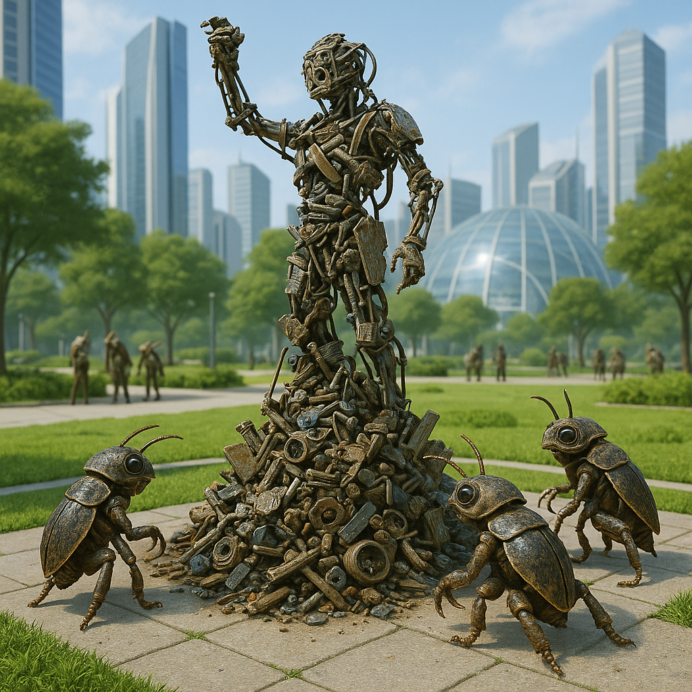

## Kryllos

### Description:

The Kryllos are small, darting creatures, each no taller than a child, armored in a glossy chitin that clicks and gleams in shades of beetle-green and oil-black. They move in sudden quick bursts, antennae forever twitching, compound eyes catching every flicker of motion, and they have about them the restless, delighted energy of a people who are never bored because the world is simply too full of interesting things lying around. For the Kryllos are scavengers in the proudest and most creative sense of the word: where other peoples see a rubbish heap, a Kryllos sees a treasury, a workshop, and a blank canvas all at once.

Nothing delights a Kryllos like the discarded. Their settlements rise, glittering and improbable, from the castoffs of grander civilizations — towers of welded scrap, mosaics of broken crockery, wind-chimes of bent cutlery, whole cathedrals assembled from what others threw away. To them this is not poverty but art and even piety; they hold that every object has a second life waiting inside it, and that to let a useful thing rot unused is a small blasphemy against the ingenuity of the world. A Kryllos artisan is judged not by the costliness of its materials but by the cleverness with which it redeems the worthless, and the finest among them are celebrated as heroes who can turn a heap of rust into something that makes the heart ache.

Their remarkable sense of smell is the engine of this whole way of life. A Kryllos can sniff out buried metal, catch the faint tang of a useful chemical on the breeze, follow a scent-trail through a maze of alleys, and tell at a single whiff whether a scrap is sound or rotten. This gift makes them superb foragers and uncanny trackers, and it has shaped a culture that trusts the nose over the eye: a Kryllos greets a friend by scent, remembers a place by scent, and believes that a lie, however smooth, always carries a faint sour note that an honest nose can catch. Quick-reflexed, inventive, and irrepressibly cheerful, the Kryllos are often underestimated by larger peoples — right up until they realize the little scavengers have quietly built something magnificent out of the garbage left behind.

### Notable Traits:

- Habitat: Ruins, waste-fields, and the fringes of larger settlements
- Lifespan: 60–80 years, lived at a frantic pace
- Strength: Remarkable sense of smell and lightning reflexes; peerless inventors
- Weakness: Small and fragile; easily overlooked and underestimated
- Temperament: Restless, inventive, and cheerfully opportunistic

### Fun Fact:

The Kryllos word for "masterpiece" translates literally as "best garbage," and it is the highest honor their art-guilds can bestow.

---

*"One creature's ruin is a Kryllos's raw material; throw nothing away where a hungry nose can smell it."* — Kryllos scavenger's blessing

[Back to Aliens](../aliens.md#kryllos)
