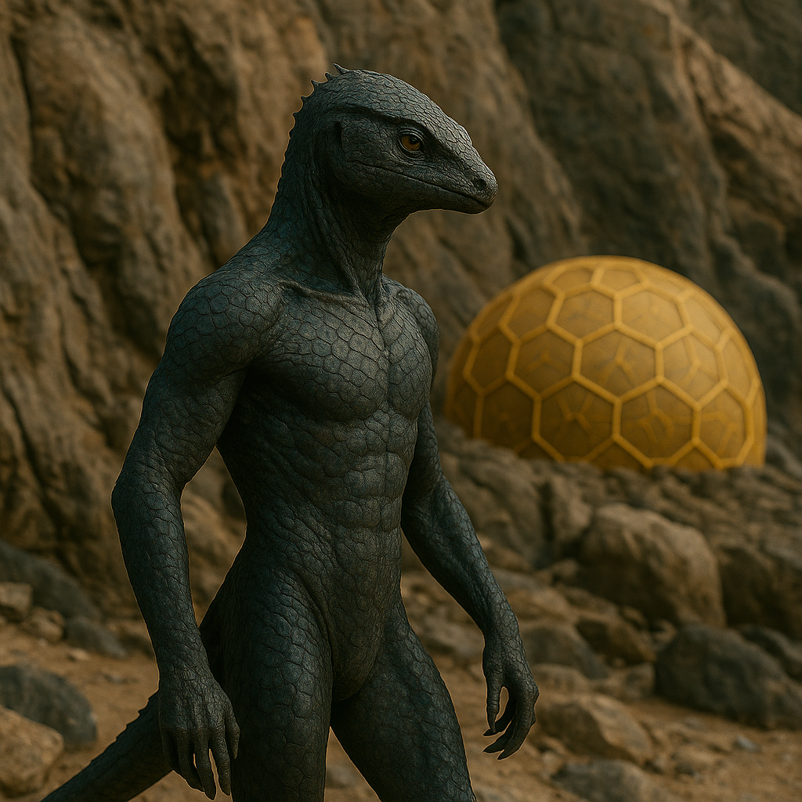

## Kryssoth

### Description:

The Kryssoth are sleek, reptilian climbers, their lithe bodies sheathed in fine overlapping scales that range from slate grey to the deep green of lichen-crusted rock. Each toe ends in a curved, powerful hook, and their long tails serve as a fifth limb for balance and anchorage, making them masters of the vertical world. Where flatland peoples see an impassable cliff, a Kryssoth sees a highway; they live their whole lives upon sheer faces, accomplished cliff-masons who carve and build their holds from the living rock — tier upon tier of chiseled galleries, buttressed ledges, and walled terraces hewn far above the reach of ground-bound predators.

Everything in Kryssoth life bends toward the heights. Their cities cling to escarpments and canyon walls, their trade routes thread along ledges invisible from below, and their very notion of status rises with altitude — the most honored elders dwell at the loftiest tiers, nearest the open sky. But the defining moment of any Kryssoth life is the Ascent: the coming-of-age rite in which a youth must climb, utterly alone and without aid, to the summit of a sacred cliff held holy by their colony. To return from the Ascent is to be reborn an adult; to turn back is to remain forever a child in the eyes of one's people.

Their faith is woven into the stone they climb. The Kryssoth revere the Peak Unseen, a mythic summit above all others that they believe cannot be reached in life, toward which every climb is a small act of devotion. The Ascent is thus more than a trial of nerve and muscle; it is a pilgrimage in miniature, a conversation between the climber and the cliff. Solitary and self-reliant by necessity, yet fiercely proud of their colony's sacred peak, the Kryssoth measure a life by the heights it dared and hold that the only true failure is to have climbed nothing at all.

### Notable Traits:

- Habitat: Sheer cliffs, canyon walls, and mountain faces
- Lifespan: 95 years
- Strength: Superb climbers and accomplished cliff-masons who carve and build their holds from living rock; at home on any vertical surface
- Weakness: Awkward and uneasy on open, level ground
- Temperament: Self-reliant, proud, and fearless

### Fun Fact:

A Kryssoth measures another's worth by a single question — "What have you climbed?" — and considers anyone who answers "nothing" to be scarcely an adult at all.

---

*"The cliff asks only one question, and your hands must answer it."* — Kryssoth Ascent blessing

[Back to Aliens](../aliens.md#kryssoth)
