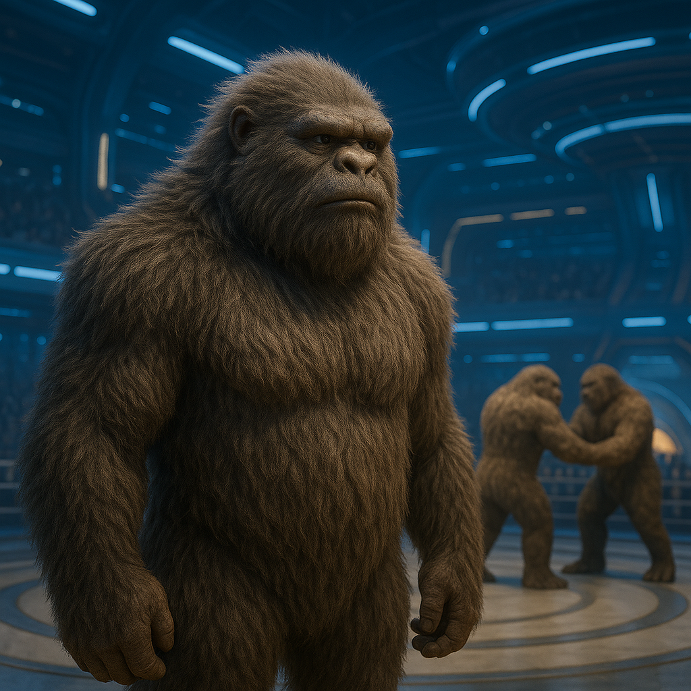

## Maxothis

### Description:

The Maxothis are towering, broad-headed beings, mountainous of frame and swathed in dense, shaggy fur that ranges from snow-white to the deep brown of frozen earth. They stand head and shoulders above most other peoples, their massive skulls set low between powerful sloping shoulders, and when one of them moves there is a slow, glacial inevitability to it, like a boulder deciding to roll. Yet for all their fearsome bulk the Maxothis have gentle, almost sorrowful eyes, and a visitor who expects brutes is invariably surprised to find a people of enormous dignity, patience, and courtesy.

Born upon frozen worlds of endless snowfields and howling wind, the Maxothis are naturally, magnificently resistant to cold; they sleep bare upon the ice, breathe blizzards without discomfort, and regard the freezing wastes that would kill lesser folk as simply the pleasant outdoors. This hardiness has given them a calm, unhurried confidence, for there is little in the harsh world that can truly threaten them, and a people with nothing to fear from the elements has the luxury of being gracious. Their settlements are great carved strongholds — halls hewn from ice, packed snow, and quarried stone, raised with patient, masterful workmanship into fortified keeps lit golden from within — and the Maxothis fill them with slow feasting, deep song, and the ponderous good cheer of giants at their ease.

Their great size and strength might make them tyrants, but the Maxothis have bent these gifts instead toward ritual, settling their disputes not through war or bloodshed but through formal contests of strength. When two Maxothis quarrel — over property, over honor, over love — they do not fight to harm but grapple in a stylized, rule-bound trial of power, witnessed and judged by the community, until one yields and the matter is settled with no lasting wound. These contests are solemn, almost sacred affairs, as much theater and law as sport, and the greatest champions are revered less for the enemies they have thrown than for the fairness with which they have thrown them. In this way the Maxothis have turned their most dangerous trait into the keystone of a remarkably peaceable society: among a people who could so easily destroy one another, strength is a thing to be measured honestly, respected, and then set gently aside.

### Notable Traits:

- Habitat: Snowfields, glaciers, and the frozen slopes of high mountains
- Lifespan: 170–210 years
- Strength: Immense size and might turned to skilled stoneworking and the raising of carved strongholds; naturally resistant to extreme cold
- Weakness: Suffer greatly in heat; slow-moving and ponderous
- Temperament: Gentle, dignified, and ceremonious despite their power

### Fun Fact:

A Maxothis strength-contest always ends with the victor helping the loser to its feet — refusing this courtesy voids the win and shames the champion.

---

*"Great strength is a question the world keeps asking; answer it gently, and you need never answer it in blood."* — Maxothis contest-elder's judgment

[Back to Aliens](../aliens.md#maxothis)
