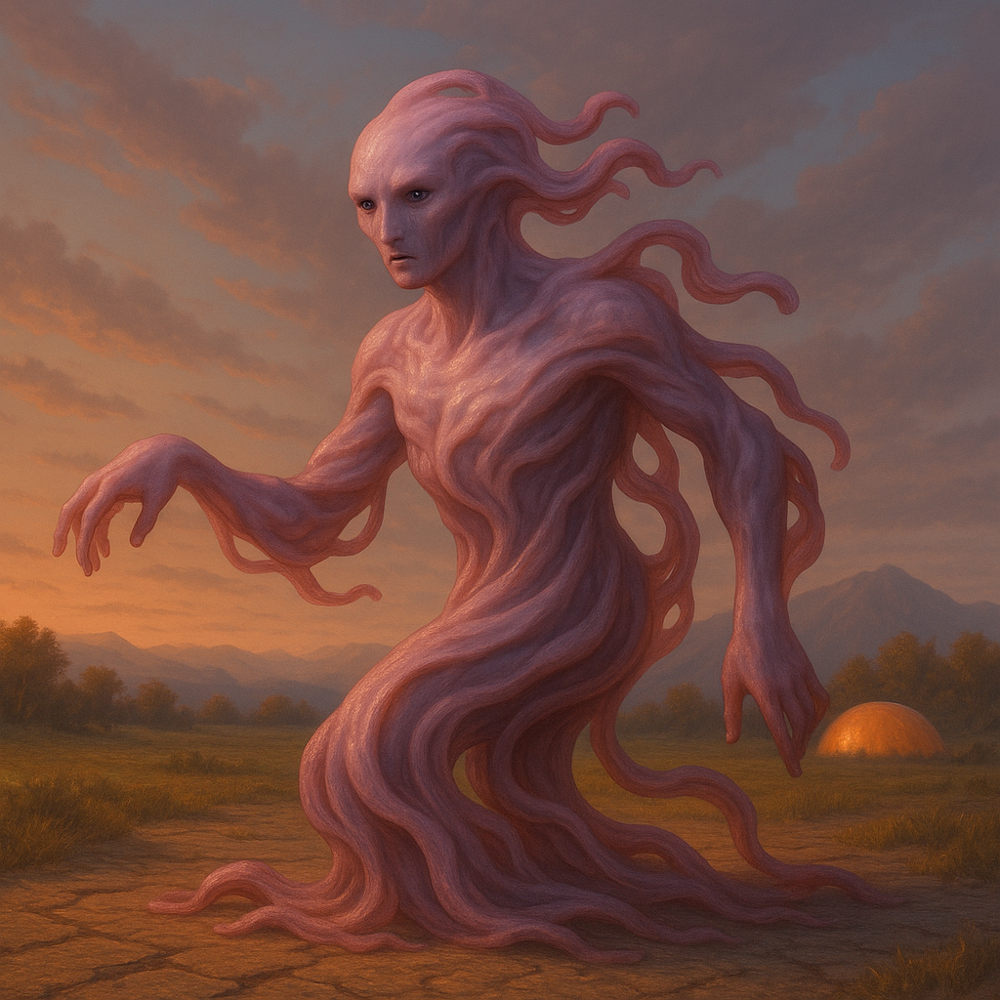

## Mel'tanni

### Description:

The Mel'tanni are a fluid, ever-shifting people whose bodies hold no single fixed form. Their flesh is pale and malleable, flowing between shapes as mood and need dictate — now tall and slender to pass through a narrow place, now broad and low to weather a storm, now mimicking the silhouette of whatever world they have most recently called home. Only their eyes, large and liquid and faintly iridescent, remain constant across every transformation, so that the Mel'tanni recognize one another not by shape but by gaze.

The Mel'tanni are the galaxy's great wanderers, a people who have made rootlessness into a philosophy. They hold no ancestral homeworld sacred; indeed, they regard permanent attachment to any single place as a kind of spiritual decay, a hardening of the soul into something as rigid as stone. Their colonies are founded with the full expectation of being abandoned — way-stations on an endless migration rather than homes — and a Mel'tanni settlement is forever either being established or being left behind. They press outward into new worlds not from conquest or need but from an almost compulsive restlessness, a conviction that the next horizon holds a shape of life they have not yet tried.

This wanderlust is inseparable from their astonishing adaptability. A Mel'tanni arriving on a frozen world will, within a generation, have reshaped their bodies, their customs, and their entire way of living to suit it — only to melt it all away and begin again when the migration calls. They treat tradition, biology, and belief alike as garments to be changed with the season. No environment defeats them because they simply become whatever the environment requires; no custom binds them because they regard all customs as temporary. To the Mel'tanni, to live is to change, and to settle is to begin to die.

### Notable Traits:

- Habitat: Everywhere and nowhere; a new world each generation
- Lifespan: 130 years of perpetual motion
- Strength: Boundless adaptability and tireless expansion into new lands
- Weakness: So restless they abandon thriving colonies on little more than a whim
- Temperament: Curious, mercurial, and incapable of standing still

### Fun Fact:

A Mel'tanni asked where they are from will answer with wherever they happen to be standing — and mean it sincerely.

---

*"Roots are just the first stage of petrifaction."* — Mel'tanni migration-elder

[Back to Aliens](../aliens.md#meltanni)
