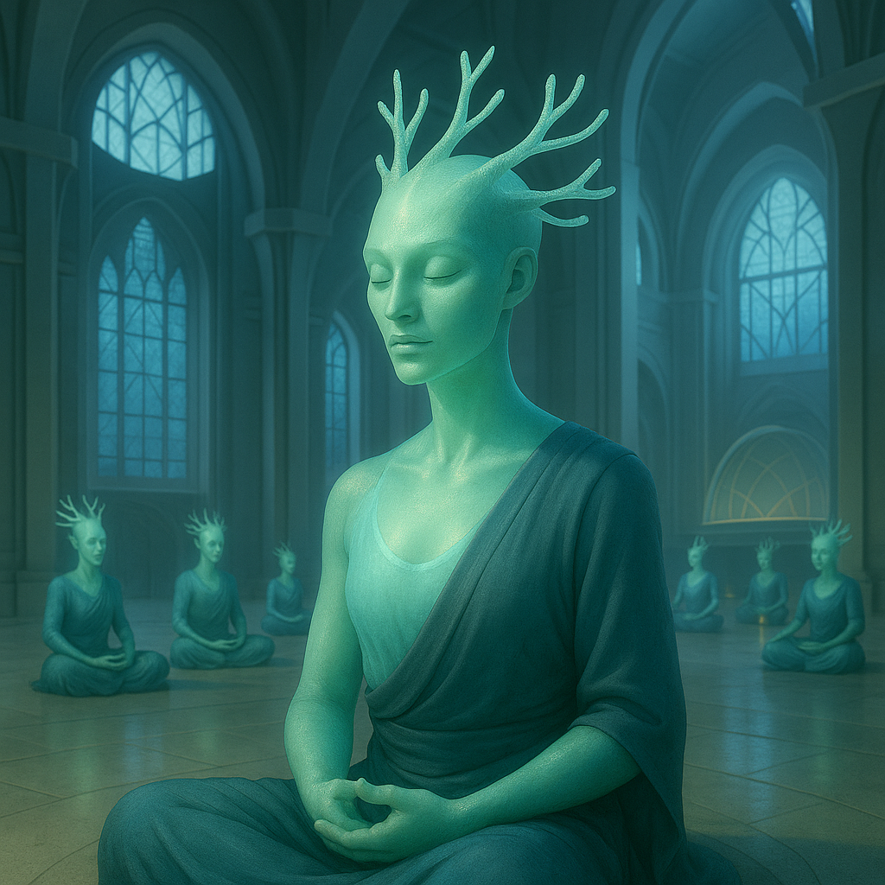

## Menthara

### Description:

The Menthara are a calm, luminous-skinned people, serene of face and soft of voice, their smooth hides glowing with a gentle inner light that waxes and wanes with their breathing like a slow tide of pale fire. From their heads rise branching crests, delicate antler-like growths that fork and spread and shimmer faintly in time with the body's glow, so that a gathering of Menthara at rest resembles nothing so much as a grove of softly pulsing coral. Everything about them radiates tranquility; they move without haste, speak without heat, and carry into any room a stillness that others find either profoundly soothing or faintly maddening, according to their own restlessness.

The Menthara are, above all, a spiritual people, and their civilization is organized around the practice of shared meditation. Their communities gather daily under the guidance of revered spiritual leaders — the crest-elders, whose own branching crowns have grown vast and intricate with age — to sink together into deep collective reverie. Central to this practice is a shared rhythmic breathing: dozens or hundreds of Menthara breathing as one, their luminous skins pulsing in unison, their crests glowing brighter and dimmer in a single slow rhythm until the whole assembly seems to beat like one great quiet heart. They believe that in this synchrony the boundaries between individuals thin and soften, and that a community which breathes together is literally of one mind, incapable of the misunderstandings and resentments that fracture lonelier peoples.

This devotion to shared stillness shapes everything the Menthara do. Their decisions are reached not through debate but through meditation, the community breathing over a question until a consensus simply emerges, felt rather than argued. Their art is slow and contemplative, their cities quiet and open, built to accommodate the great breathing-halls where the collective rites are held. They abhor haste, noise, and conflict, regarding anger as a failure of breath and violence as the ultimate forgetting of one's rhythm, and they are famous across the continent as peacemakers whose mere serene presence can calm a quarreling room. Yet their tranquility is not weakness but discipline, hard-won and deliberately maintained, and a Menthara community breathing in unified calm against a crisis possesses a collective steadiness that no panic can shake and no provocation can hurry.

### Notable Traits:

- Habitat: Quiet valleys, misty highlands, and sheltered contemplative groves
- Lifespan: 180–230 years
- Strength: Deep collective calm and focus; gifted meditators and peacemakers
- Weakness: Slow to act and conflict-averse; unsettled by chaos and haste
- Temperament: Serene, spiritual, and profoundly communal

### Fun Fact:

A troubled Menthara seeking advice is simply invited to "breathe with us" — and the community will quietly match its rhythm to the sufferer's until, breath by breath, it is drawn back into calm.

---

*"Breathe together and you think together; a people of one rhythm is a people of one heart."* — Menthara crest-elder's teaching

[Back to Aliens](../aliens.md#menthara)
