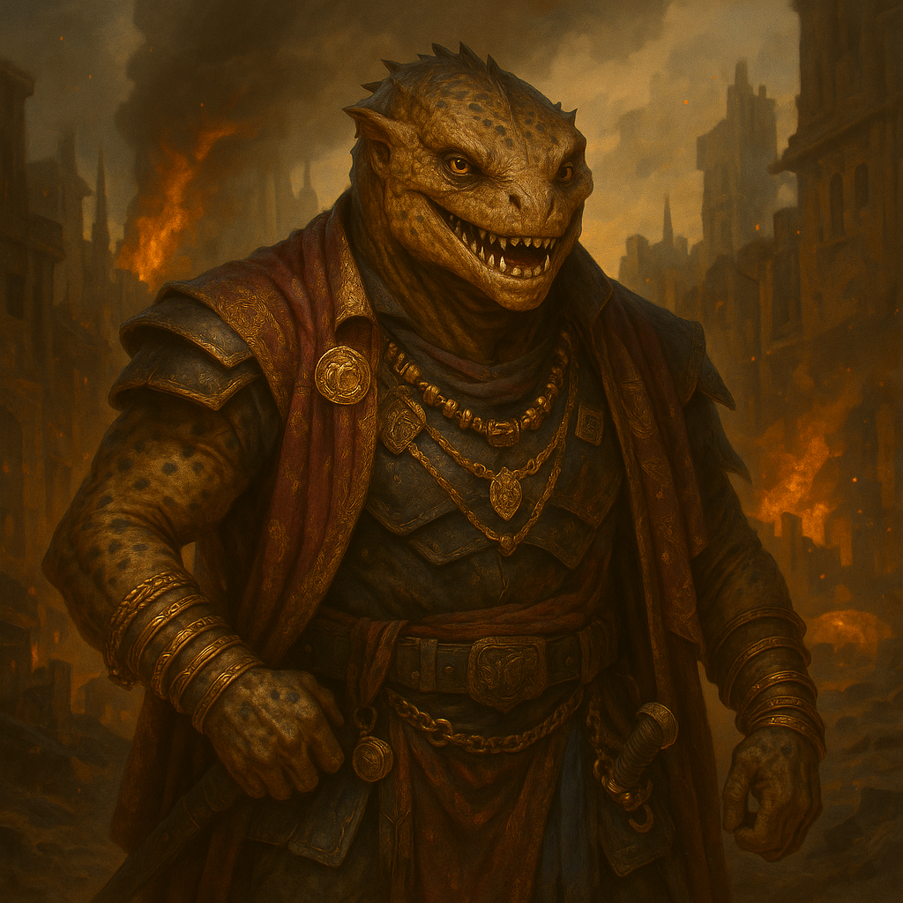

## Molkaar

### Description:

The Molkaar are sleek, sharp-featured, and dressed to be remembered. Their mottled tan-and-umber hides are kept deliberately scarred in decorative patterns, and they drape themselves in the spoils of a hundred contracts — looted silks, enemy insignia worn as trophies, rings and chains that double as a running tally of coin earned. Lean and quick, with a wide mouth full of sharp teeth that spends as much time grinning as snarling, a Molkaar greets a stranger the same way whether it intends to sell them a weapon or bury one in them: with easy, voluble, dangerous charm. They are, famously, never at a loss for words.

The Molkaar are mercenaries to the marrow, raider-traders who have turned violence into a commodity and themselves into its finest purveyors. Their war-companies hire out their blades to the highest bidder, and when no one is hiring they simply raid on their own account and sell the plunder back to the people they took it from. Every Molkaar camp is also a market: a loud, haggling bazaar where captured goods, intelligence, hostages, and the promise of future violence are all traded with the same cheerful ruthlessness. They keep meticulous ledgers, honor their contracts to the letter — betrayal is bad for business — and will cut your throat and sell your boots with no hard feelings whatsoever, because to a Molkaar it was never personal, only a transaction.

Their aggression, then, is a product with a price tag. The Molkaar fight constantly not out of fury or doctrine but because war is simply the most profitable enterprise they have ever found, and they are far too good at it to do anything else. They will talk endlessly — flattering, bargaining, threatening, deal-making — right up until the moment the numbers favor steel, and then they will fight with a glib, grinning savagery that is somehow worse than silent rage. A people who have monetized their own ferocity are never short of reasons to deploy it, and the Molkaar are forever drumming up the next war, the next contract, the next lucrative ruin, because peace, to a Molkaar, is just a market with no customers.

### Notable Traits:

- Habitat: Mobile mercenary camps that double as sprawling, noisy marketplaces
- Lifespan: 65 years, extended by never fighting for free
- Strength: Deadly, versatile hired blades who turn every conflict into profit
- Weakness: Loyalty extends exactly as far as the contract; out-bid them and their swords may turn
- Temperament: Glib, grinning, and relentlessly aggressive — they sell violence and love the work

### Fun Fact:

The Molkaar greeting and the Molkaar war-cry are the same phrase, delivered with the same smile — only the price quoted afterward tells you which one it was.

---

*"Everything is for sale, friend. Especially your defeat — and we are offering a very fair rate."* — Molkaar contract-broker's pitch

[Back to Aliens](../aliens.md#molkaar)
