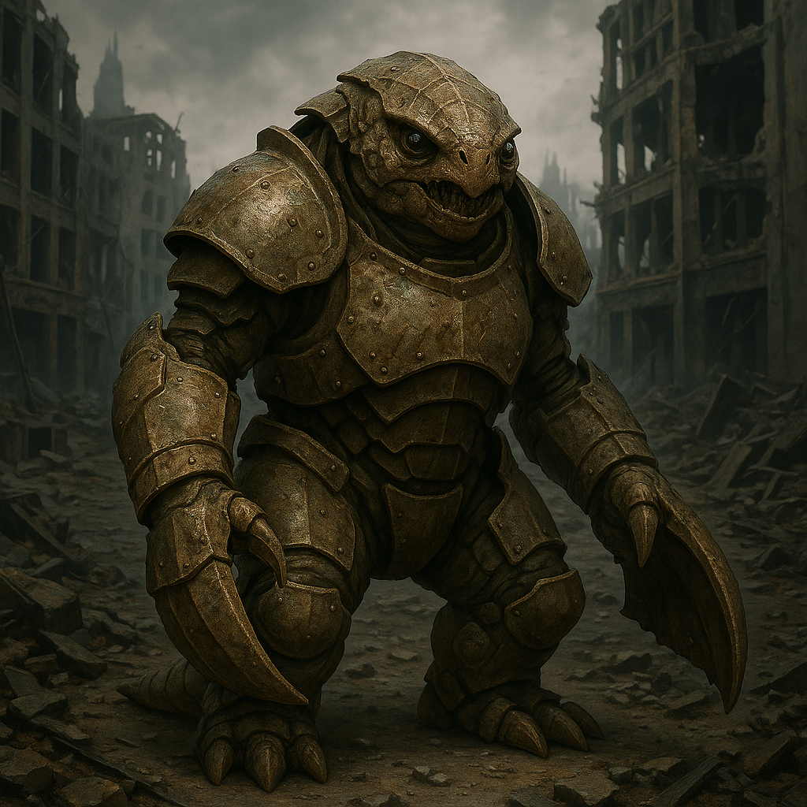

## Morvax

### Description:

The Morvax are stout, heavily armored scavengers, their bodies encased in dull, pitted plates the color of old iron and tipped with broad, shovel-like claws built for digging, prying, and sifting. Low to the ground and immensely strong, they trundle through the wastelands and ruin-fields of blasted worlds, overturning rubble and sieving the poisoned soil for anything of use. Their broad jaws and iron stomachs let them devour substances that would kill nearly any other living thing — corrosive sludge, toxic metals, the chemical residue of long-dead industries — rendering the inedible into nourishment.

To the Morvax, waste is a stranger's word; everything can be used, and the only true poverty is the failure of imagination to find a use. They hold resourcefulness as the highest virtue, far above the accumulation of wealth, which they regard as a childish fixation on shiny things. A Morvax is judged not by what it owns but by what it can make from nothing — the salvager who feeds a family from a slag-heap commands more respect than one who merely hoards treasure. Their settlements are marvels of improvisation, every structure cobbled from the discarded bones of fallen civilizations and all the better, in their eyes, for it.

Their faith is a cheerful reverence for the Great Reclamation, a belief that nothing is ever truly lost, only transformed, and that even the dead and the ruined will one day be made useful again. Death itself the Morvax treat as recycling, returning the body to the soil they so lovingly sift. Social standing flows to the cleverest menders and the boldest delvers, and their folktales celebrate the trickster-salvager who outwits the proud by turning their refuse against them. Blunt, practical, and startlingly content, the Morvax find beauty where others see only garbage, and they would not have it any other way.

### Notable Traits:

- Habitat: Ruins, wastelands, and toxic badlands
- Lifespan: 85 years
- Strength: Digests toxins; thrives where nothing else survives
- Weakness: Slow and poorly suited to clean, abundant lands
- Temperament: Blunt, practical, and good-humored

### Fun Fact:

The grandest gift a Morvax can give is a lovingly repaired object someone else had thrown away, presented with the proud words, "I found a use for it."

---

*"There is no trash — only treasure that has not yet met the right claw."* — Morvax salvager's saying

[Back to Aliens](../aliens.md#morvax)
