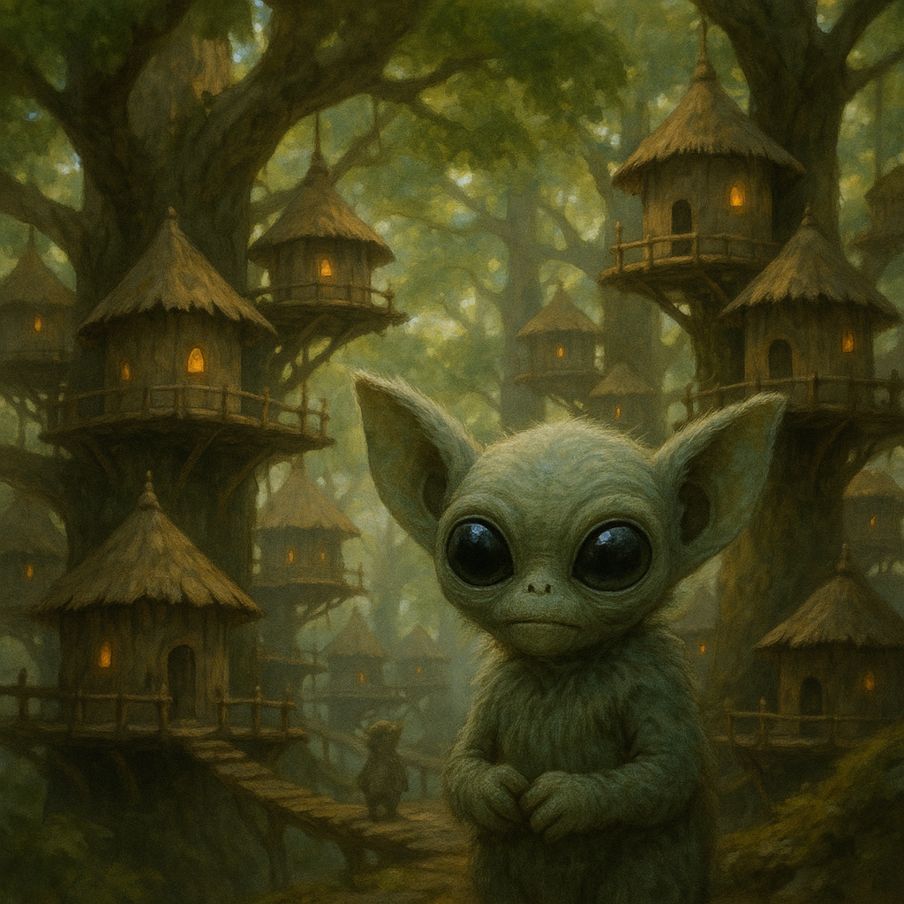

## Mossling

### Description:

The Mossling are a small, tree-dwelling species whose huge, obsidian-black eyes dominate their soft faces, drinking in every scrap of light that filters down through the forest canopy. Their bodies are covered in a dense pelt of moss-green fur, mottled with patches of lichen-grey and bark-brown, that blends them so perfectly into the trees that a motionless Mossling is nearly impossible to find. Small, nimble, and endlessly curious, they flit through the branches on long-fingered hands and prehensile toes, rarely setting foot on the forest floor below.

Life for the Mossling unfolds entirely among the trees. They build cozy nests of woven twigs and gathered down in the forks of the great trunks, strung together by swaying bridges of vine into sprawling arboreal villages. Everything they need — fruit, nuts, grubs, and the sweet sap of the canopy flowers — can be found without ever descending, and the ground below is regarded as a place of danger and bad luck, the domain of lumbering predators and sunlight too fierce for their shadow-loving eyes.

Their moss-green camouflage is both their shield and the cornerstone of their culture. Unable to fight and unwilling to flee far from their nests, the Mossling survive by becoming invisible, freezing against the bark until danger passes. From this grows a people who prize stillness, patience, and quiet observation, who settle disputes by hiding until tempers cool, and who regard boastfulness and display as not merely rude but suicidally foolish. A Mossling's highest compliment is to call another "well-hidden."

Mossling society is gentle, communal, and shy, organized into tight family-nests that cooperate loosely across the canopy without any strong central authority. They share food freely, raise their young collectively, and resolve disagreements through the mediation of elders too old to climb the highest branches but rich in forest-wisdom. Timid toward strangers to the point of invisibility, the Mossling nonetheless harbor an intense, playful curiosity, and a patient visitor who sits quietly long enough may find a ring of enormous dark eyes slowly materializing from the surrounding green.

### Notable Traits:

- Habitat: Dense forest canopies and the hollows of ancient trees
- Lifespan: Short — around 30 years
- Strength: Near-perfect camouflage and silent, agile movement through the trees
- Weakness: Tiny and defenseless; helpless and frightened on the open ground
- Temperament: Shy, gentle, and intensely curious

### Fun Fact:

A frightened Mossling can hold so still that visitors have mistaken an entire village for an unusually mossy tree.

---

*"The branch that boasts is the branch the hawk finds first."* — Mossling nest-saying

[Back to Aliens](../aliens.md#mossling)
