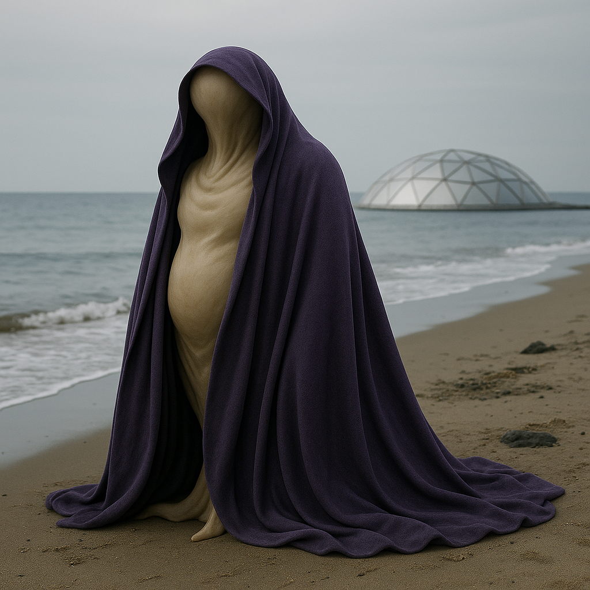

## Nel'Quoth

### Description:

The Nel'Quoth are soft-bodied, boneless beings whose natural form is a shifting mass of supple, color-muted flesh, more suggestion than fixed shape. To bring order to their fluid bodies, they favor flowing cloaks and layered wraps that lend them a semblance of silhouette, draping themselves in rich fabrics that trail and billow with every movement. Within those garments the Nel'Quoth are in constant, subtle motion, their forms swelling, narrowing, and flowing as mood and purpose dictate, so that no two moments find a Nel'Quoth quite the same.

Chief among their gifts is a limited shape-shifting: for a short time a Nel'Quoth can mimic the outline of another creature, flowing into an approximation of its silhouette and bearing. It is not perfect transformation but impression — a borrowed shape held briefly, like a held breath — and it lies at the very heart of their philosophy. To the Nel'Quoth, adaptation is the supreme virtue, and rigidity the cardinal sin. A being that cannot change, they hold, is already dead; life is nothing but the ceaseless, graceful flowing of one shape into the next.

Their society reflects this creed in every seam. The Nel'Quoth hold no permanent offices, titles, or castes; roles are assumed as circumstance requires and set aside when the need passes, each citizen expected to flow into whatever shape the moment demands. Their rituals celebrate transition above all — the Festival of a Thousand Forms, held at each turning of the seasons, sees the whole population cycle through mimicked shapes in a flowing, days-long dance of becoming. Their faith venerates the Formless, a divine principle of pure potential that is all things because it is no fixed thing, and the highest Nel'Quoth blessing is simply, "May you never set."

### Notable Traits:

- Habitat: Marshlands, estuaries, and mist-shrouded fens
- Lifespan: 100 years
- Strength: Brief mimicry of other creatures' shapes; great adaptability
- Weakness: Physically soft and easily injured when caught unformed
- Temperament: Flexible, open-minded, and quietly playful

### Fun Fact:

A Nel'Quoth considers being described as "unchanging" or "reliable in form" a grave insult, roughly equivalent to being called a corpse.

---

*"That which cannot flow has already set; and that which has set is already stone, and stone is already gone."* — Nel'Quoth meditation on the Formless

[Back to Aliens](../aliens.md#nelquoth)
