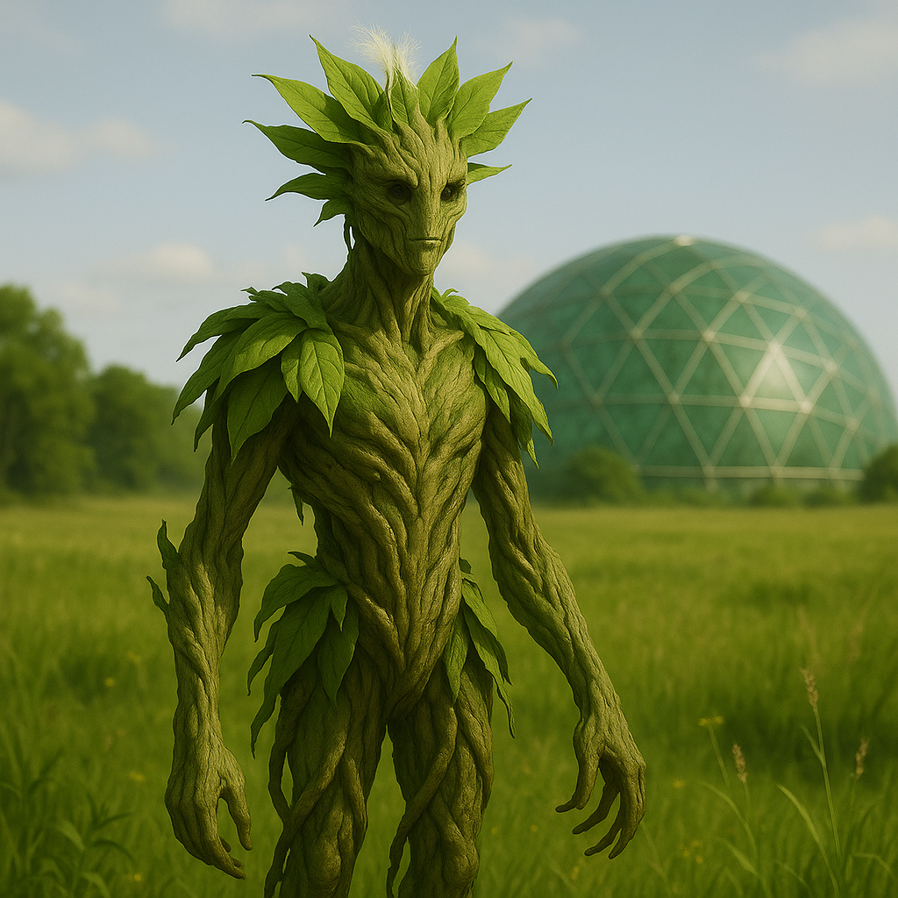

## Nomilar

### Description:

The Nomilar are a wandering, plantlike people, their bodies a graceful fusion of supple stalk and trailing vine, crowned with broad leaf-like fronds that unfurl to drink the sun. Their limbs end not in hands but in root-fingers that can split and spread, and when a Nomilar pauses to rest they drive these roots briefly into the soil, anchoring themselves for a day or a season before pulling free to wander onward. Their skin is a living green shot through with autumn golds and reds, and it photosynthesizes — a Nomilar fed by sunlight needs little else, and a Nomilar long kept in darkness grows pale, listless, and sorrowful.

Theirs is a culture of perpetual migration. The Nomilar follow the sun and the seasons across their world in slow, drifting bands, rooting wherever the light is good and the soil is kind, then moving on before any single place can claim them. They build nothing permanent, for permanence is alien to a people whose very nature is to move; instead they carry their heritage in song, in the shapes of their shared gardens, and in the memory of every place they have ever rooted. To a Nomilar, home is not a location but a direction — always onward, always toward the light.

Most remarkable is how the Nomilar communicate. They release clouds of fragrant spores, each scent a word, a mood, or a piece of news, carried on the wind to distant kin. A wandering band can learn of a drought a hundred leagues away, a birth among a sister-band, or the passing of an elder, all through the subtle perfume riding the breeze. Their language is one of layered aromas, impossibly rich, and an eloquent Nomilar can compose a drifting scent-poem that lingers in a valley for days. Other species find their meadows intoxicatingly sweet without ever grasping the complex conversations unfolding in the air.

Peaceful by nature and nourished by the sun, the Nomilar have little use for conquest, hoarding, or hierarchy. They share freely because they lack the instinct to possess, and their loose, egalitarian bands make decisions through slow consensus, scented out over days of fragrant deliberation. Gentle, patient, and endlessly curious about the wider world, they are travelers in the purest sense — rooted everywhere, bound nowhere.

### Notable Traits:

- Habitat: Sunlit plains, meadows, and open woodland
- Lifespan: 60 years, with seasonal dormancy
- Strength: Self-sustaining through sunlight and able to communicate across great distances via spores
- Weakness: Grows weak and despondent in prolonged darkness
- Temperament: Peaceful, nomadic, and generous

### Fun Fact:

A grieving Nomilar band releases a single shared mourning-scent so sorrowful that other species passing downwind have been known to weep without knowing why.

---

*"We take root to rest, but we were made to follow the light."* — Nomilar proverb

[Back to Aliens](../aliens.md#nomilar)
