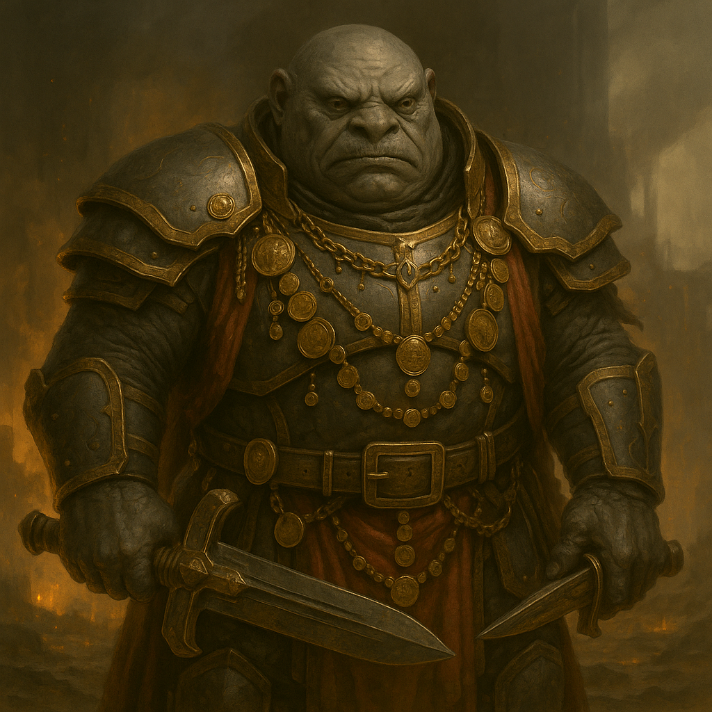

## Nurrgal

### Description:

The Nurrgal are heavyset, broad-handed creatures with slate-dark hide and shrewd, close-set eyes that seem perpetually to be adding up the worth of whatever they behold. They dress their martial bulk in finery — chains of traded coin, pauldrons chased with the marks of their trade-houses, weapons as ornate as they are lethal — for among the Nurrgal there is no shame in a soldier looking rich, only in a soldier looking poor. Their voices are smooth and persuasive even in threat, and a Nurrgal commander can make a demand for tribute sound almost like a generous offer.

Nurrgal civilization is built on the marriage of the ledger and the blade. Their great trade-houses are also war-companies, and the same accountants who tally caravans and markets also tally soldiers, siege-trains, and the price of a given province's conquest. They are relentlessly pragmatic: a war is worth fighting only if the spoils exceed the cost, and a Nurrgal house that spends more blood than it earns in treasure is reckoned a failure no matter how glorious its battles. Status is measured in wealth and the influence it buys, and the grandest Nurrgal are those whose armies have paid for themselves many times over.

The Nurrgal are aggressive conquerors, forever expanding their commercial empires at swordpoint, but theirs is a calculated, almost bloodless cruelty. They will besiege a city, then offer it generous terms of trade the moment surrender becomes cheaper than slaughter, because a ruined province pays no tribute. They prefer to buy a betrayal rather than storm a wall, to bankrupt a rival before fighting them, and to turn conquered foes into customers. This commercial pragmatism makes them no less dangerous — only more patient, more subtle, and far harder to see coming than a people who merely want you dead.

### Notable Traits:

- Habitat: Fortified trade-cities astride rivers, roads, and sea-lanes
- Lifespan: 95 years
- Strength: Deep war-chests, mercenary might, and ruthless strategic calculation
- Weakness: Loyalty follows profit; their coin-bought armies can be out-bid
- Temperament: Aggressive and conquering, yet commercial, pragmatic, and patient

### Fun Fact:

A Nurrgal general's war-journal records every battle twice — once in casualties and once in coin — and only the second column decides whether the campaign is remembered as a victory.

---

*"A dead enemy pays no tribute. Conquer them twice: once with the blade, once with the bill."* — Nurrgal trade-house proverb

[Back to Aliens](../aliens.md#nurrgal)